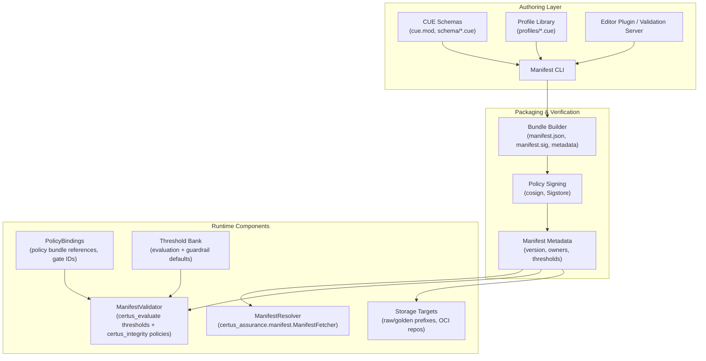

# Component View (C4 Level 3)

| Component            | Responsibilities                                                                                                           |
| -------------------- | -------------------------------------------------------------------------------------------------------------------------- |
| CUE Schemas          | Define manifest structure (targets, scanners, policies, evaluation thresholds, storage locations).                         |
| Profile Library      | Curated profiles (light, standard, full, AI-eval) that authors reuse across manifests.                                     |
| Manifest CLI / LSP   | Validate manifests, render JSON for runtime consumption, and offer IDE feedback (hover docs, schema validation).           |
| Bundle Builder       | Produces OCI/S3 bundles containing manifest JSON, metadata, and optional signatures.                                       |
| Policy Signing       | Uses cosign/Sigstore to sign manifest digests; optionally attaches transparency log entries.                               |
| Manifest Metadata    | Captures owners, workspace/component IDs, SLA tier, policy bundle digests, evaluation thresholds, evidence storage targets.|
| ManifestResolver     | Fetches manifests from inline payloads, Git, S3, or OCI references; verifies signatures before returning text.             |
| ManifestValidator    | Applies schema versioning, ensures required fields exist, and distributes threshold data to certus-evaluate/integrity.    |
| PolicyBindings       | Links manifest items to policy bundles (OPA/CUE) for certus-assurance and certus-integrity gates.                          |
| Threshold Bank       | Stores default evaluation/guardrail thresholds; manifests can override per asset or environment.                           |
| Storage Targets      | Defines raw/golden prefixes, bucket names, OCI repositories used by certus-assurance and certus-transform.                 |
