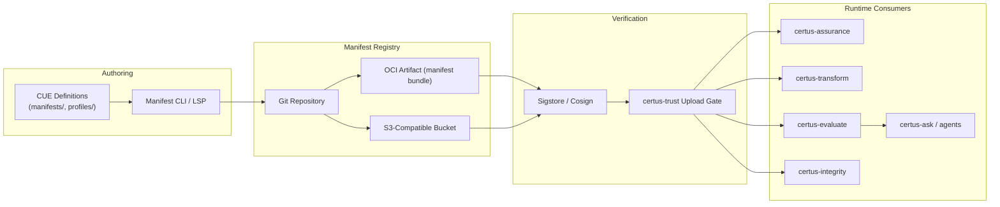

# Container View (C4 Level 2)

| Container          | Responsibilities                                                                                             |
| ------------------ | ------------------------------------------------------------------------------------------------------------ |
| CUE Definitions    | Source of truth for schemas, policy bindings, and profile definitions.                                       |
| Manifest CLI / LSP | Validates manifests locally, enforces schema versioning, and generates signed bundles.                       |
| Git Repository     | Hosts authored manifests and change history (PR review, policy approvals).                                   |
| OCI Artifact / S3  | Distributes versioned, signed manifests to runtime systems with immutable digests.                           |
| Sigstore / Cosign  | Issues signatures, verifies authenticity before runtime consumption.                                         |
| certus-trust       | Validates manifests before granting upload permissions or evaluation rights.                                 |
| certus-assurance   | Reads manifest instructions (scanners, profiles, storage targets) to orchestrate runs.                       |
| certus-transform   | Applies manifest metadata for routing (workspace, asset, SLA, anonymization rules).                          |
| certus-evaluate    | Enforces quality thresholds and guardrails defined in the manifest.                                          |
| certus-integrity   | Emits `IntegrityDecision` objects referencing manifest IDs/digests for traceability across services.         |
