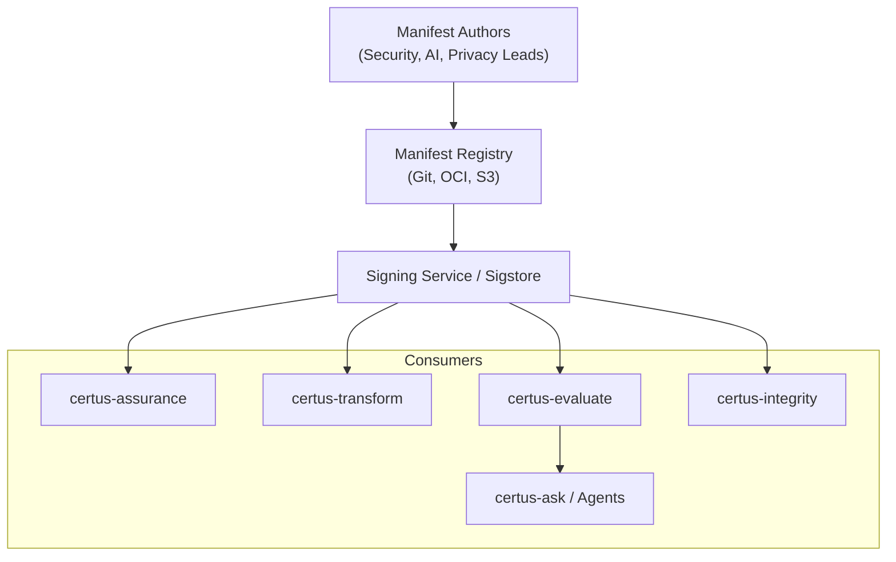

# Context

Assurance Manifests are the declarative contract that drives every Certus workflow: repository scans, evaluation runs, AI guardrails, policy enforcement, and downstream evidence promotion. They describe **what** to scan, **how** to evaluate it, **who** owns the run, **which** policies to apply, and **where** to store evidence. Manifests are authored in CUE, signed before execution, and referenced throughout certus-assurance, certus-transform, certus-evaluate, and certus-integrity.

| Actor / System      | Description                                                                                              |
| ------------------- | -------------------------------------------------------------------------------------------------------- |
| Manifest Authors    | Write CUE definitions, profile overrides, and policy bindings.                                           |
| Manifest Registry   | Stores signed manifests (Git repo, OCI artifact, S3 bucket) and exposes version history.                 |
| Signing Service     | Sigstore/Certus-Trust verifies and signs manifest digests before distribution.                           |
| certus-assurance    | Resolves manifest text, validates signatures, and orchestrates scans according to manifest profiles.     |
| certus-transform    | Uses manifest metadata (owners, scope, thresholds) to normalize and route evidence.                      |
| certus-evaluate     | Reads evaluation/guardrail thresholds embedded in the manifest to enforce quality gates.                 |
| certus-integrity    | References manifest IDs when issuing decisions to keep evidence provenance tied to the declared contract.|
| Certus-Ask / Agents | Surface manifest context (scope, policies, run metadata) when answering questions about pipelines.       |
