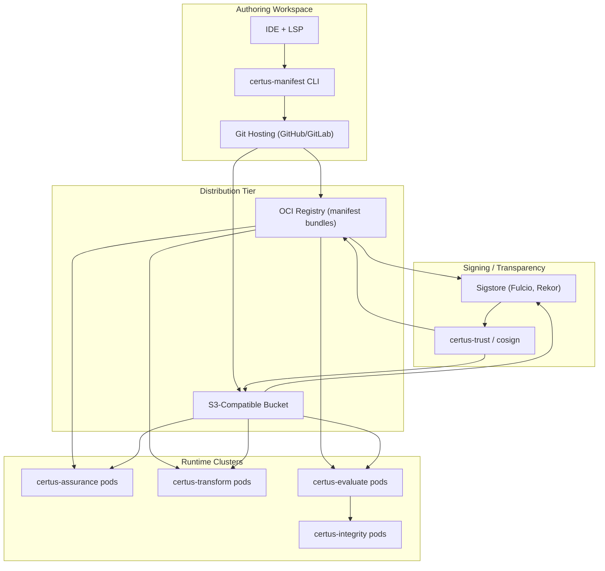

# Deployment

Assurance Manifests rely on a lightweight authoring toolchain and a distribution channel that every runtime can reach. The core requirements are: version control, signing, access controls, and caching near the services that consume manifests.

## Reference Deployment

## Operational Considerations

- **Caching:** Deploy local OCI/S3 mirrors in customer VPCs (or use LocalStack) to avoid pulling manifests over the public internet, especially for fully self-hosted deployments.
- **Versioning:** Use Git tags and OCI digests as immutable identifiers. Services should pin to a specific manifest digest; rolling updates require explicit promotion.
- **Access Control:** Restrict who can merge manifest changes or push bundles. Integrate with Sigstore/IAM policies so only approved signers can bless manifests.
- **CI Validation:** Add CI jobs that run `cue vet`, `cue export`, and manifest unit tests before PRs merge. Include cosign verification to prevent tampered bundles from entering the registry.
- **Runtime Failover:** certus-assurance caches resolved manifests on disk per run, but fall back to inline manifests during outages. certus-evaluate should keep the last known thresholds until a new manifest is verified.
