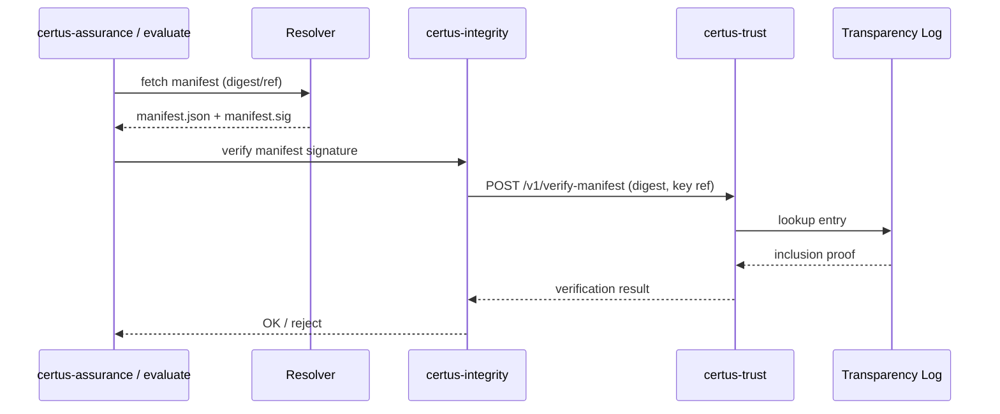

# Security

Manifests encode the canonical policy contract for every run. If an attacker modifies a manifest, they can weaken scans, lower thresholds, or redirect evidence. This section highlights the controls that keep manifests trustworthy.

## Threats & Controls

| Threat                                 | Control                                                                                                         |
| -------------------------------------- | ---------------------------------------------------------------------------------------------------------------- |
| Unauthorized manifest edits            | Git PR reviews + CODEOWNERS + branch protections; OCI push limited to signer service accounts.                  |
| Tampered distribution bundle           | Sigstore/cosign signing + Rekor transparency logs; certus-assurance verifies signature before use.              |
| Stale manifests                        | `manifest_version` and `policy_bundle_digest` tracked per run; certus-integrity rejects mismatched versions.    |
| Threshold bypass (eval/security)       | Thresholds stored in manifest and signed; certus-evaluate only accepts values from verified manifests.          |
| Storage redirection (exfiltration)     | Manifest defines bucket + prefix; certus-trust enforces allowlist and logs upload_destination decisions.        |
| Policy drift                           | Manifest includes policy binding IDs; certus-integrity compares against active policy bundles at runtime.       |

## Verification Flow

## Residual Risks

- **Policy Dependence:** If policy bundles referenced in a manifest are removed without updating manifests, runs can fail. Mitigate by version-locking policy bundles and keeping a compatibility matrix.
- **Secret Leakage:** Manifests should not include secrets. Use references to secret managers (ARNs, path IDs) instead.
- **Manifest Explosion:** As manifests drive more workflows (AI evaluation, deploy gates, runbooks), they may need modularization. Consider composition (imports) and automation to reduce duplication.
- **Insider Threats:** Signing keys must be protected (HSM/KMS). Multi-party approvals for manifest releases reduce the risk of malicious insiders lowering thresholds.
