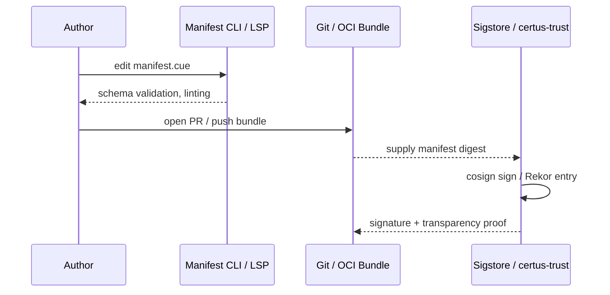
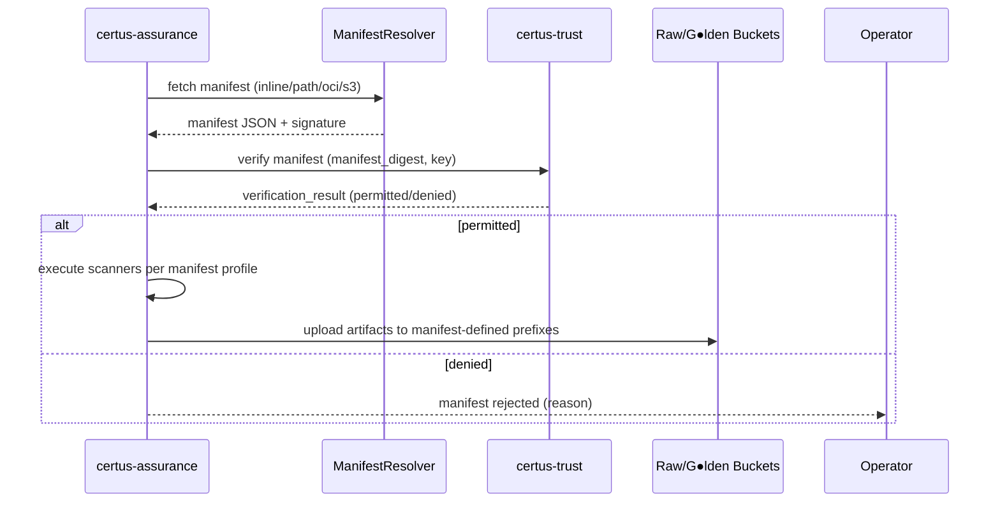
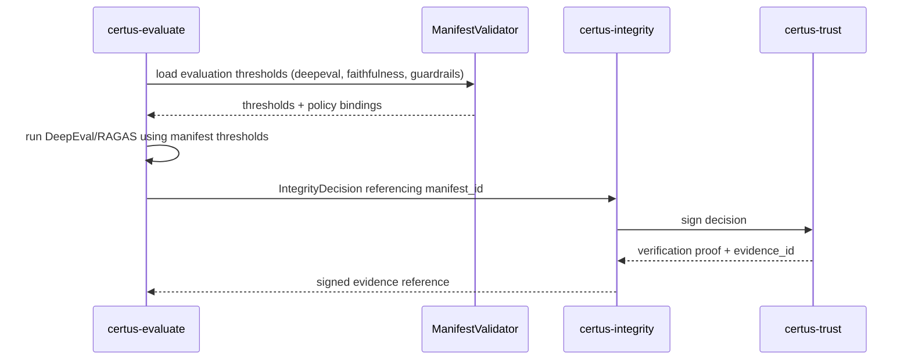

# Sequence Diagrams

## Authoring & Publication

```mermaid
sequenceDiagram
    participant Author
    participant CLI as Manifest CLI / LSP
    participant Repo as Git / OCI Bundle
    participant Signer as Sigstore / certus-trust

    Author->>CLI: edit manifest.cue
    CLI-->>Author: schema validation, linting
    Author->>Repo: open PR / push bundle
    Repo-->>Signer: supply manifest digest
    Signer->>Signer: cosign sign / Rekor entry
    Signer-->>Repo: signature + transparency proof
```

## Runtime Consumption (Scan)

```mermaid
sequenceDiagram
    participant Assurance as certus-assurance
    participant Resolver as ManifestResolver
    participant Trust as certus-trust
    participant Storage as Raw/G●lden Buckets

    Assurance->>Resolver: fetch manifest (inline/path/oci/s3)
    Resolver-->>Assurance: manifest JSON + signature
    Assurance->>Trust: verify manifest (manifest_digest, key)
    Trust-->>Assurance: verification_result (permitted/denied)
    alt permitted
        Assurance->>Assurance: execute scanners per manifest profile
        Assurance->>Storage: upload artifacts to manifest-defined prefixes
    else denied
        Assurance-->>Operator: manifest rejected (reason)
    end
```

## Runtime Consumption (Evaluation & Guardrails)

```mermaid
sequenceDiagram
    participant Evaluate as certus-evaluate
    participant Manifest as ManifestValidator
    participant Integrity as certus-integrity
    participant Trust as certus-trust

    Evaluate->>Manifest: load evaluation thresholds (deepeval, faithfulness, guardrails)
    Manifest-->>Evaluate: thresholds + policy bindings
    Evaluate->>Evaluate: run DeepEval/RAGAS using manifest thresholds
    Evaluate->>Integrity: IntegrityDecision referencing manifest_id
    Integrity->>Trust: sign decision
    Trust-->>Integrity: verification proof + evidence_id
    Integrity-->>Evaluate: signed evidence reference
```
