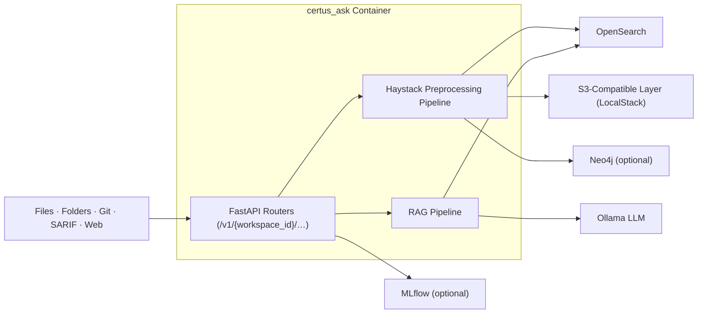
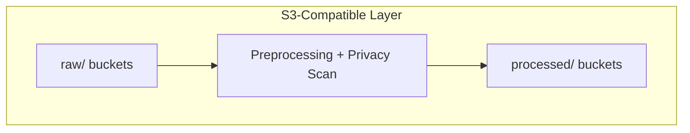
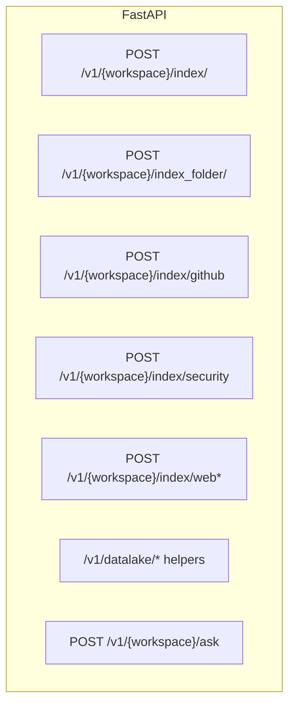
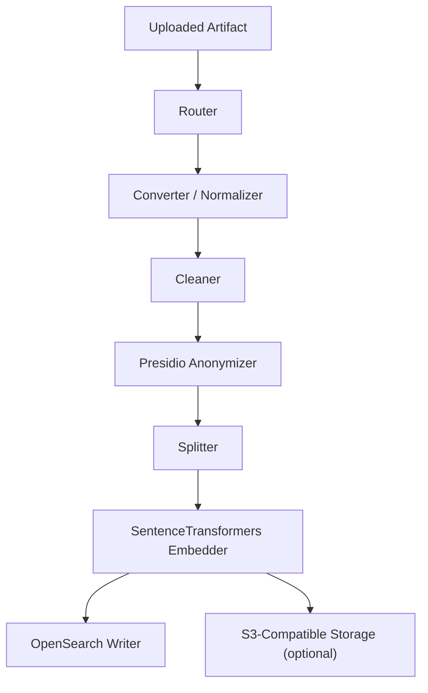
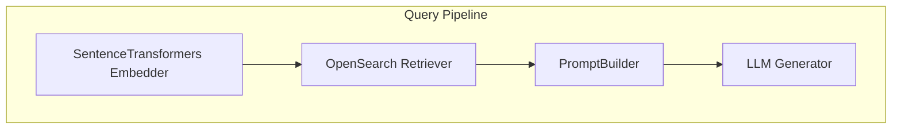
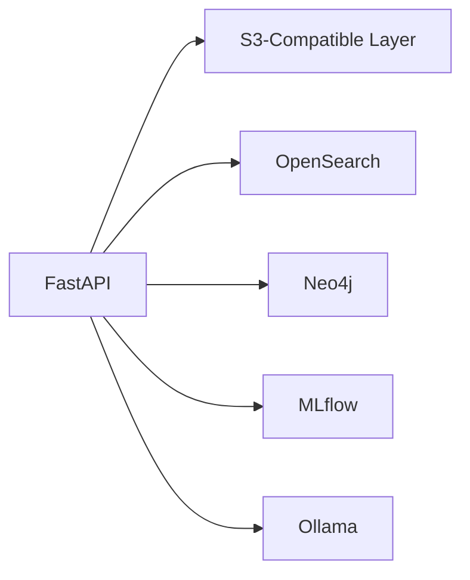
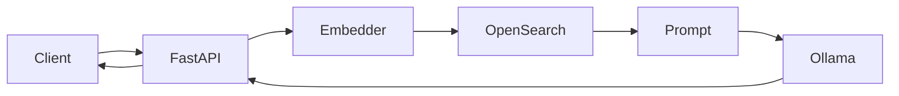

# Container Diagram

This System Landscape Diagram provides a comprehensive overview of the architecture for our document processing application built using FastAPI and Haystack. Following the C4 model, it visually represents key internal components, such as the indexing pipeline, document stores, and APIs, alongside external systems like AWS S3 and OpenSearch. The diagram highlights the interactions and data flows between these elements, illustrating how documents are processed, indexed, and queried. This high-level representation aids stakeholders in understanding system relationships and ensures alignment with organizational goals, facilitating informed decision-making for future development and integration efforts within the broader IT landscape.

| Name                             | Description                                                                                    |
| -------------------------------- | ---------------------------------------------------------------------------------------------- |
| FastAPI Routers                  | `/v1/{workspace_id}/index_*`, `/v1/{workspace_id}/ask`, `/v1/datalake/*`, `/v1/evaluation/*`.  |
| Haystack Preprocessing Pipeline  | Conversion, Presidio anonymisation, splitting, embedding, and OpenSearch writes happen inline. |
| RAG Pipeline                     | Embedder + OpenSearch retriever + prompt builder + Ollama generator.                           |
| S3-Compatible Layer (LocalStack) | LocalStack S3 endpoint used as the datalake while running locally.                             |
| OpenSearch                       | Stores embeddings, metadata, and retrieval context.                                            |
| Neo4j                            | Optional graph DB used by SARIF/SPDX loaders.                                                  |
| Ollama                           | Local model runtime powering `llm` stages and evaluation utilities.                            |
| MLflow                           | Receives metrics when the evaluation extra is installed.                                       |

## S3-Compatible Layer (LocalStack)

The datalake in the current developer stack is simply LocalStack’s S3-compatible endpoint. It persists uploaded files, privacy-scanned artifacts, and evaluation payloads before (or after) indexing.

| Name          | Description                                                                                                   |
| ------------- | ------------------------------------------------------------------------------------------------------------- |
| raw/ buckets  | Where uploads land when routed through the datalake helpers.                                                  |
| Preprocessing | `certus_ask/services/datalake.py` applies folder initialisation plus optional Presidio scans.                 |
| processed/    | Output of `batch_preprocess` endpoints or notebook experiments; still backed by LocalStack, not AWS Glue/KMS. |

## API Surface

| Endpoint                          | Description                                                           |
| --------------------------------- | --------------------------------------------------------------------- |
| `/v1/{workspace}/index/`          | Uploads a single document (file upload) and indexes immediately.      |
| `/v1/{workspace}/index_folder/`   | Recursively walks a local directory path on the API host.             |
| `/v1/{workspace}/index/github`    | Clones a repository and indexes filtered files.                       |
| `/v1/{workspace}/index/security*` | Handles SARIF/SPDX uploads or S3 pulls with Neo4j enrichment.         |
| `/v1/{workspace}/index/web*`      | Simple fetch-or-crawl utilities (requires `web` extra).               |
| `/v1/datalake/*`                  | Bucket initialisation, uploads, preprocess, and ingest-to-OpenSearch. |
| `/v1/{workspace}/ask`             | RAG query endpoint.                                                   |

## Indexing Pipeline

Detailed look at the Haystack-based ingestion stages executed inside background workers.

| Stage                  | Description                                                                     |
| ---------------------- | ------------------------------------------------------------------------------- |
| Converter / Normalizer | File-type detection plus loaders defined in `preprocessing.py`.                 |
| Cleaner                | Markdown/HTML cleaners and heuristics to drop boilerplate.                      |
| Presidio Anonymizer    | Optional privacy scrub controlled via `ANONYMIZER_ENABLED`.                     |
| Splitter               | Chunking parameters tuned for the default OpenSearch retriever.                 |
| Embedder               | `sentence-transformers/all-MiniLM-L6-v2`.                                       |
| Writers                | Persist both to OpenSearch (primary) and, when needed, the S3-compatible layer. |

## Query Pipeline

Stages executed when answering questions via `/v1/ask`.

| Name                          | Description                                           |
| ----------------------------- | ----------------------------------------------------- |
| SentenceTransformers Embedder | Embeds the question into a vector space               |
| OpenSearch Retriever          | Retrieves the most relevant documents from the Corpus |
| PromptBuilder                 | Builds the prompt for the LLM                         |
| LLM Generator                 | Generates an answer to the question                   |

## Ingestion Services Containers

Shows how ingestion responsibilities are split across API, schedulers, and per-source workers, plus the shared services they depend on.

All ingestion happens inside the FastAPI worker process—there is no Celery/Redis deployment or background worker fleet yet. Long-running ingestions should therefore be tested with realistic file sizes to understand current latency characteristics.

## Query & Serving Containers

Container-level view of the online serving path, including guardrails, LLM selection, and observability.

| Stage                         | Description                                               |
| ----------------------------- | --------------------------------------------------------- |
| FastAPI `/v1/{workspace}/ask` | Receives question payloads.                               |
| Embedder                      | `SentenceTransformersTextEmbedder` component per request. |
| OpenSearch                    | Provides the retrieval context.                           |
| Prompt                        | `PromptBuilder` renders the defensive template.           |
| Ollama                        | Generates the final answer returned to the caller.        |

## Edge Collector Containers

Depicts customer-side components responsible for gathering data, sanitizing it, and pushing it to the TAP cloud.

This section previously described future edge collectors. The current repository does not include that code; everything runs centrally in the FastAPI service. Keep this in mind before promising hybrid ingestion.
