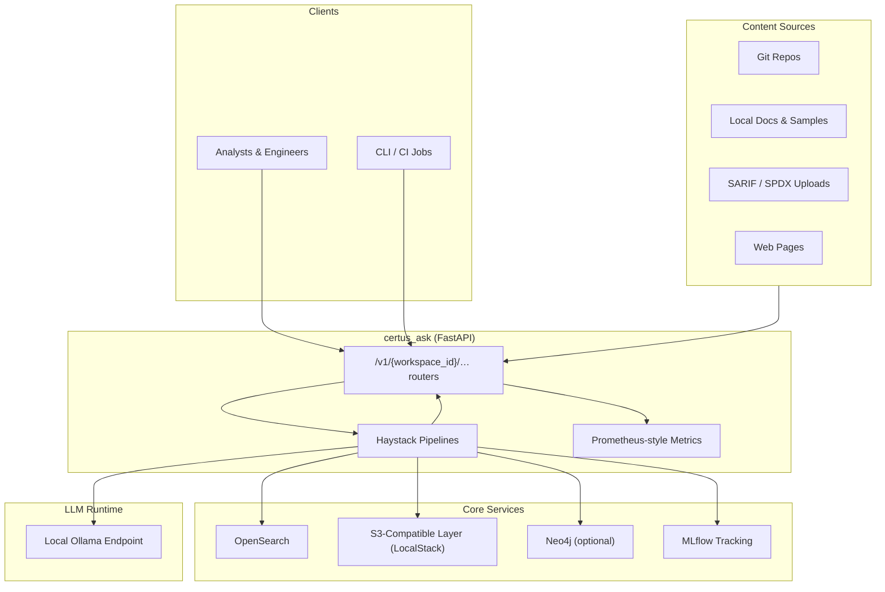
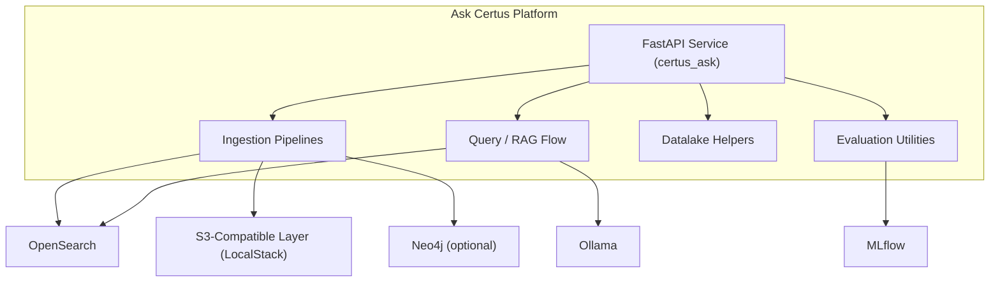
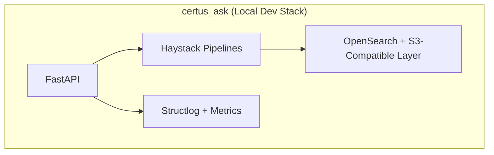
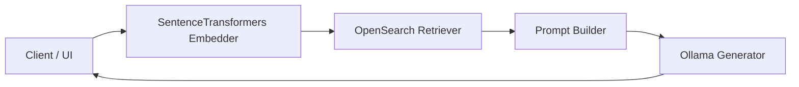
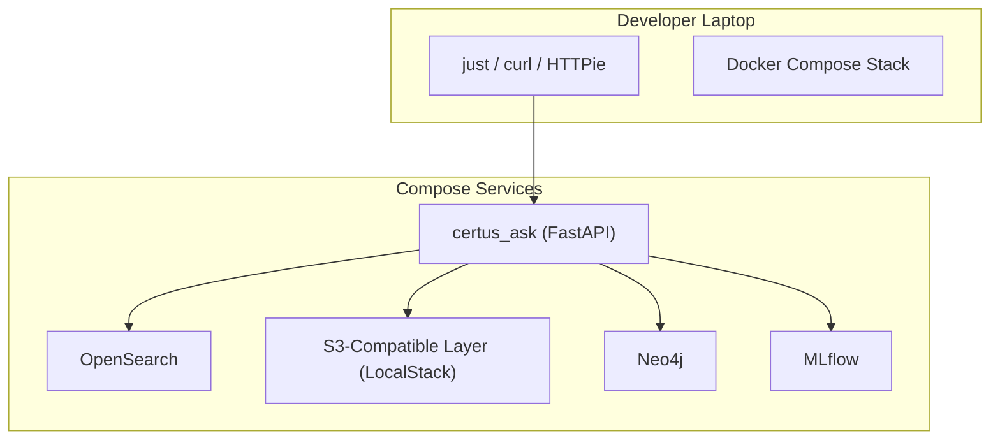

## TAP Platform

High-level view of the TAP platform, external data sources, and downstream consumers to anchor deeper deployment diagrams.

| Name                             | Description                                                                                                                       |
| -------------------------------- | --------------------------------------------------------------------------------------------------------------------------------- |
| Analysts & Engineers             | Primary callers using FastAPI endpoints to ingest documents or ask questions.                                                     |
| CLI / CI Jobs                    | Local scripts or CI pipelines exercising the same public API surface.                                                             |
| Git Repos / Docs / SARIF / Web   | Supported ingestion sources handled synchronously by the FastAPI service today.                                                   |
| certus_ask routers               | Single FastAPI app exposing `/v1/{workspace_id}/ingestion`, `/v1/{workspace_id}/query`, `/v1/datalake/*`, and `/v1/evaluation/*`. |
| Haystack Pipelines               | In-process Haystack graphs that convert, split, embed, and store documents per request.                                           |
| OpenSearch                       | Primary vector + metadata store addressed via `get_document_store_for_workspace`.                                                 |
| S3-Compatible Layer (LocalStack) | LocalStack S3 endpoint acting as the datalake layer for uploads, preprocessing, and evaluation artifacts.                         |
| Neo4j (optional)                 | Used only when SARIF/SPDX -> graph visualisation is enabled; configured via `.env`.                                               |
| MLflow Tracking                  | Records evaluation and ingestion metrics when the optional `eval` extra is installed.                                             |
| Local Ollama Endpoint            | `settings.llm_url` target used by the default RAG pipeline and evaluation utilities.                                              |

## Platform Components and Flows

Breakdown of internal platform capabilities—security services, backend APIs, pipelines, and data stores—and how they interact.

| Name                             | Description                                                                                   |
| -------------------------------- | --------------------------------------------------------------------------------------------- |
| FastAPI Service                  | The only running API surface; no separate gateway layer exists in the current implementation. |
| Ingestion Pipelines              | Async Haystack graphs defined in `certus_ask/pipelines/preprocessing.py`.                     |
| Query / RAG Flow                 | Embedder → OpenSearch retriever → prompt builder → Ollama generator.                          |
| Datalake Helpers                 | Convenience helpers for pushing artifacts into the S3-compatible LocalStack endpoint.         |
| Evaluation Utilities             | DeepEval + MLflow helpers gated by the optional `eval` extra.                                 |
| OpenSearch                       | CertusDB target for all indexed chunks.                                                       |
| S3-Compatible Layer (LocalStack) | Raw and processed artifacts live here during local testing.                                   |
| Neo4j                            | Optional graph backend for SARIF/SPDX visualisation.                                          |
| MLflow                           | Receives evaluation metrics when enabled.                                                     |

## Compliance & Governance Context

Shows stakeholders, trust boundaries, and governance controls touching TAP deployments in regulated environments.

| Name                          | Description                                                                 |
| ----------------------------- | --------------------------------------------------------------------------- |
| FastAPI                       | Authentication, validation, and request-scoped logging happen here.         |
| Haystack Pipelines            | Perform conversion, anonymisation, splitting, and embedding in-process.     |
| OpenSearch + S3-Compatible DB | Storage footprint available in the compose stack (no managed AWS services). |
| Observability                 | Structured logs plus Prometheus-style metrics exposed by the FastAPI app.   |

## LLM Serving Context

Focuses on the retrieval-augmented generation flow: guardrails, retrievers, synthesizers, LLM endpoints, and observability hooks.

| Component                     | Description                                                |
| ----------------------------- | ---------------------------------------------------------- |
| Client / UI                   | Any caller hitting `POST /v1/{workspace_id}/ask`.          |
| SentenceTransformers Embedder | Converts the incoming question into a dense vector.        |
| OpenSearch Retriever          | Fetches top-K passages from the workspace index.           |
| Prompt Builder                | Jinja template defined in `certus_ask/pipelines/rag.py`.   |
| Ollama Generator              | Local model endpoint configured via `LLM_URL`/`LLM_MODEL`. |

## Customer Integration Context

Illustrates today's developer-focused integration model: everything runs on a laptop via Docker Compose.

| Component           | Description                                                           |
| ------------------- | --------------------------------------------------------------------- |
| CLI / tooling       | Developers hit APIs directly via `curl`, HTTP clients, or tests.      |
| certus_ask          | FastAPI process running locally (no external gateway).                |
| OpenSearch          | Containerised OpenSearch instance defined in `certus_infrastructure`. |
| S3-Compatible Layer | LocalStack S3 endpoint for uploads and evaluation payloads.           |
| Neo4j               | Optional graph DB container for SARIF/SPDX experiments.               |
| MLflow              | Tracks evaluation metrics when the optional `eval` extra is used.     |
