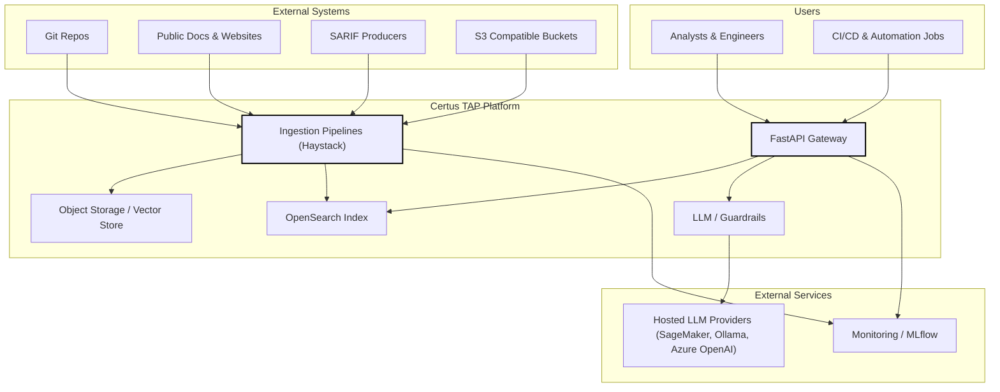
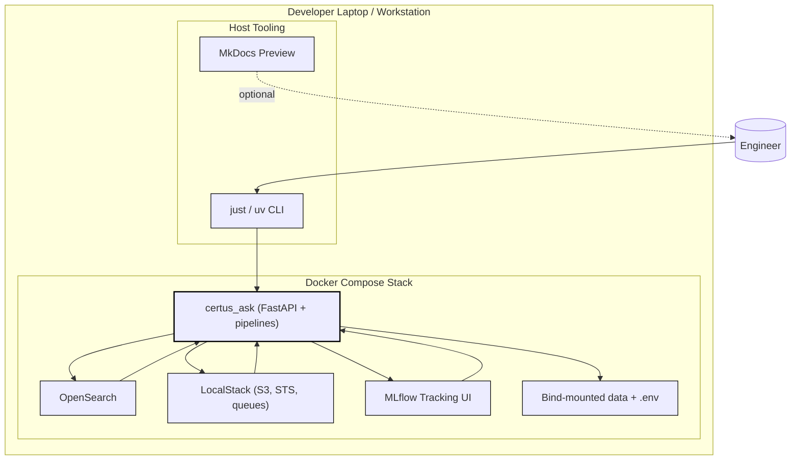
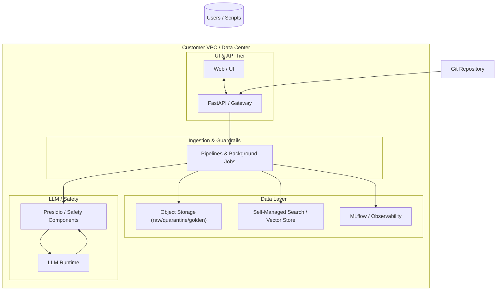
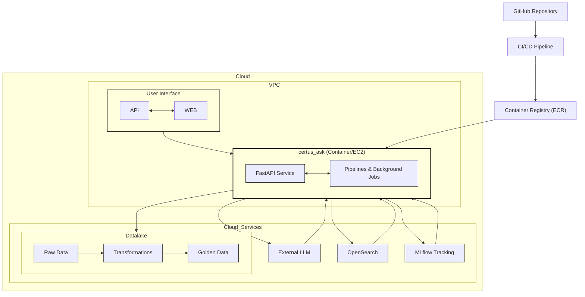
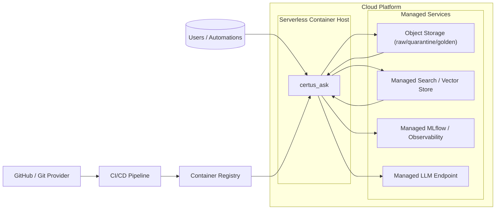
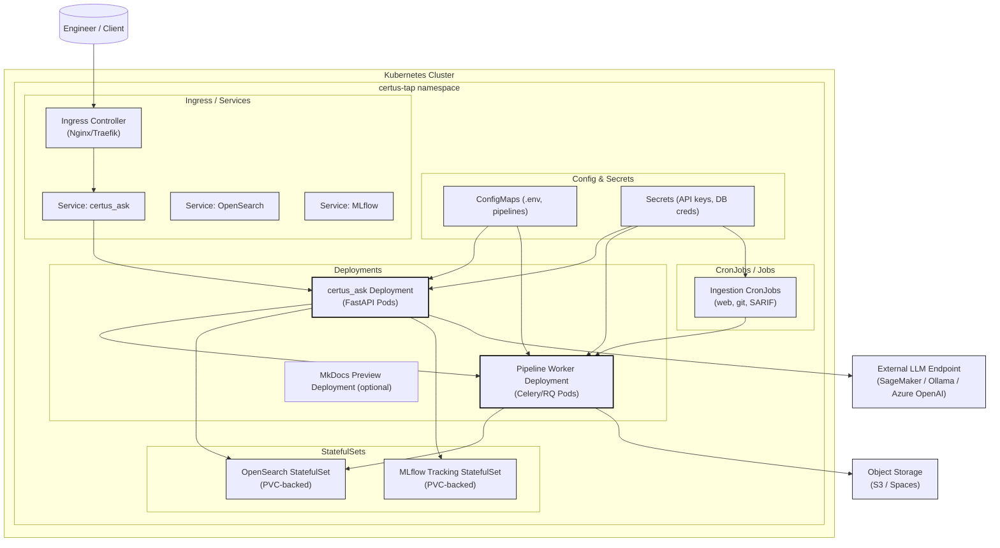
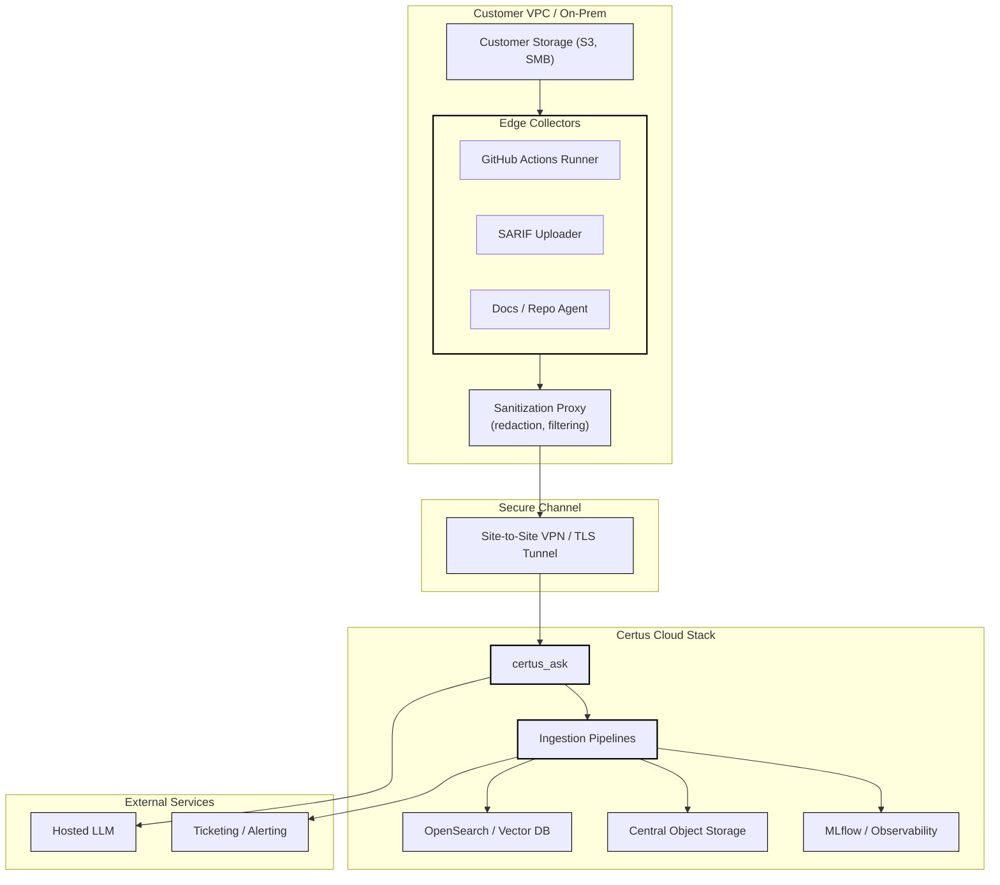

# Deployment

High-level deployment context tying users, pipelines, and observability targets before diving into concrete environments. We will aim to support the deployment of the TAP platforms with these deployment approaches.

## TAP Platform

| Name                          | Description                                                   |
| ----------------------------- | ------------------------------------------------------------- |
| Analysts & Engineers          | Primary users of TAP APIs and UI surfaces.                 |
| CI/CD & Automation Jobs       | Scheduled workflows triggering ingestion or evaluation tasks. |
| GitHub / GitLab Repos         | Code and docs repositories feeding the pipelines.             |
| Public Docs & Websites        | Open web sources used for crawling.                           |
| SARIF Producers               | Security tool outputs being ingested.                         |
| S3 Compatible Buckets         | External storage delivering documents or receiving exports.   |
| FastAPI Gateway               | certus_ask entry point.                                       |
| Ingestion Pipelines           | Haystack-based document processing stages.                    |
| OpenSearch Index              | Primary vector/metadata store.                                |
| Object Storage / Vector Store | Long-lived storage for raw/processed data.                    |
| LLM / Guardrails              | Prompt orchestration plus safety layers.                      |
| Hosted LLM Providers          | External LLM endpoints (SageMaker/Ollama/Azure).              |
| Monitoring / MLflow           | Observability sinks for pipelines and models.                 |

## Local / Self-Contained Deployment

Developer-focused Docker Compose stack running entirely on a workstation for offline testing.

| Name               | Description                                     |
| ------------------ | ----------------------------------------------- |
| just / uv CLI      | Local tooling to orchestrate syncs and scripts. |
| MkDocs Preview     | Docs live-reload service for writers.           |
| certus_ask         | FastAPI + pipelines container.                  |
| OpenSearch         | Local search engine container.                  |
| LocalStack         | AWS emulator providing S3/STS/queues.           |
| MLflow Tracking UI | Local experiment tracking service.              |
| Bind-mounted data  | Shared volumes for .env and artifacts.          |

## Self-Managed / Single VPC Deployment (no managed services)

All services run inside a single VPC (e.g., EC2 instances or a small Kubernetes cluster) with the customer responsible for every component.

| Name                        | Description                                               |
| --------------------------- | --------------------------------------------------------- |
| Web / UI                    | Customer-managed UI surface inside the VPC.               |
| FastAPI / Gateway           | certus_ask serving ingestion/query APIs.                  |
| Pipelines & Background Jobs | Haystack pipelines plus scheduled ingestion tasks.        |
| Object Storage              | Raw/quarantine/golden layers on customer-managed storage. |
| Self-Managed Search         | Customer-managed OpenSearch / vector database.            |
| MLflow / Observability      | Local telemetry and experiment tracking stack.            |
| LLM Runtime / Guardrails    | Customer-managed LLM plus Presidio-based safety layer.    |

## Cloud Deployment (with managed services)

Reference deployment for AWS accounts, using native services for storage, search, and model endpoints.

| Name                              | Description                                    |
| --------------------------------- | ---------------------------------------------- |
| User Interface                    | Web/UI tier inside VPC accessing backend APIs. |
| certus_ask                        | EC2/Container running FastAPI and pipelines.   |
| Datalake on S3 Compatible Service | Raw/processed buckets plus Glue transforms.    |
| OpenSearch                        | Managed search cluster for embeddings.         |
| MLflow Tracking                   | Experiment tracking service (EC2/ECS).         |
| Managed/External LLM              | Managed LLM/embedding endpoints.               |

## Serverless Container Deployment

Generic view of a TAP deployment on a serverless container platform (Cloud Run, Azure Container Apps, AWS App Runner, etc.).

| Name                           | Description                                          |
| ------------------------------ | ---------------------------------------------------- |
| GitHub / Git Provider          | Source control feeding the CI/CD pipeline.           |
| CI/CD Pipeline                 | Builds and deploys container images.                 |
| Container Registry             | Stores built images (e.g., Artifact Registry/ECR).   |
| Serverless Container Host      | Executes the backend/pipelines as a managed service. |
| Object Storage                 | Raw/quarantine/golden data and artifacts.            |
| Managed Search / Vector Store  | Stores embeddings and metadata.                      |
| Managed MLflow / Observability | Captures experiment metrics and service telemetry.   |
| Managed LLM Endpoint           | External LLM used for inference/guardrails.          |

## Kubernetes Deployment

Generic Kubernetes topology (self-managed or cloud) detailing Deployments, StatefulSets, and supporting resources.

| Name                             | Description                                   |
| -------------------------------- | --------------------------------------------- |
| certus_ask Deployment            | Stateless FastAPI pods serving APIs.          |
| Pipeline Worker Deployment       | Workers handling ingestion/ETL tasks.         |
| StatefulSets (OpenSearch/MLflow) | Persistent workloads backed by PVCs.          |
| CronJobs                         | Scheduled ingestion runs (web/git/SARIF).     |
| ConfigMaps / Secrets             | Runtime configuration and credentials.        |
| Ingress Controller               | Exposes services to external clients.         |
| Services                         | Stable endpoints for API, OpenSearch, MLflow. |
| External LLM Endpoint            | Off-cluster LLM provider.                     |
| Object Storage                   | S3/Spaces buckets accessed by workers.        |

## Hybrid Ingestion (Edge + Cloud)

Edge collectors inside customer environments sanitize data before tunneling it into the central Certus cloud stack.

| Name                          | Description                                                 |
| ----------------------------- | ----------------------------------------------------------- |
| Edge Collectors               | Customer-hosted runners pulling data from internal systems. |
| Sanitization Proxy            | Redaction/filtering layer before data leaves VPC.           |
| Site-to-Site VPN / TLS Tunnel | Secure channel between customer and Certus cloud.           |
| certus_ask                    | Central ingest API receiving sanitized payloads.            |
| Ingestion Pipelines           | Normalize and load artifacts into storage/search.           |
| OpenSearch / Vector DB        | Core retrieval store in the Certus cloud.                   |
| Central Object Storage        | Holds raw and processed documents.                          |
| MLflow / Observability        | Monitors ingestion and model health.                        |
| Hosted LLM                    | Downstream generation endpoint.                             |
| Ticketing / Alerting          | Systems receiving findings or alerts.                       |
