# Security

Defense-in-depth overview of how Certus TAP handles requests, secrets, and classified data across trust boundaries.

### Data Flow Diagram (DFD)


| Element                          | Security Notes                                                                                    |
| -------------------------------- | ------------------------------------------------------------------------------------------------- |
| User                             | Auth via API tokens is optional today; most dev flows run locally.                                |
| FastAPI Application              | Performs validation, logging, and error handling in a single container.                           |
| S3-Compatible Layer (LocalStack) | Local-only S3 emulator secured by Docker networking; no AWS credentials are required.             |
| OpenSearch                       | Runs without the security plugin in dev; restrict access via network/firewall rules when exposed. |
| Neo4j / MLflow                   | Optional services; reuse Docker network isolation.                                                |
| Ollama                           | Local model runtime bound to localhost/compose network.                                           |

### Network Trust Boundaries

The developer stack runs entirely on a Docker bridge network. Exposing services beyond the host requires explicit port publishing; keep them bound to localhost when possible.

| Component                        | Security Notes                                                                                 |
| -------------------------------- | ---------------------------------------------------------------------------------------------- |
| Docker bridge network            | Isolates containers; only mapped ports are reachable from the host OS.                         |
| FastAPI container                | Publishes `8000` for API access; secure with `AUTH_TOKEN` middleware if needed.                |
| OpenSearch container             | Ships without auth; do not expose beyond localhost unless security plugin is on.               |
| S3-Compatible Layer (LocalStack) | Accessed via `AWS_ACCESS_KEY_ID`/`AWS_SECRET_ACCESS_KEY` from `.env`; use unique keys per dev. |
| Ollama                           | Bind to loopback and restrict to trusted callers.                                              |

### Ingestion Sequence (Security Controls)

```mermaid
sequenceDiagram
    participant U as User / Automation
    participant API as FastAPI Router
    participant Pipe as Ingestion Pipeline
    participant S3 as S3-Compatible Layer
    participant OS as OpenSearch
    participant Audit as Audit Log Stream

    U->>API: POST /v1/{workspace}/index/…
    API->>API: Schema validation + request id
    API->>Pipe: Run preprocessing steps
    Pipe->>S3: Optional privacy/quarantine uploads
    Pipe->>OS: Write vectors + metadata
    Pipe->>Audit: Structured audit event
    API-->>U: 202 Accepted + job id
```



Each hop enforces transport encryption, explicit IAM policies, and audit trails so that even compromised components cannot access downstream systems without their role-specific credentials.

| Component           | Security Notes                                                                        |
| ------------------- | ------------------------------------------------------------------------------------- |
| User / Automation   | Supply auth headers if you enable them; otherwise restrict access to trusted hosts.   |
| FastAPI Router      | Validates schemas, enforces size limits, and tags logs with request ids.              |
| Ingestion Pipeline  | Runs synchronously inside the FastAPI worker; failures bubble directly to the client. |
| S3-Compatible Layer | Stores raw payloads; default LocalStack volume is developer-owned.                    |
| Pipeline Processors | Apply the Presidio anonymizer when enabled.                                           |
| OpenSearch          | Receives only processed embeddings; one index per workspace by convention.            |
| Audit Log Stream    | Structlog output tagged with request ids for later correlation.                       |

### Secrets Management Flow

The dev stack reads configuration from `.env`. Use filesystem permissions (`chmod 600 .env`) to keep secrets private. If you need stronger isolation, set environment variables at runtime instead of checking `.env` into source control.

### Monitoring & Incident Response

```mermaid
graph TD
    Services[FastAPI + Pipelines] --> Logs[Structlog]
    Services --> Metrics[Prometheus-style Metrics]
    Services --> Traces[OTel (optional)]
    Logs --> Console[Console Output]
    Metrics --> Grafana
```

| Component     | Security Notes                                                          |
| ------------- | ----------------------------------------------------------------------- |
| Structlog     | Includes request ids, error codes, and context for later correlation.   |
| Metrics       | `get_query_metrics` / `get_ingestion_metrics` feed Prometheus scrapers. |
| OpenTelemetry | Optional; configured via `certus_integrity.telemetry`.                  |
| Grafana       | Reads from VictoriaMetrics; runs on the same Docker network.            |

### Data Classification Lifecycle

Developers are responsible for deciding which files can be indexed locally. There is no automatic classification in the current stack; treat the LocalStack S3 volume and OpenSearch index as sensitive if you ingest private data.
