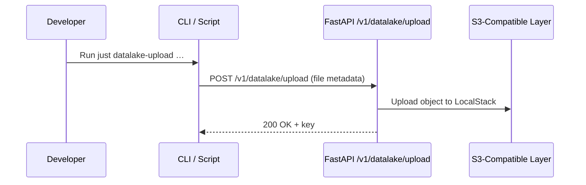
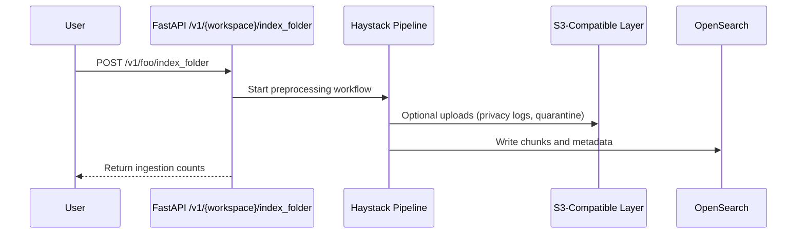
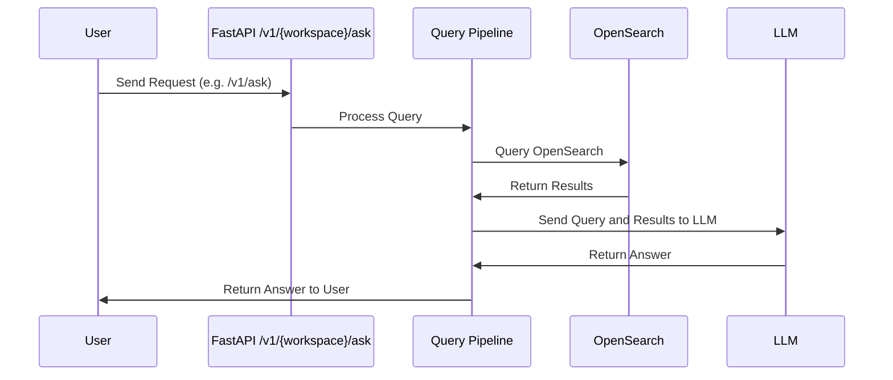
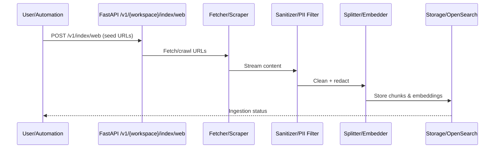
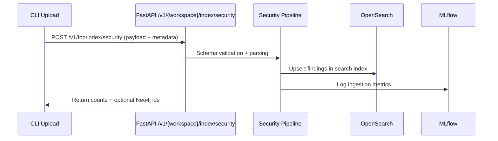
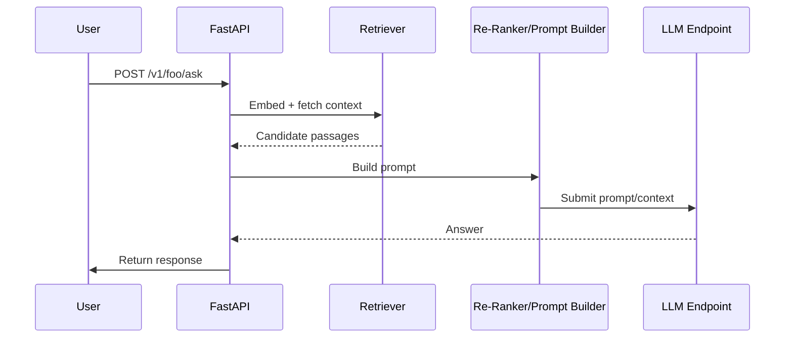
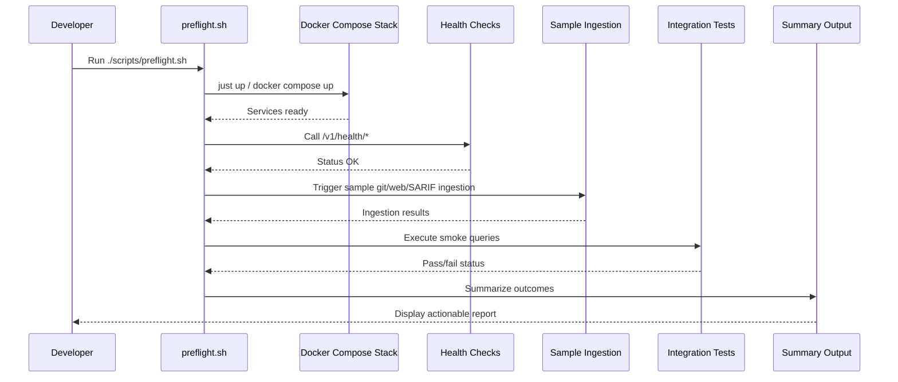

# Sequence Diagrams

End-to-end flow references for common TAP interactions—use these to reason about touchpoints, guardrails, and hand-offs before updating pipelines or deployments.

## Store Documents in the S3-Compatible Layer

| Participant         | Description                                               |
| ------------------- | --------------------------------------------------------- |
| Developer / CLI     | Invokes the helper endpoints locally.                     |
| FastAPI             | Validates payloads and streams bytes.                     |
| S3-Compatible Layer | LocalStack S3 endpoint storing raw and processed objects. |

## Bulk Index of Documents (single process)

| Participant         | Description                                              |
| ------------------- | -------------------------------------------------------- |
| User                | Person or automation initiating ingestion.               |
| FastAPI             | certus*ask handling `/v1/{workspace}/index*\*` requests. |
| Haystack Pipeline   | Runs inside the same process; no background workers.     |
| S3-Compatible Layer | Optional persistence for raw/quarantined artifacts.      |
| OpenSearch          | Target store for embeddings + metadata.                  |

#### Simple Query

The Query function in the included application is very simple. More robust query capabilities will be built as a seperate service in the future.

| Participant    | Description                                        |
| -------------- | -------------------------------------------------- |
| User           | Issues a question via UI or API.                   |
| FastAPI        | Routes query to the retrieval pipeline.            |
| Query Pipeline | Embeds question, runs retrieval, orchestrates LLM. |
| OpenSearch     | Returns relevant context chunks.                   |
| LLM            | Generates final natural-language response.         |

## Web or Git Ingestion with Guardrails

Illustrates how `/v1/index/web` or Git ingestion respects robots.txt, rate limits, and sanitization before persisting data.

| Participant          | Description                                          |
| -------------------- | ---------------------------------------------------- |
| User/Automation      | Triggers ingestion (manual or scheduled).            |
| FastAPI              | Validates the request and builds the Haystack graph. |
| Fetcher/Scraper      | Downloads content, handles git clone or HTTP fetch.  |
| Sanitizer/PII Filter | Removes secrets, PII, or disallowed text.            |
| Splitter/Embedder    | Chunks content and produces embeddings.              |
| Storage/OpenSearch   | Persists processed content for retrieval.            |

## SARIF Upload to Ticketing

Edge collectors push SARIF files, which are normalized, indexed, and used to raise tickets or alerts.

| Participant       | Description                                                |
| ----------------- | ---------------------------------------------------------- |
| CLI Upload        | Script or automation posting SARIF/SPDX payloads.          |
| FastAPI           | Validates request and routes to the SARIF/SPDX pipeline.   |
| Security Pipeline | Parses SARIF/SPDX, enriches metadata, handles Neo4j hooks. |
| OpenSearch        | Stores normalized findings for search/analytics.           |
| MLflow            | Captures ingestion metrics for observability.              |

## Guarded Query & LLM Selection

Extended query flow showing policy checks, guardrails, multi-LLM routing, and observability taps.

| Participant              | Description                                         |
| ------------------------ | --------------------------------------------------- |
| User                     | Initiates the question.                             |
| FastAPI                  | Coordinates the whole RAG call chain.               |
| Retriever                | Embeds question and fetches relevant context.       |
| Re-Ranker/Prompt Builder | Orders snippets, prepares final prompt.             |
| LLM Endpoint             | Executes completion/generation (Ollama by default). |

## Preflight & Health Automation

Shows how `./scripts/preflight.sh` orchestrates stack startup, sample ingestion, and verification before commits.

| Participant          | Description                                             |
| -------------------- | ------------------------------------------------------- |
| Developer            | Engineer preparing a change or verifying the stack.     |
| preflight.sh         | Automation script orchestrating the workflow.           |
| Docker Compose Stack | Local services (backend, OpenSearch, LocalStack, etc.). |
| Health Checks        | `/v1/health/*` endpoints ensuring readiness.            |
| Sample Ingestion     | Representative ingestion tasks run during preflight.    |
| Integration Tests    | Smoke queries validating retriever/LLM path.            |
| Summary Output       | Final pass/fail report shown to the developer.          |
