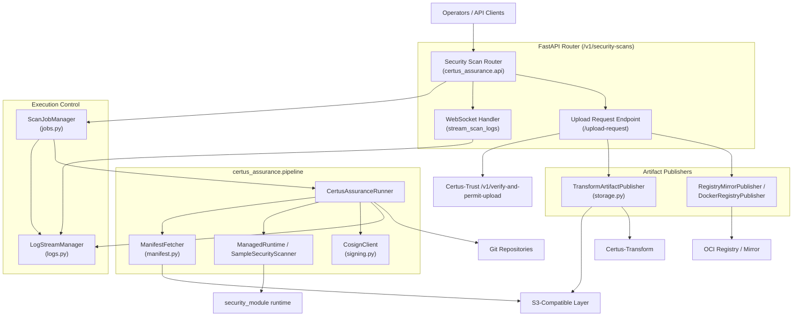

# Component View (C4 Level 3)

This view breaks down the Certus-Assurance FastAPI service into the components that orchestrate scans, manage manifests, and publish verified bundles.

| Component                              | Responsibilities                                                                                                                                                           |
| -------------------------------------- | -------------------------------------------------------------------------------------------------------------------------------------------------------------------------- |
| Security Scan Router                   | Implements `/v1/security-scans` POST/GET plus dependency wiring (settings, runner, publishers). Validates manifests, schedules jobs, and exposes stream URLs.              |
| WebSocket Handler                      | Bridges `LogStreamManager` histories and live events to clients so they can follow the pipeline without polling.                                                           |
| Upload Request Endpoint                | Builds Trust `UploadRequest` payloads from stored artifacts, calls `_submit_upload_request`, and invokes publishers when permission is granted.                            |
| ScanJobManager                         | ThreadPool-backed controller that tracks job lifecycle, persists metadata in-memory, and exposes status queries.                                                           |
| LogStreamManager                       | Allocates `LogStream` queues per scan, buffers history for late subscribers, and brokers runner emissions to WebSocket clients.                                            |
| CertusAssuranceRunner                  | Clones repositories, resolves manifests (inline, repo path, S3, or OCI), executes the security module runtime or sample scanner, and composes artifact bundles + metadata. |
| ManifestFetcher                        | Downloads manifests/signatures from the caller’s preferred location (local path, S3, OCI image) before handing them to the runner for verification.                        |
| ManagedRuntime / SampleSecurityScanner | Either executes the shared `security_module` runtime or the built-in sample scanner when ManagedRuntime is unavailable.                                                    |
| CosignClient                           | Wraps the cosign CLI for blob signing, attestation, and manifest verification. Used for both registry pushes and manifest validation.                                      |
| TransformArtifactPublisher             | Implements the raw→golden promotion workflow over the configured S3-compatible layer so downstream services ingest consistent bundles.                                     |
| Registry Publishers                    | Either mirror reports to a local filesystem (development) or build/push minimalist OCI images, optionally signing with cosign.                                             |
| Certus-Trust Integration               | `_submit_upload_request` contacts `/v1/verify-and-permit-upload` before anything leaves the host, ensuring only verified runs are published.                               |
