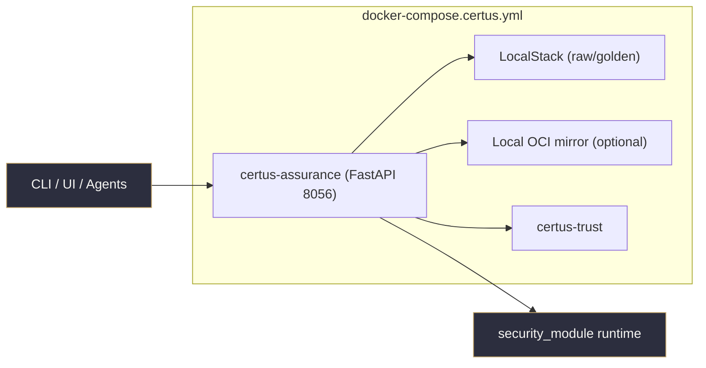
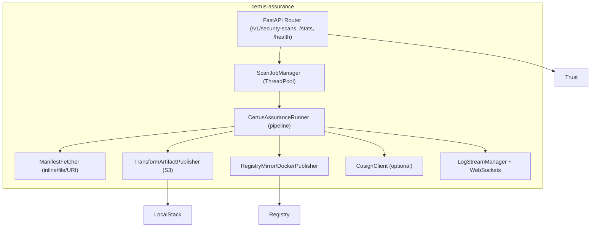

# Container View

## Runtime Components

| Component                  | Responsibilities                                                                          |
| -------------------------- | ----------------------------------------------------------------------------------------- |
| FastAPI Router             | Exposes scan submission, status, WebSocket streams, upload requests, and stats endpoints. |
| ScanJobManager             | Queues scans in a thread pool and tracks status/metadata.                                 |
| CertusAssuranceRunner      | Clones repos, loads manifests, runs security_module scanners, bundles artifacts.          |
| ManifestFetcher            | Resolves manifests from inline JSON, repo paths, or URIs (S3/OCI).                        |
| TransformArtifactPublisher | Uploads bundles to raw → golden S3 buckets with metadata, ready for Transform ingestion.  |
| Registry Publishers        | Either mirror artifacts to disk or push tiny OCI images signed via cosign.                |
| LogStreamManager           | Keeps per-scan log history and streams events over WebSockets.                            |
| Cosign Client              | Optional signing of manifests/bundles prior to registry publication.                      |
| Certus-Trust               | Receives upload request payloads and returns permission + verification proof.             |
