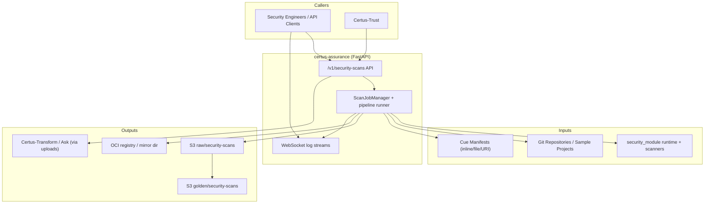

# Context

Certus-Assurance orchestrates repository scanning, manifest verification, artifact bundling, and publication to downstream storage (S3 + OCI). It also streams live logs to callers and requests upload permissions from Certus-Trust.

| Actor / System          | Description                                                                                                   |
| ----------------------- | ------------------------------------------------------------------------------------------------------------- |
| Security Engineers      | Submit scans, monitor WebSocket logs, trigger upload requests, download status.                               |
| Certus-Trust            | Accepts upload requests (`/upload-request`), verifies signatures, and grants permission to publish artifacts. |
| Git Repositories        | Source code scanned by the security_module runtime.                                                           |
| Cue Manifests           | Policies that describe what scanners/profiles to run and how to package results.                              |
| security_module runtime | Optional managed runtime that executes scanners; sample mode is used when not installed.                      |
| ScanJobManager / API    | FastAPI endpoints, job queue, streaming logs, stats endpoints.                                                |
| S3 raw/golden buckets   | Stage + promoted artifacts (sarif, metadata, provenance) for later ingestion by Transform/Ask.                |
| OCI registry / mirror   | Optional push of attestation bundle so consumers can pull via container tooling.                              |
| Certus-Transform / Ask  | Downstream ingestion once Trust permits uploads and Transform copies the bundles into golden storage.         |
