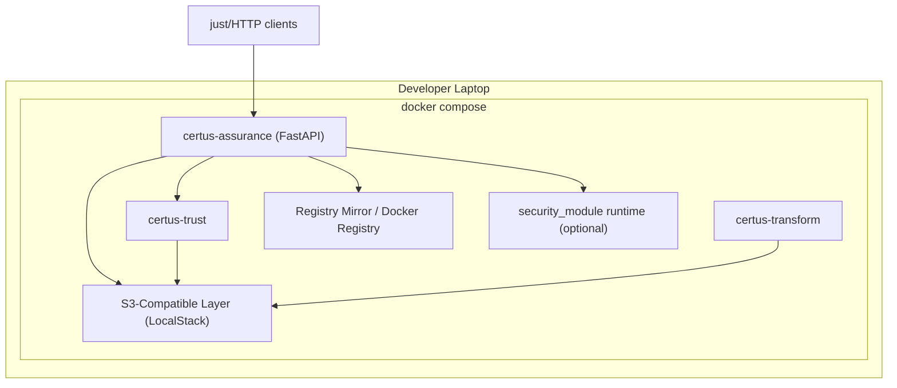
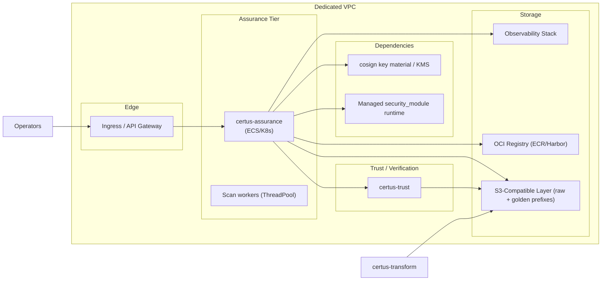

# Deployment

Certus-Assurance is typically co-located with Certus-Trust and Certus-Transform so scans can be verified and published without leaving the trusted network. The service can run entirely in Docker Compose for development or as a hardened workload (ECS/Kubernetes) in production.

## Local / Compose Stack

| Service                           | Notes                                                                                                                                       |
| --------------------------------- | ------------------------------------------------------------------------------------------------------------------------------------------- |
| certus-assurance                  | Built from `certus_assurance/Dockerfile`, exposes FastAPI on `8056` (mapped to `:8000` inside). Volume-mounts the repo for rapid iteration. |
| certus-trust                      | Provides `/v1/verify-and-permit-upload` and mock Sigstore services so upload gating behaves the same as production.                         |
| certus-transform                  | Consumes verified bundles from the golden bucket; useful when testing the full ingestion chain.                                             |
| S3-Compatible Layer               | Backed by LocalStack buckets defined by `CERTUS_ASSURANCE_DATALAKE_*` settings. Both Assurance and Transform point at the same endpoint.    |
| Registry Mirror / Docker Registry | Optional container that accepts pushes from the registry publisher. Developers can inspect attestation images locally.                      |
| security_module runtime           | Optional container that provides the managed scanner runtime. When absent, the runner drops into `SampleSecurityScanner`.                   |

## Production Blueprint

Deployment considerations:

- **Networking:** Expose FastAPI through a private ALB/API Gateway; only DevSecOps automation or authenticated CLI users should reach `/v1/security-scans`.
- **Secrets & Cosign:** Inject cosign keys/signing passwords via the orchestrator’s secret manager (AWS Secrets Manager, KMS, Vault). Never bake them inside the container image.
- **Manifest Verification:** Enable `CERTUS_ASSURANCE_MANIFEST_VERIFICATION_REQUIRED=true` when manifests must be signed before execution. Store the verification key reference in HSM/KMS.
- **Scaling:** `ScanJobManager` uses a Python `ThreadPoolExecutor`. For heavy workloads deploy multiple pods/tasks behind the ALB, each with its own worker pool and artifact volume.
- **Storage Paths:** Mount a writable volume for `CERTUS_ASSURANCE_ARTIFACT_ROOT`; rotate and prune bundles regularly or ship them to object storage after uploads succeed.
- **Observability:** Forward structured logs (scan_id, workspace_id, manifest_digest) to the organization’s SIEM and monitor WebSocket error rates.
