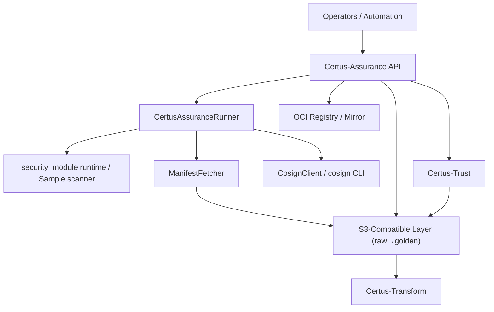
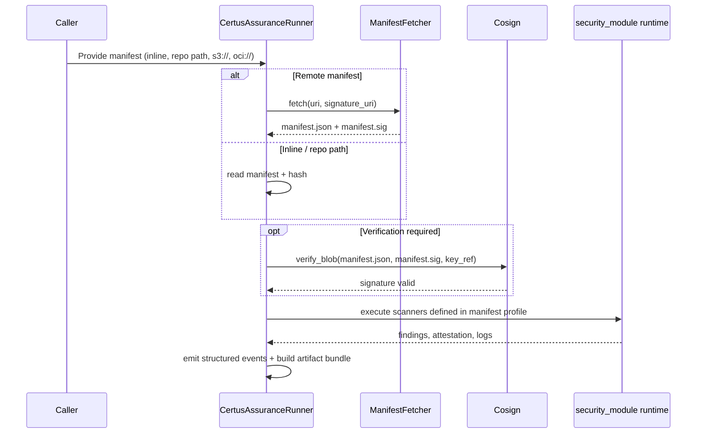
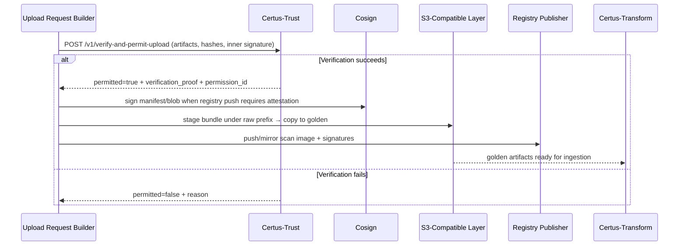

# Security

Certus-Assurance is the entry point for untrusted repositories and manifests, so the service enforces verification before executing scanners or uploading anything to shared storage. The diagrams below call out the trust boundaries and the controls that harden each hop.

## Data Flow & Trust Boundaries

Trust boundaries:

- **Caller → API:** Authenticated HTTP (for automation) plus WebSocket streaming. Payload validation ensures one manifest source is provided.
- **Runner → External Inputs:** Repository clones, manifest downloads, and optional runtime execution are sandboxed under the artifact root with per-run directories.
- **Assurance → Trust:** Uploads never leave the host until `/v1/verify-and-permit-upload` returns `permitted=true`.
- **Publishing → Storage:** The `TransformArtifactPublisher` writes to raw prefixes first, then promotes to golden buckets within the S3-compatible layer.

## Manifest Verification & Execution

Controls:

- `manifest_verification_required` enforces cosign verification before the runtime executes.
- The runner keeps manifests, logs, and bundles under a per-test folder, preventing cross-run contamination.
- When `security_module.runtime` is unavailable the `SampleSecurityScanner` runs against canned inputs so secrets are never fetched.

## Upload Gating & Publication

Controls:

- Upload permissions include the manifest digest, git metadata, and signer identity. They are stored with the job record for downstream auditing.
- `TransformArtifactPublisher` copies files inside the S3 endpoint so data never traverses the public internet.
- Registry pushes can be routed through cosign for image and manifest signatures; credentials are injected at runtime and not stored on disk.
- WebSocket streams append `scan_complete` with the manifest digest so clients can confirm they are referencing the verified bundle.

## Residual Risks & Work in Progress

- Artifact storage currently resides on the same node that runs the FastAPI process. Harden this directory with disk encryption and prune old bundles automatically.
- Authentication/authorization middleware is still in progress; today’s dev builds rely on network isolation. Production deployments must enforce OIDC tokens or per-tenant API keys.
- The upload workflow retries LocalStack/S3 failures but not registry pushes; add exponential backoff before widening access.
- Managed runtime execution assumes the scanners themselves are safe. Consider sandboxing (Firecracker, containerized workers) when executing arbitrary manifests.
