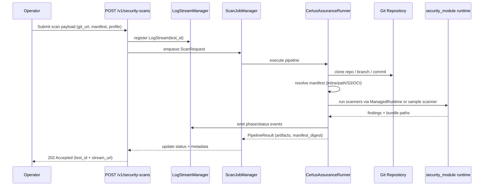
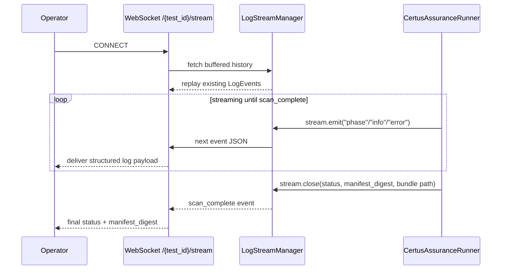
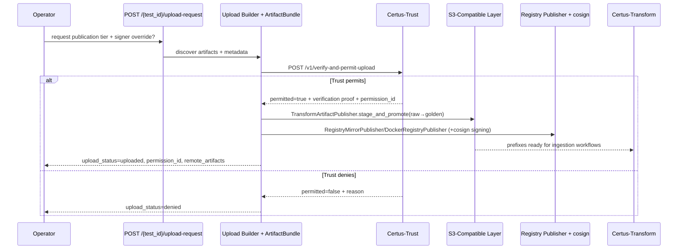

# Sequence Diagrams

## Scan Submission & Execution

```mermaid
sequenceDiagram
    participant Operator
    participant API as POST /v1/security-scans
    participant Logs as LogStreamManager
    participant Jobs as ScanJobManager
    participant Runner as CertusAssuranceRunner
    participant Git as Git Repository
    participant Runtime as security_module runtime

    Operator->>API: Submit scan payload (git_url, manifest, profile)
    API->>Logs: register LogStream(test_id)
    API->>Jobs: enqueue ScanRequest
    Jobs->>Runner: execute pipeline
    Runner->>Git: clone repo / branch / commit
    Runner->>Runner: resolve manifest (inline/path/S3/OCI)
    Runner->>Runtime: run scanners via ManagedRuntime or sample scanner
    Runtime-->>Runner: findings + bundle paths
    Runner->>Logs: emit phase/status events
    Runner-->>Jobs: PipelineResult (artifacts, manifest_digest)
    Jobs-->>API: update status + metadata
    API-->>Operator: 202 Accepted (test_id + stream_url)
```

## Live Log Streaming

```mermaid
sequenceDiagram
    participant Operator
    participant WS as WebSocket /{test_id}/stream
    participant Logs as LogStreamManager
    participant Runner as CertusAssuranceRunner

    Operator->>WS: CONNECT
    WS->>Logs: fetch buffered history
    Logs-->>WS: replay existing LogEvents
    loop streaming until scan_complete
        Runner->>Logs: stream.emit("phase"/"info"/"error")
        Logs->>WS: next event JSON
        WS-->>Operator: deliver structured log payload
    end
    Runner->>Logs: stream.close(status, manifest_digest, bundle path)
    Logs-->>WS: scan_complete event
    WS-->>Operator: final status + manifest_digest
```

## Upload Request & Publishing

```mermaid
sequenceDiagram
    participant Operator
    participant Upload as POST /{test_id}/upload-request
    participant Builder as Upload Builder + ArtifactBundle
    participant Trust as Certus-Trust
    participant S3 as S3-Compatible Layer
    participant Registry as Registry Publisher + cosign
    participant Transform as Certus-Transform

    Operator->>Upload: request publication tier + signer override?
    Upload->>Builder: discover artifacts + metadata
    Builder->>Trust: POST /v1/verify-and-permit-upload
    alt Trust permits
        Trust-->>Builder: permitted=true + verification proof + permission_id
        Builder->>S3: TransformArtifactPublisher.stage_and_promote(raw→golden)
        Builder->>Registry: RegistryMirrorPublisher/DockerRegistryPublisher (+cosign signing)
        S3-->>Transform: prefixes ready for ingestion workflows
        Builder-->>Operator: upload_status=uploaded, permission_id, remote_artifacts
    else Trust denies
        Trust-->>Builder: permitted=false + reason
        Builder-->>Operator: upload_status=denied
    end
```
