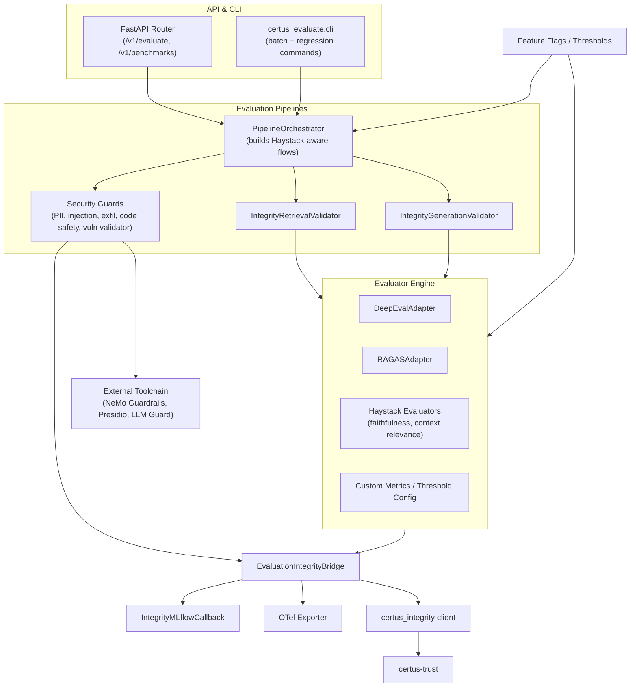

# Component View (C4 Level 3)

| Component                  | Responsibilities                                                                                                     |
| -------------------------- | -------------------------------------------------------------------------------------------------------------------- |
| FastAPI Router             | Receives evaluation requests, toggles shadow/enforce modes, and streams quality results back to callers.             |
| CLI                        | Provides regression, benchmarking, and compare commands for CI/CD and local experiments.                             |
| Pipeline Orchestrator      | Wraps existing Haystack pipelines with validators, handles request fan-out to retrieval/generation evaluators.       |
| IntegrityRetrievalValidator| Verifies retrieval quality (count, score, diversity) and emits integrity evidence in shadow or blocking mode.        |
| IntegrityGenerationValidator| Runs DeepEval, RAGAS, and Haystack evaluators on model outputs, enforcing thresholds before responses exit.         |
| Security Guards            | Apply prompt injection detection, PII leakage scanning (Presidio), code safety checks (Bandit/Semgrep), exfil detection, and vulnerability hallucination controls. |
| DeepEval / RAGAS Adapters  | Normalize responses for each framework, aggregate scores, and report metrics to the bridge.                          |
| Custom Metrics / Config    | Define threshold profiles per workspace, workspace-tier, or environment; support `shadow_mode` toggles.              |
| EvaluationIntegrityBridge  | Builds `IntegrityDecision` payloads and routes them to `certus_integrity` while returning evidence IDs to callers.   |
| IntegrityMLflowCallback    | Logs metrics, parameters, and artifacts (evidence bundles, manifest digests) under the active experiment/run.        |
| Telemetry Exporter         | Emits spans (`evaluation.retrieval`, `evaluation.ragas`, etc.) and attaches decisions, scores, and evidence IDs.     |
| certus_integrity client    | Thin HTTP client for posting decisions, retrieving signing status, and surfacing errors to the API.                  |
| certus-trust               | Signs evidence bundles via `/v1/verify-and-permit-upload` semantics reused from the assurance workflow.              |
