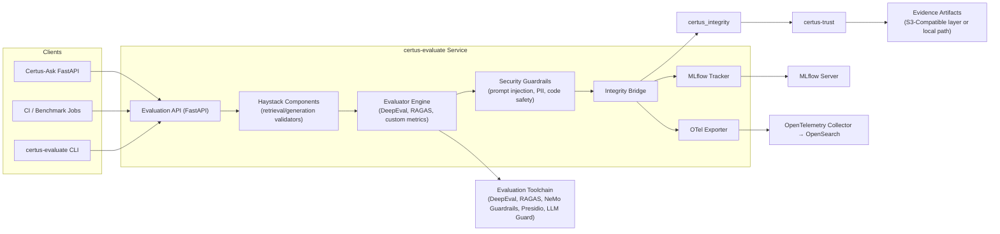

# Container View (C4 Level 2)

| Container              | Responsibilities                                                                                           |
| ---------------------- | ---------------------------------------------------------------------------------------------------------- |
| Evaluation API         | FastAPI surface and CLI entry point that accept prompt/response/context payloads or wrap Haystack pipelines. |
| Haystack Components    | `IntegrityRetrievalValidator`, `IntegrityGenerationValidator`, `PIIGuard`, etc., that slot into existing DAGs. |
| Evaluator Engine       | Runs DeepEval, RAGAS, Haystack evaluators, and bespoke quality metrics with configurable thresholds.        |
| Guardrail Suite        | Executes security/privacy validators (prompt injection, PII, code safety, exfiltration, vuln hallucination). |
| Evidence Bridge        | Converts evaluation outputs into `IntegrityDecision` objects and posts them to `certus_integrity`.         |
| MLflow Tracker         | Logs metrics, params, and artifacts (including evidence IDs) to MLflow experiments for reproducibility.    |
| Telemetry Exporter     | Emits OpenTelemetry spans/metrics so operators can monitor pass/fail rates and anomalies in OpenSearch.     |
| Evaluation Toolchain   | External dependencies: DeepEval, RAGAS, Haystack, Microsoft Presidio, NeMo Guardrails, LLM Guard, etc.     |
| certus_integrity/trust | Sign decisions, enforce global guardrails, and coordinate storage in the S3-compatible evidence layer.     |
