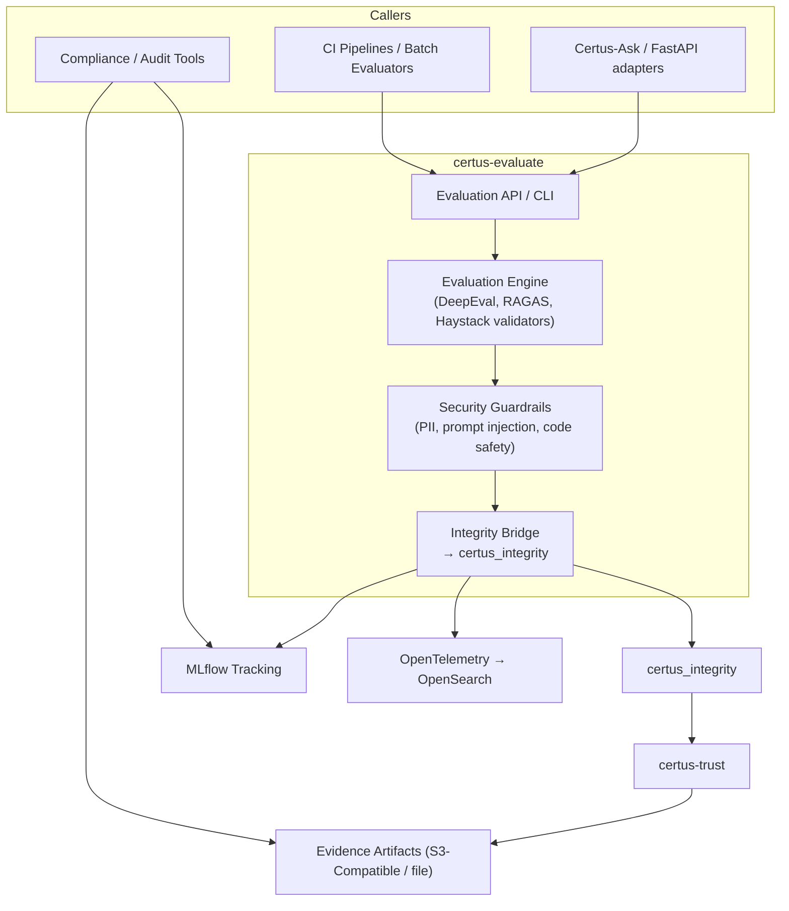

# Context

Certus-Evaluate is the quality gate for every RAG workflow inside Certus TAP. It receives prompts, responses, and retrieval context from Certus-Ask or CI pipelines, runs multi-framework evaluations (DeepEval, RAGAS, Haystack evaluators, guardrail libraries), and emits cryptographically verifiable evidence through `certus_integrity` + `certus_trust`. The service ensures that every answer, experiment, or regression test has measurable quality scores, signed artifacts, and observability hooks.

| Actor / System            | Description                                                                                               |
| ------------------------- | --------------------------------------------------------------------------------------------------------- |
| Certus-Ask / Adapters     | Call `/evaluate` endpoints or embed Haystack validators inline with RAG pipelines.                        |
| CI Pipelines / Batch Jobs | Run regression suites, A/B tests, or prompt experiments using the CLI wrapper.                           |
| Auditors                  | Consume signed evidence bundles via MLflow artifacts, OpenTelemetry traces, or S3-compatible storage.     |
| Evaluation Engine         | Executes DeepEval, RAGAS, Haystack evaluators, and custom security validators with configurable thresholds. |
| Guardrails                | Detect prompt injection, PII leakage, unsafe code, data exfiltration, and vulnerability hallucinations.   |
| Integrity Bridge          | Converts evaluation outcomes into `IntegrityDecision` objects and forwards them to `certus_integrity`.    |
| certus_integrity / trust  | Sign evidence, enforce global guardrails, and coordinate storage with Certus-Trust.                       |
| MLflow / Telemetry        | Store metrics, parameters, and OTel traces for dashboards, alerting, and post-mortem analysis.            |
