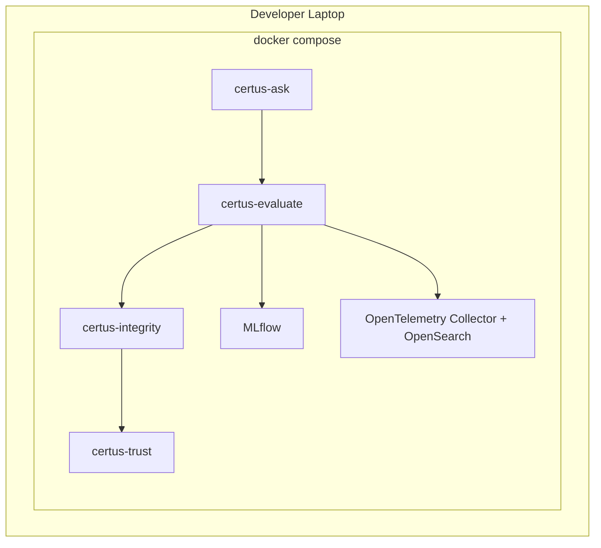
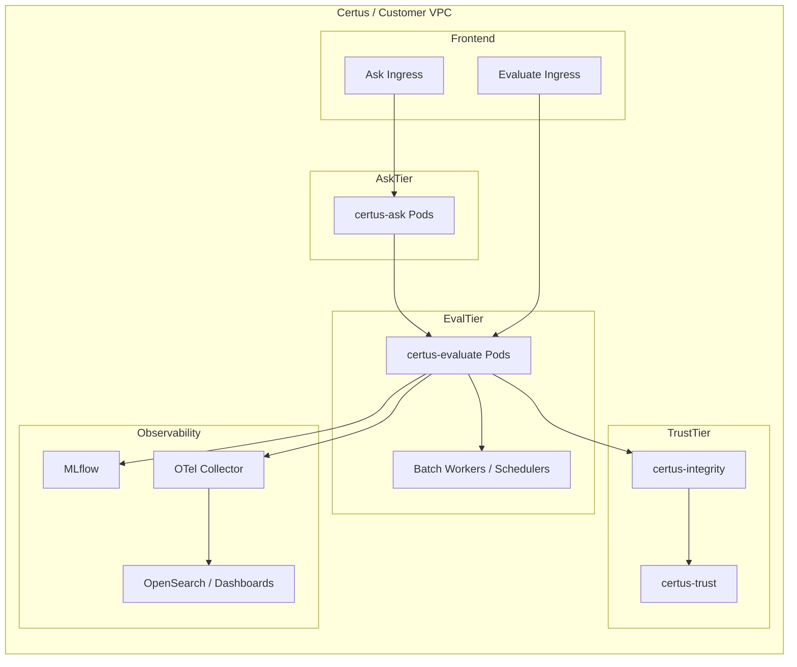

# Deployment

Certus-Evaluate runs alongside Certus-Ask during local development and scales independently in production so batch jobs, CI pipelines, and real-time guardrails can be evaluated without slowing down the question-answering service.

## Local / Compose Stack

| Service         | Notes                                                                                                  |
| --------------- | ------------------------------------------------------------------------------------------------------ |
| certus-evaluate | Runs FastAPI + CLI with DeepEval/RAGAS dependencies baked into the image; exposes port `8075`.         |
| certus-ask      | Sends evaluation payloads using an internal HTTP call or embedded Haystack validators.                 |
| certus-integrity| Shared service for signing evidence (mock Sigstore optional).                                          |
| certus-trust    | Provides real signing + upload permissions when `mock_sigstore=false`.                                 |
| MLflow          | Stores experiment metadata and evidence artifacts for reproducibility.                                 |
| OpenTelemetry   | Collector + OpenSearch index pass/fail metrics and guardrail alerts.                                   |

## Production Blueprint

Deployment considerations:

- **Scaling:** Evaluation loads can be bursty (batch regressions). Run certus-evaluate as an autoscaled deployment with a worker queue for long-running benchmarks, keeping latency-sensitive inline validations on separate pods.
- **Isolation:** Run DeepEval/RAGAS toolchains in dedicated containers with locked-down egress. The guardrail libraries sometimes shell out (e.g., Bandit, Semgrep); restrict filesystem access to temporary volumes.
- **Secrets:** Provide API keys (OpenAI, DeepEval, MLflow) via secret managers. Do not bake them into images.
- **GPU Optionality:** If certain evaluators leverage GPU acceleration, deploy a GPU-enabled node group and schedule the heavy workers there, while keeping inline validators on CPU nodes.
- **Caching:** Cache model checkpoints for DeepEval/RAGAS to avoid repeated downloads; mount read-only volumes shared across pods.
- **Observability:** Wire evaluation stats into the same alerting stack as Certus-Ask. Alert when pass rates drop or guardrail denials spike.
