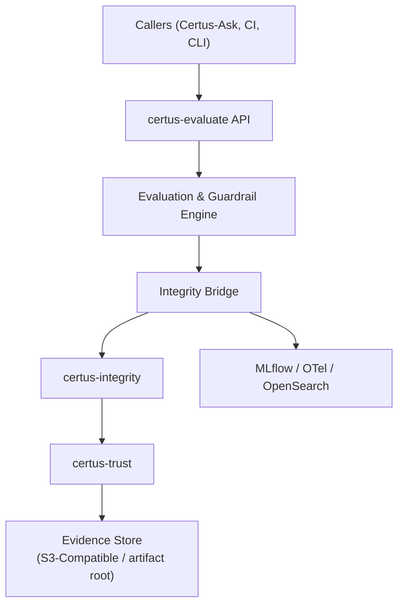

# Security

The evaluation service is itself a security control: it detects low-quality or malicious outputs before they impact operators, and it emits cryptographically signed evidence for every decision. This section highlights the trust boundaries and the controls enforced by certus-evaluate.

## Data Flow & Trust Boundaries

- **Caller Boundary:** Inputs (prompt, response, retrieval context) may be adversarial. Validators run in sandboxed workers with strict temp directories and network policies.
- **Guardrail Boundary:** Prompt injection, PII, code safety, data exfiltration, jailbreak, and vulnerability hallucination guards treat both queries and outputs as untrusted.
- **Evidence Boundary:** Only signed evidence IDs are returned to callers; raw artifacts stay in the S3-compatible evidence layer or MLflow artifacts with audit controls.

## Core Controls

1. **Prompt Injection Detection:** ML classifiers + regex patterns identify attempts to override system prompts. Enforce mode blocks the request and returns an evidence ID explaining why.
2. **PII Leakage Prevention:** Microsoft Presidio scans responses and optional retrieved context, redacting or blocking when sensitive entities are detected.
3. **Code Safety Checks:** Bandit/Semgrep/regex detectors flag unsafe shell commands, SQL drops, eval/exec usage, or high-risk API calls before they reach the user.
4. **Data Exfiltration Detection:** Query heuristics plus document-count thresholds detect “dump everything” requests. Responses exceeding size limits or containing structured dumps are suppressed.
5. **Vulnerability Hallucination Guard:** Compares referenced CVE/CWE IDs against retrieved documents to prevent fabricated security findings.
6. **Jailbreak Detection:** Looks for DAN-mode style prompts or responses indicating the model ignored policies; in enforce mode the pipeline halts and emits evidence.
7. **Shadow + Enforcement Modes:** Every guard can run in shadow mode first, giving telemetry and evidence without impacting users. Roll into enforce mode by toggling config.
8. **Telemetry & Alerting:** Each denial emits an OpenTelemetry span with `evaluation_type`, `passed=false`, and `evidence_id`, allowing dashboards and alerting on spikes.
9. **Cryptographic Evidence:** Every validator result becomes an `IntegrityDecision`, signed via certus_integrity → certus_trust. Auditors verify authenticity independently.

## Residual Risks & Mitigations

- **Toolchain Supply Chain:** DeepEval/RAGAS/guardrail models are third-party dependencies. Pin versions via `uv.lock`, scan containers with Certus-Assurance, and restrict outbound network access.
- **Secrets in Logs:** Validators emit structured logs; redact query/response bodies or hash them when forwarding to shared observability stacks.
- **Performance Backpressure:** Heavy evaluations may delay responses. Use shadow mode for high-latency checks or schedule them asynchronously with callbacks.
- **Extensibility:** New guardrails should follow the same bridge pattern so they inherit signing + telemetry automatically.
