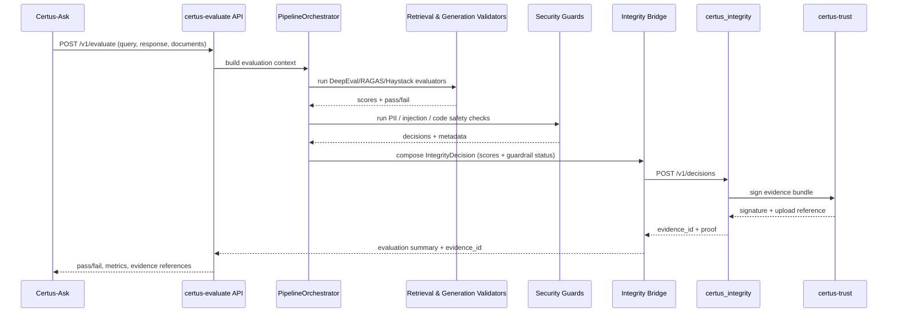
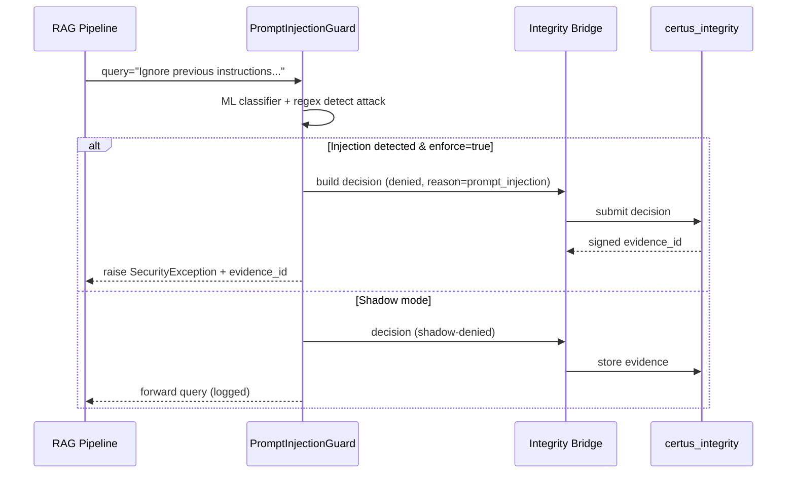
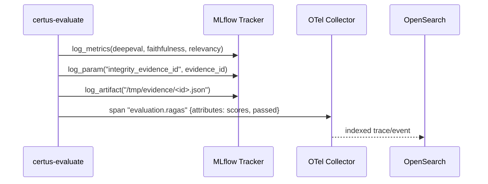

# Sequence Diagrams

## Inline Evaluation for Certus-Ask

```mermaid
sequenceDiagram
    participant Client as Certus-Ask
    participant EvalAPI as certus-evaluate API
    participant Pipeline as PipelineOrchestrator
    participant Validators as Retrieval & Generation Validators
    participant Guardrails as Security Guards
    participant Bridge as Integrity Bridge
    participant Integrity as certus_integrity
    participant Trust as certus-trust

    Client->>EvalAPI: POST /v1/evaluate (query, response, documents)
    EvalAPI->>Pipeline: build evaluation context
    Pipeline->>Validators: run DeepEval/RAGAS/Haystack evaluators
    Validators-->>Pipeline: scores + pass/fail
    Pipeline->>Guardrails: run PII / injection / code safety checks
    Guardrails-->>Pipeline: decisions + metadata
    Pipeline->>Bridge: compose IntegrityDecision (scores + guardrail status)
    Bridge->>Integrity: POST /v1/decisions
    Integrity->>Trust: sign evidence bundle
    Trust-->>Integrity: signature + upload reference
    Integrity-->>Bridge: evidence_id + proof
    Bridge-->>EvalAPI: evaluation summary + evidence_id
    EvalAPI-->>Client: pass/fail, metrics, evidence references
```

## Security Guard Enforcement

```mermaid
sequenceDiagram
    participant Client as RAG Pipeline
    participant Guard as PromptInjectionGuard
    participant Bridge as Integrity Bridge
    participant Integrity as certus_integrity

    Client->>Guard: query="Ignore previous instructions..."
    Guard->>Guard: ML classifier + regex detect attack
    alt Injection detected & enforce=true
        Guard->>Bridge: build decision (denied, reason=prompt_injection)
        Bridge->>Integrity: submit decision
        Integrity-->>Bridge: signed evidence_id
        Guard-->>Client: raise SecurityException + evidence_id
    else Shadow mode
        Guard->>Bridge: decision (shadow-denied)
        Bridge->>Integrity: store evidence
        Guard-->>Client: forward query (logged)
    end
```

## MLflow + Telemetry Logging

```mermaid
sequenceDiagram
    participant Eval as certus-evaluate
    participant MLflow as MLflow Tracker
    participant Telemetry as OTel Collector

    Eval->>MLflow: log_metrics(deepeval, faithfulness, relevancy)
    Eval->>MLflow: log_param("integrity_evidence_id", evidence_id)
    Eval->>MLflow: log_artifact("/tmp/evidence/<id>.json")
    Eval->>Telemetry: span "evaluation.ragas" {attributes: scores, passed}
    Telemetry-->>OpenSearch: indexed trace/event
```
