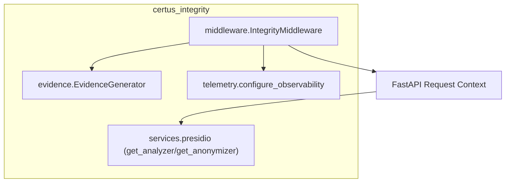

# Component View

| Component                  | Responsibilities                                                                  |
| -------------------------- | ---------------------------------------------------------------------------------- |
| IntegrityMiddleware        | Rate limiting, shadow mode, evidence generation, rate-limit headers, logging.     |
| EvidenceGenerator          | Background task that writes JSON bundles describing guardrail decisions.          |
| Telemetry helpers          | Instruments FastAPI with OpenTelemetry spans/metrics (used by host services).     |
| Presidio services          | Provide analyzer/anonymizer objects (Presidio when available, regex fallback).    |
