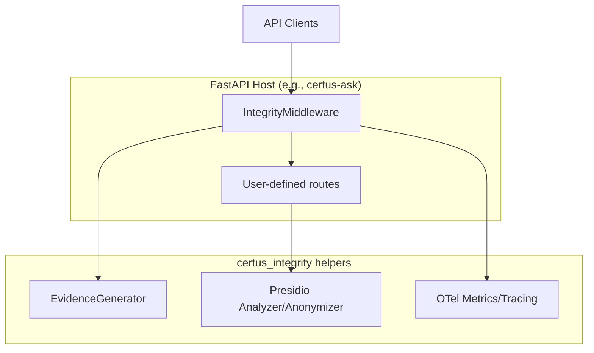

# Context

Certus-Integrity is a shared library/service bundle that adds guardrails to any FastAPI application in the Certus ecosystem. It provides:

- **IntegrityMiddleware** – rate limiting, logging, evidence generation
- **Presidio fallback services** – PII analysis/anonymization
- **Telemetry configuration** – OpenTelemetry + metrics instrumentation

Because Integrity is embedded in other services rather than exposed as a standalone API, its context diagram focuses on the flows within a host FastAPI app.

| Actor / System     | Description                                                                 |
| ------------------ | --------------------------------------------------------------------------- |
| API Clients        | Requests entering the host service; IntegrityMiddleware evaluates them first.|
| FastAPI Host       | Any service importing `certus_integrity` (certus-ask, certus-transform, etc.).|
| IntegrityMiddleware| Guardrail layer providing rate limits, evidence, telemetry hooks.           |
| EvidenceGenerator  | Produces decision bundles (JSON artifacts) for auditing.                    |
| Presidio Services  | `get_analyzer` / `get_anonymizer` functions used wherever PII handling is needed. |
| Telemetry helpers  | `configure_observability` instrumentation for host apps.                     |
