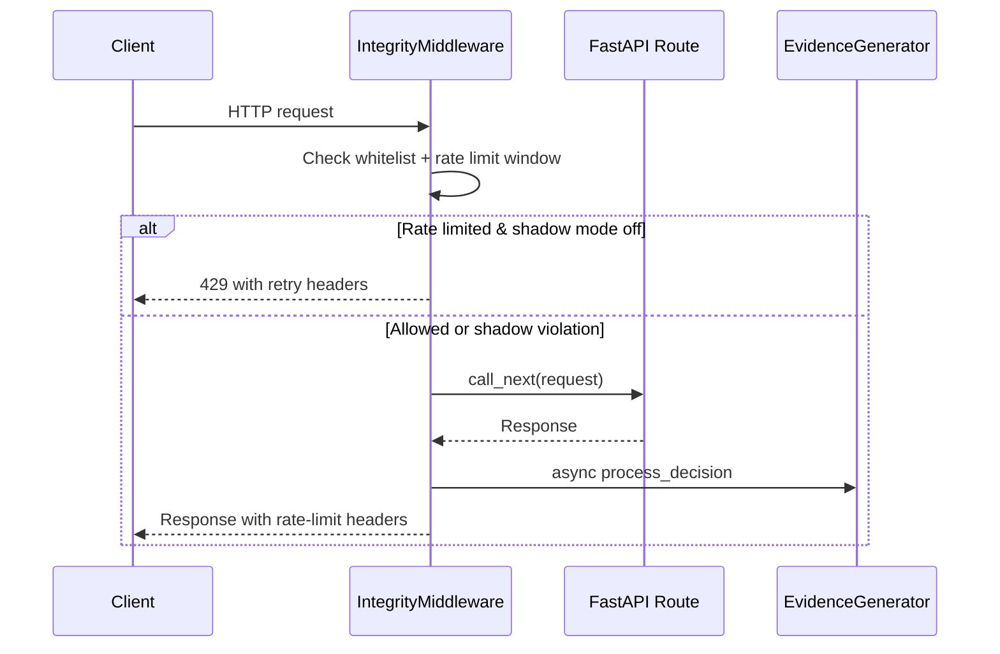
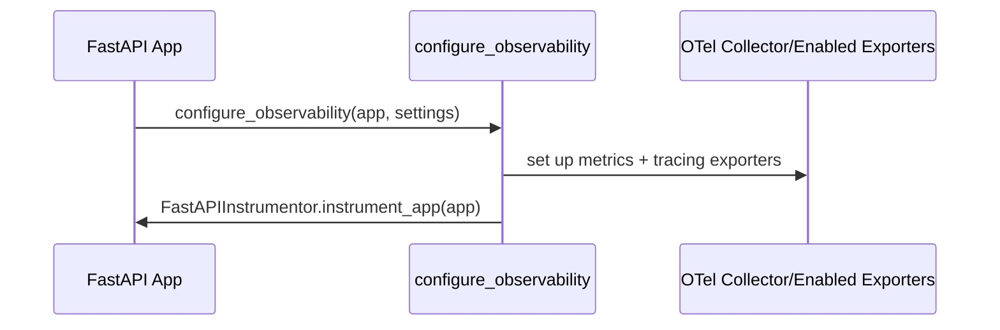

# Sequence Diagrams

## Middleware Decision Flow

```mermaid
sequenceDiagram
    participant Client
    participant Middleware as IntegrityMiddleware
    participant Host as FastAPI Route
    participant Evidence as EvidenceGenerator

    Client->>Middleware: HTTP request
    Middleware->>Middleware: Check whitelist + rate limit window
    alt Rate limited & shadow mode off
        Middleware-->>Client: 429 with retry headers
    else Allowed or shadow violation
        Middleware->>Host: call_next(request)
        Host-->>Middleware: Response
        Middleware->>Evidence: async process_decision
        Middleware-->>Client: Response with rate-limit headers
    end
```

## Telemetry Instrumentation

```mermaid
sequenceDiagram
    participant App as FastAPI App
    participant Telemetry as configure_observability
    participant OTel as OTel Collector/Enabled Exporters

    App->>Telemetry: configure_observability(app, settings)
    Telemetry->>OTel: set up metrics + tracing exporters
    Telemetry->>App: FastAPIInstrumentor.instrument_app(app)
```
