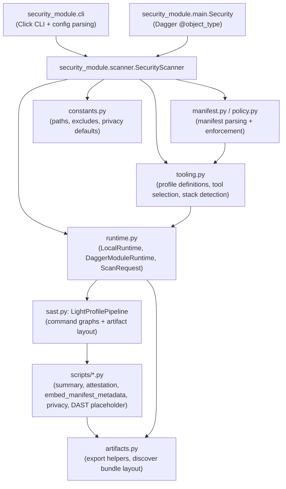

# Component View (C4 Level 3)

The module is intentionally self-contained so partners can copy the directory and run scans anywhere. Each major Python module maps to a component below.

| Component                 | Responsibilities                                                                                                 |
| ------------------------- | ---------------------------------------------------------------------------------------------------------------- |
| CLI (`security_module.cli`)              | User-facing interface with shared options (profile, workspace, export dir, privacy assets, manifest references). |
| Scripts (`scripts/*.py`)  | Standalone helpers invoked by runtimes: summaries, manifest embedding, privacy scan orchestration, attestation.  |
| Dagger Entry (`main.py`)  | Declares public Dagger functions that wrap `SecurityScanner` calls with Dagger directories/services.             |
| SecurityScanner           | Normalizes paths, loads manifests/JSON, builds `ScanRequest`, and dispatches into whichever runtime is available.|
| Manifest & Policy Modules | Parse Cue-exported JSON, load thresholds, and enforce policy before returning metadata for manifest-info files.  |
| Tool Resolver (`tooling.py`) | Maps scan profiles to concrete tools, handles manifest overrides, and determines if stack services are required. |
| Runtime Adapters          | Implement host execution (`LocalRuntime`) and `dagger` execution (`DaggerModuleRuntime`), streaming logs upstream.|
| LightProfilePipeline      | Wires concrete Dagger steps or subprocesses for each tool, identity of artifact directories, and stack services. |
| Artifacts Helpers         | Ensure exports land in deterministic folders and expose `.discover()` for Certus-Assurance artifact bundling.    |
| Constants                 | Centralizes module root paths, exclude patterns, privacy directories, and default export directories.            |
