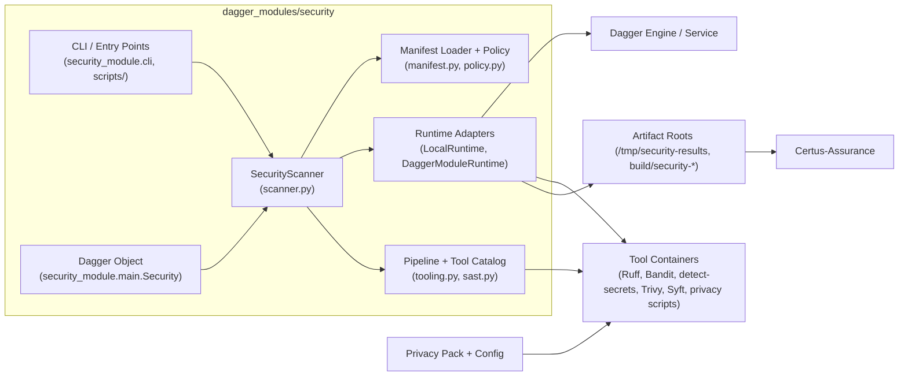

# Container View (C4 Level 2)

Although it ships as a Python package, the security module operates across a few clear “containers”: the CLI / Dagger object, the runtime adapters, tool images, and artifact storage.

| Container             | Responsibilities                                                                                                        |
| --------------------- | ----------------------------------------------------------------------------------------------------------------------- |
| CLI / Entry Points    | Provides `uv run python -m security_module.cli` plus helper scripts (summary, attestation, privacy) for host execution. |
| Dagger Object         | Exposes `smoke/fast/standard/full/...` functions for `dagger call` and CI pipelines.                                    |
| SecurityScanner       | Normalizes inputs, loads manifests, resolves which tools to execute, and prepares `ScanRequest` structures.             |
| Manifest Loader       | Reads Cue-exported manifest JSON/paths, applies default thresholds, and enforces policy metadata.                       |
| Runtime Adapters      | Either spawn Dagger pipelines (`DaggerModuleRuntime`) or run the tools directly via the host (`LocalRuntime`).          |
| Tooling / Pipeline    | Defines the commands per profile (Ruff, Bandit, detect-secrets, Opengrep, Trivy, Syft, privacy scripts, attestation).   |
| Dagger Engine         | Runs the module when invoked through Dagger; handles caching and container lifecycle.                                   |
| Tool Containers       | Container images for each tool, wired via the Dagger pipeline definition.                                               |
| Privacy Pack & Config | Provides fixtures/assets for privacy scans plus shared baselines (Opengrep, allowlists).                                |
| Artifact Roots        | Deterministic bundle layout consumed later by Certus-Assurance / Transform.                                             |
