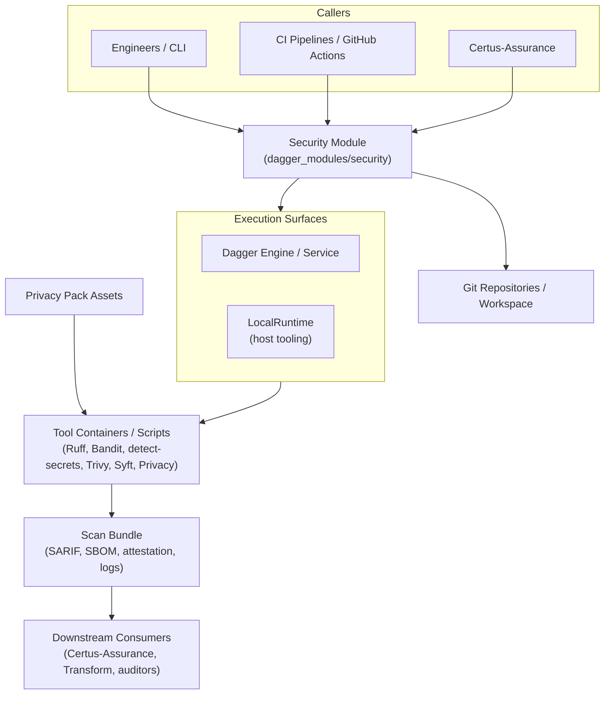

# Context

The Certus Security Module is a standalone Dagger module plus Python CLI that executes the standardized scan profiles used throughout Certus TAP. Certus-Assurance, CI pipelines, and individual engineers all treat it as the canonical “engine” for generating SARIF, SBOMs, privacy findings, and attestations.

| Actor / System          | Description                                                                                   |
| ----------------------- | --------------------------------------------------------------------------------------------- |
| Engineers / CLI         | Run `uv run python -m security_module.cli …` or `dagger call` locally to vet repositories.   |
| CI Pipelines            | Invoke the published Dagger module for reproducible scans inside ephemeral CI runners.        |
| Certus-Assurance        | Imports `security_module.runtime.ManagedRuntime` to execute scans for API requests.           |
| Dagger Engine / Service | Provides containerized execution for the module when run through `dagger call` or CI.        |
| LocalRuntime            | Fallback host runner that shells out to the installed tools when Dagger is unavailable.       |
| Tool Containers         | Ruff, Bandit, detect-secrets, Opengrep, Trivy, Syft, privacy scripts, attestation helpers.    |
| Privacy Pack Assets     | Bundled sample data that exercises privacy tooling when enabled.                              |
| Scan Bundle             | Structured folder with SARIF, SBOMs, Trivy, DAST placeholders, attestation, manifest info.    |
| Downstream Consumers    | Certus-Assurance (artifact upload), Certus-Transform, Certus-Ask, auditors, and evidence repos.|
