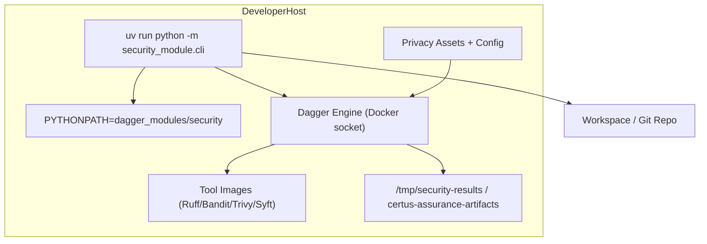
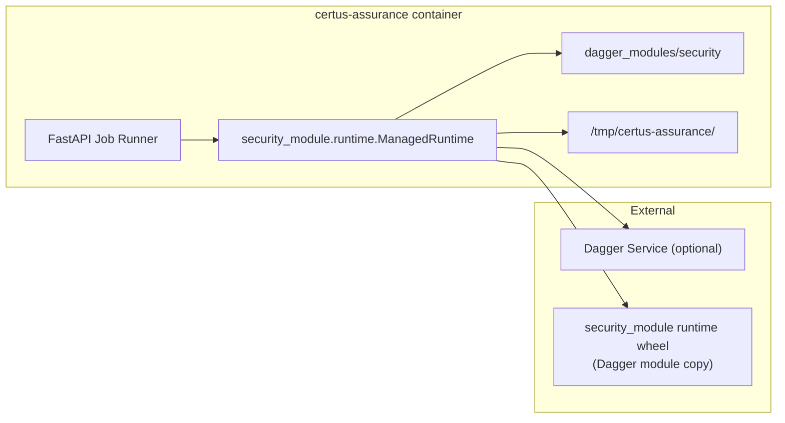

# Deployment

The module is intentionally portable: copy the directory into another repo, run via Dagger, or import it directly from Certus-Assurance. Two common deployment patterns are illustrated below.

## Local Development / CLI

Key traits:
- Requires Docker (or the Dagger Cloud runner) plus Python 3.11.
- Developers can override export directories or bundle IDs; defaults land under `/tmp/security-results`.
- Privacy assets stay on-disk and are mounted read-only; disabling privacy scans keeps sensitive corpora out of runs.

## Certus-Assurance / CI Runtime

Notes:
- The Assurance container sets `PYTHONPATH=/app/dagger_modules:/app`, so imports resolve without publishing the module to PyPI.
- ManagedRuntime prefers the shared `security_module.runtime` package; if it is missing, the service drops back to the sample scanner (development mode).
- CI pipelines can either `pip install` the module (from the repo or artifact registry) or vendor it just like Certus-Assurance does.

## Operational Considerations

- Keep `dagger_modules/security/` synchronized between repositories (git subtree or automation) so scan definitions match what the Assurance API expects.
- When exporting outside Docker (e.g., GitHub Actions), use `dagger call --mod dagger_modules/security full --export-path $RUNNER_TEMP/security-results`.
- The privacy pack contains intentionally sensitive fixtures; treat it like test data and avoid bundling it into public containers.
- Forward artifact directories (especially `reports/` and `attestation.intoto.json`) into whichever storage layer (S3, OCI registry) the Assurance workflow expects.
