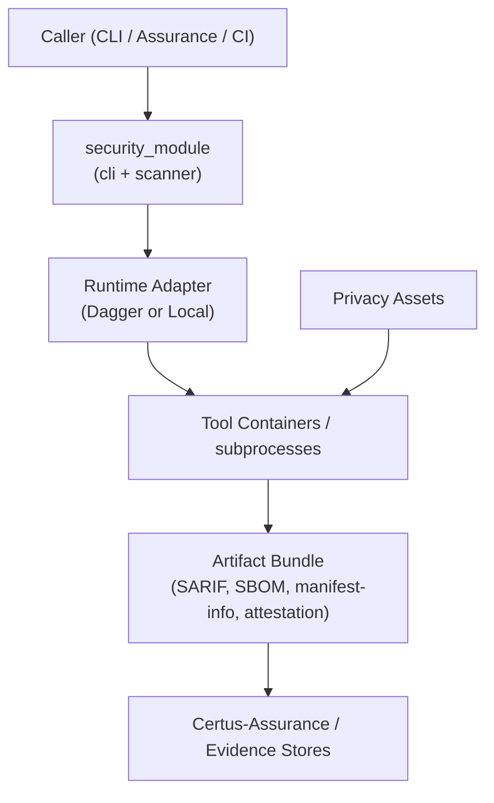

# Security

The module touches both sensitive source code and privacy fixtures, so it enforces strict boundaries even though it often runs on developer laptops. The controls below apply whether the module is invoked through Dagger, the CLI, or Certus-Assurance.

## Data Flow & Trust Boundaries

Trust notes:
- Callers pass untrusted manifests and repositories; manifest parsing and policy enforcement run before any external tooling starts.
- Tool containers are sandboxed by Dagger (when available) and isolated per run, reducing the blast radius of malicious repositories.
- Privacy assets mount read-only and can be skipped entirely; no bundled data leaves the workstation unless explicitly exported.

## Controls

- **Manifest Policy Enforcement:** `manifest.py` + `policy.py` embed thresholds into `manifest-info.json`. The runtime aborts when vulnerability budgets are exceeded or unsupported tools are requested.
- **Deterministic Artifact Layout:** `artifacts.py` guarantees consistent paths; Certus-Assurance hashes files before uploading to Trust/S3, making tampering easy to detect.
- **Stack Isolation:** Profiles requiring HTTP stacks start ephemeral services via Dagger services (or local placeholders), preventing scans from depending on long-lived daemons.
- **Privacy Guardrails:** Privacy scans run only when requested and rely on curated fixtures shipped with the module. Operators can substitute their own assets via CLI options.
- **Attestation & Metadata:** The attestation script emits in-toto statements referencing executed tools, bundle IDs, and git SHAs. Cosign or downstream services can sign these files.
- **Dependency Pinning:** `dagger_modules/security/pyproject.toml` + `uv.lock` capture tool versions, ensuring reproducible environments when the module is copied elsewhere.

## Residual Risks & Follow-ups

- LocalRuntime shells out to host binaries; operators must trust their installation of Ruff/Bandit/etc. Prefer the Dagger runtime for consistent containers.
- Secrets embedded in repositories can still leak via tool logs. Route CLI output through log sinks (as Certus-Assurance does) when forwarding to remote observers.
- The privacy pack contains sample PII; treat the directory as confidential test data and avoid packaging it into containers that leave the organization.
- When vendoring the module into other repos, include its `LICENSE` and keep CHANGELOGs so downstream consumers know when the scanning logic changed.
