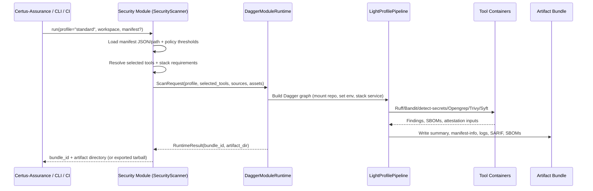
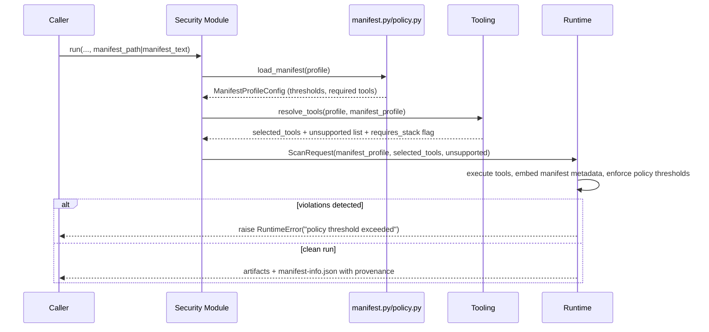

# Sequence Diagrams

## Dagger Invocation (standard profile)

```mermaid
sequenceDiagram
    participant Caller as Certus-Assurance / CLI / CI
    participant Module as Security Module (SecurityScanner)
    participant Runtime as DaggerModuleRuntime
    participant Pipeline as LightProfilePipeline
    participant Tools as Tool Containers
    participant Artifacts as Artifact Bundle

    Caller->>Module: run(profile="standard", workspace, manifest?)
    Module->>Module: Load manifest JSON/path + policy thresholds
    Module->>Module: Resolve selected tools + stack requirements
    Module->>Runtime: ScanRequest(profile, selected_tools, sources, assets)
    Runtime->>Pipeline: Build Dagger graph (mount repo, set env, stack service)
    Pipeline->>Tools: Ruff/Bandit/detect-secrets/Opengrep/Trivy/Syft
    Tools-->>Pipeline: Findings, SBOMs, attestation inputs
    Pipeline->>Artifacts: Write summary, manifest-info, logs, SARIF, SBOMs
    Runtime-->>Module: RuntimeResult(bundle_id, artifact_dir)
    Module-->>Caller: bundle_id + artifact directory (or exported tarball)
```

## Manifest Policy Enforcement

```mermaid
sequenceDiagram
    participant Caller
    participant Module as Security Module
    participant Manifest as manifest.py/policy.py
    participant Tooling
    participant Runtime

    Caller->>Module: run(..., manifest_path|manifest_text)
    Module->>Manifest: load_manifest(profile)
    Manifest-->>Module: ManifestProfileConfig (thresholds, required tools)
    Module->>Tooling: resolve_tools(profile, manifest_profile)
    Tooling-->>Module: selected_tools + unsupported list + requires_stack flag
    Module->>Runtime: ScanRequest(manifest_profile, selected_tools, unsupported)
    Runtime->>Runtime: execute tools, embed manifest metadata, enforce policy thresholds
    alt violations detected
        Runtime-->>Caller: raise RuntimeError("policy threshold exceeded")
    else clean run
        Runtime-->>Caller: artifacts + manifest-info.json with provenance
    end
```
