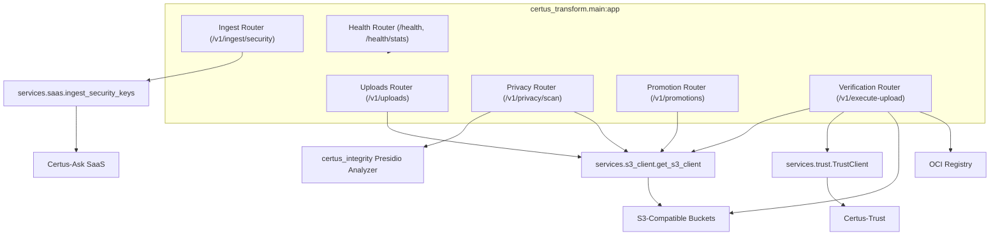

# Component View (C4 Level 3)

| Component        | Responsibilities                                                                                                       |
| ---------------- | --------------------------------------------------------------------------------------------------------------------- |
| Uploads Router   | Single-file uploads into raw/active prefixes with configurable destination folders.                                   |
| Privacy Router   | Scans raw prefixes with Presidio, quarantines detections under `<prefix>/quarantine/`, writes optional scan reports.  |
| Promotion Router | Legacy raw→golden copy logic for environments that do not use verification-first workflow.                            |
| Ingest Router    | Calls Certus-Ask SaaS ingestion endpoints with golden keys for SARIF/SPDX pipelines.                                  |
| Verification Router | Receives `/v1/execute-upload` from Certus-Trust, writes markers/artifacts to S3 and optional OCI registry, records metadata. |
| Health Router    | Liveness/stats endpoints tracking upload counts, quarantines, promotions, etc.                                        |
| S3 Client        | Memoized boto3 client pinned to customer LocalStack/S3.                                                               |
| Trust Client     | Optional helper for verifying chains (mirrors Certus-Trust API).                                                      |
| SaaS Client      | HTTPX helper that forwards golden keys to Certus-Ask ingestion endpoints.                                             |
