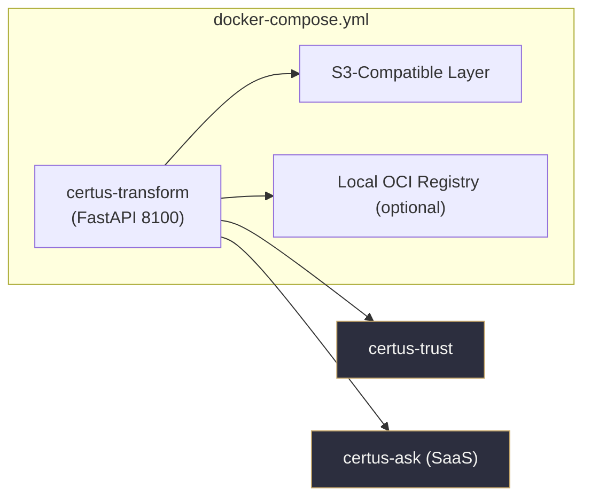
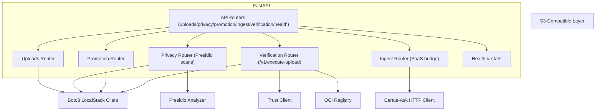

# Container View (C4 Level 2)

The data prep service ships as a single FastAPI container with LocalStack S3, an optional OCI registry, and outbound HTTP calls to Certus-Trust and the Certus-Ask SaaS backend.

## Local Compose Stack

| Container        | Responsibilities                                                                 |
| ---------------- | ------------------------------------------------------------------------------- |
| certus-transform | Hosts FastAPI routers for uploads, privacy scans, promotions, verification, etc.|
| S3-Compatible    | Raw/quarantine/golden buckets (LocalStack in dev, AWS S3 in prod).              |
| Local Registry   | Optional OCI registry mirror for verified bundles.                              |
| certus-trust     | Verifies scans and calls Transform to execute uploads (gatekeeper).            |
| certus-ask       | Receives golden keys via `/v1/ingest/security`.                                 |

## Runtime Components

| Component        | Notes                                                                                           |
| ---------------- | ----------------------------------------------------------------------------------------------- |
| Uploads Router   | Streams user uploads into `raw` bucket prefixes.                                                |
| Privacy Router   | Runs Presidio scans, quarantines findings, writes optional reports.                             |
| Promotion Router | Legacy promotion path (raw → golden) for basic tier environments.                               |
| Verification Router | Handles `/v1/execute-upload` and `/v1/execute-upload/batch`, writes to S3/OCI with proof.    |
| Ingest Router    | Calls Certus-Ask SaaS ingestion endpoints for golden keys.                                      |
| Health Router    | Exposes `/health` + `/health/stats`.                                                            |
| Trust Client     | Optional helper when Transform needs to re-verify a chain.                                      |
| SaaS Client      | HTTPX client hitting Certus-Ask `/v1/{workspace}/index/security/s3`.                            |
