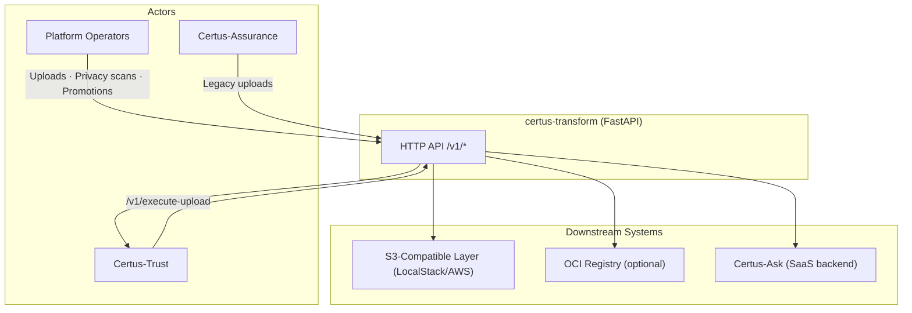

# Context

Certus-Transform is the customer-operated data preparation service that moves artifacts from **raw → quarantine → golden**, executes privacy scans, and uploads Trust-approved bundles to storage (S3 + optional OCI registries). It sits between Certus-Assurance (producers of scans), Certus-Trust (gatekeeper), and the Certus-Ask SaaS backend (consumer of golden findings).

## System Context (C4 Level 1)

| Actor / System              | Description                                                                                               |
| --------------------------- | --------------------------------------------------------------------------------------------------------- |
| Platform Operators          | Run privacy scans, upload raw files, promote/quarantine, and trigger SaaS ingestion.                      |
| Certus-Assurance            | Produces inner-signed artifacts; may call upload/promotion endpoints in legacy/basic tier deployments.    |
| Certus-Trust                | Calls `/v1/execute-upload` after verifying non-repudiation chains. Transform confirms completion back.    |
| S3-Compatible Layer         | Raw/quarantine/golden buckets hosted on LocalStack or customer S3.                                        |
| OCI Registry                | Optional registry where verified bundles are mirrored (tagged by scan ID/commit).                         |
| Certus-Ask (SaaS backend)   | Receives golden keys via `/v1/{workspace}/index/security/s3` once Transform uploads succeed.              |
| Certus-Transform FastAPI    | Exposes `/v1/privacy`, `/v1/promotions`, `/v1/uploads`, `/v1/execute-upload`, `/v1/ingest/security`, etc. |
