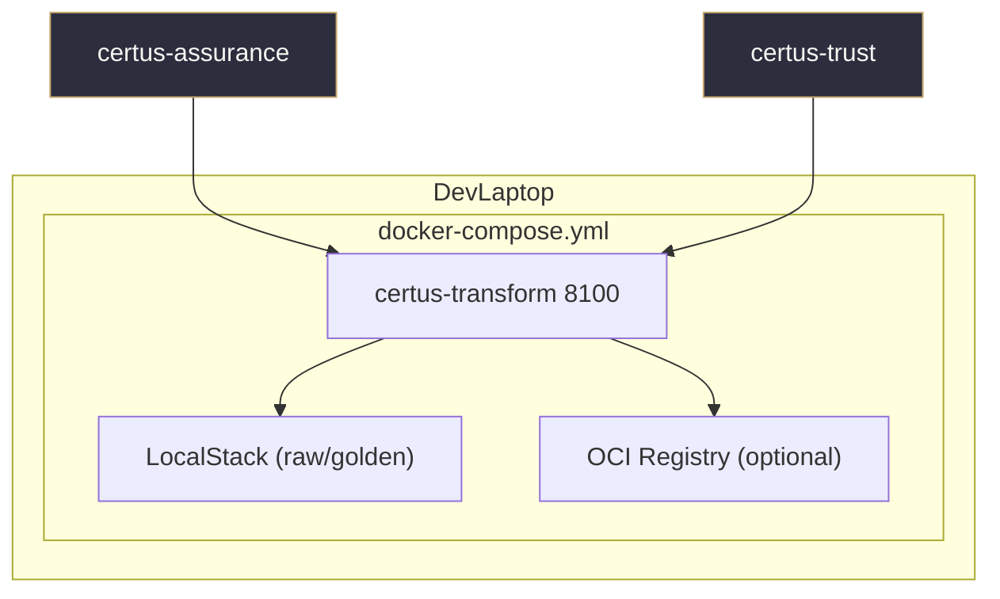
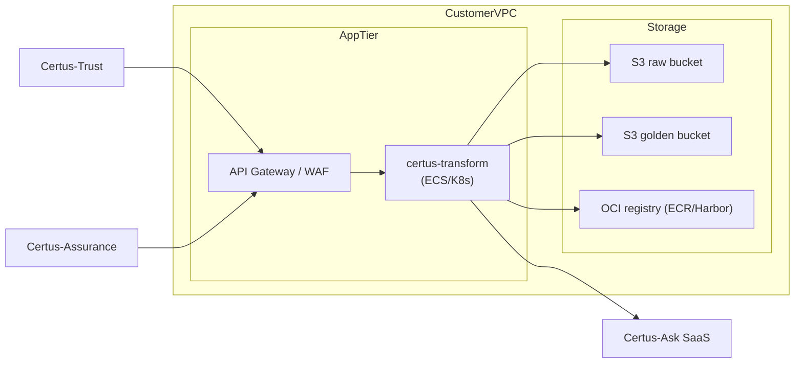

# Deployment

## Local Developer Stack

| Service             | Notes                                                                                             |
| ------------------- | ------------------------------------------------------------------------------------------------- |
| certus-transform    | FastAPI container exposing `/v1/*` routes for uploads, privacy scans, verification, ingestion.    |
| LocalStack          | Raw/quarantine/golden buckets; use `AWS_ACCESS_KEY_ID/SECRET` from `.env`.                        |
| OCI Registry        | Optional registry container; `_push_to_oci_registry` simply creates tags/markers for testing.     |
| certus-trust        | Sends `/v1/execute-upload` requests once signatures are verified.                                 |
| certus-assurance    | Legacy workflows can still call upload/promotion APIs.                                            |

## Production Blueprint

Deployment considerations:

- **Network:** Keep S3/OCI endpoints private; only expose ALB/WAF for API clients (Assurance/Trust/operators).
- **Secrets:** Store AWS credentials, SaaS API keys, and Trust tokens in a secret manager (not `.env`).
- **Observability:** Ship `/health/stats` metrics into whatever telemetry stack backs the rest of TAP.
- **Scaling:** The verification-first workflow is CPU-light; autoscale on request rate or queue depth if future async workers are added.
