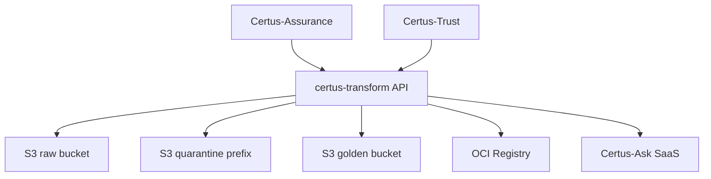
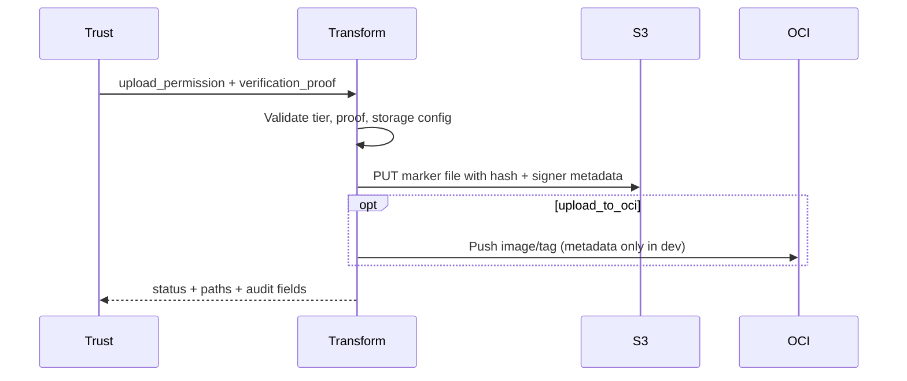
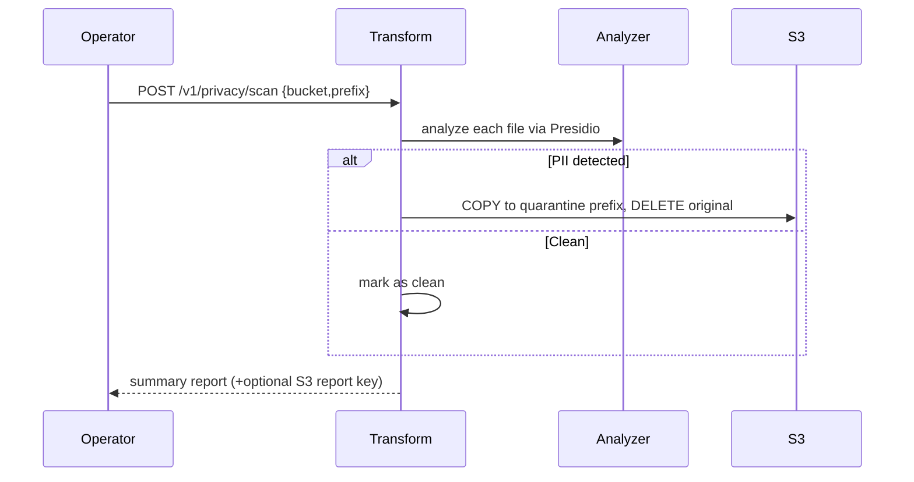

# Security

Certus-Transform runs inside the customer boundary and controls when artifacts move from **raw** to **golden** storage. The design relies on verification-first uploads (Certus-Trust) plus optional privacy/quarantine gates.

## Data Flow & Trust Boundaries

- **API Boundary:** FastAPI endpoints should be fronted by auth (OIDC/API keys) in customer deployments. The dev stack defaults to no auth.
- **Trust Boundary:** Only Certus-Trust should call `/v1/execute-upload`. That call includes proof (Rekor entry, cosign signature) recorded in S3 metadata.
- **Storage Boundary:** Raw and golden buckets must enforce encryption, versioning, and least privilege IAM (read-only for consumers, write-only for Transform).

## Verification-First Controls

- Metadata includes hash, scan ID, tier, inner/outer signer identities, and timestamps.
- Upload counters (`health._upload_*`) highlight anomalies in `/health/stats`.

## Privacy & Quarantine

Controls:
- Files on the SKIP list (e.g., `verification-proof.json`) are ignored to avoid tampering.
- Setting `dry_run=true` allows auditing without moving files.

## SaaS Ingestion

`/v1/ingest/security` is the bridge to Certus-Ask SaaS. Use API keys (`SAAS_API_KEY`) when calling cloud deployments to prevent unauthorized ingestion.

## Residual Risks & Mitigations

- **Mock uploads:** In dev, `_upload_to_s3` writes marker files, not binaries. Production deployments should be wired to the actual artifact source (e.g., object streams from Assurance).
- **Legacy promotion:** `/v1/promotions/golden` bypasses Trust. Restrict or disable it in verified tiers.
- **Secrets in `.env`:** Use secret managers when running outside local compose.
- **OCI uploads:** `_push_to_oci_registry` currently stubs image pushes. Validate registry credentials before enabling in prod.
