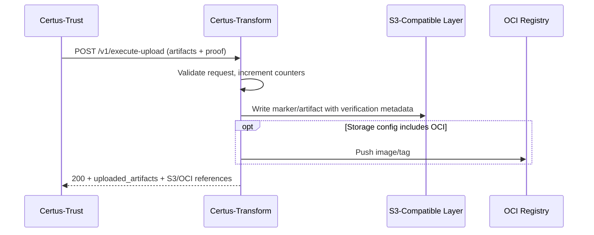
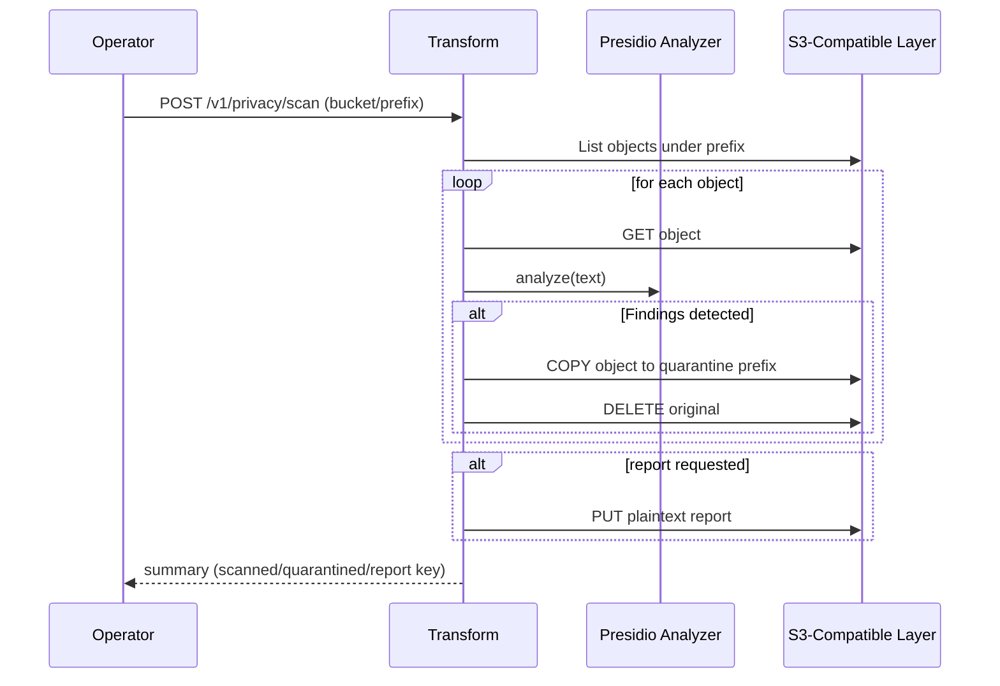
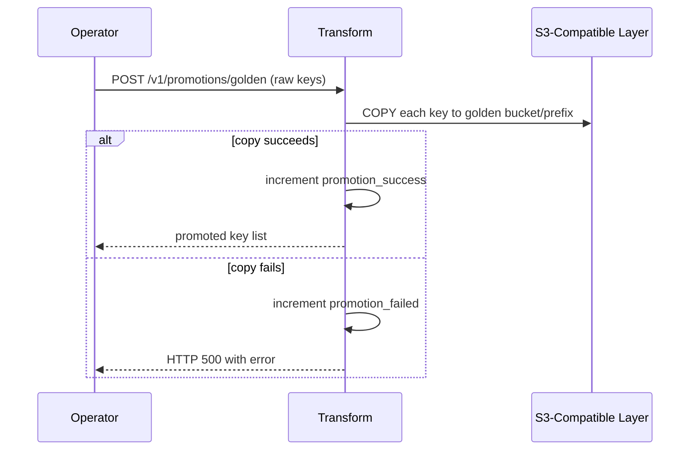
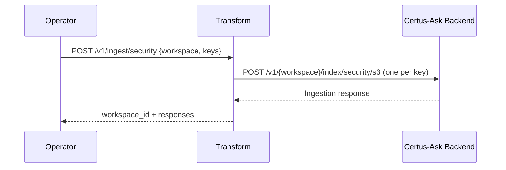

# Sequence Diagrams

## Verification-First Upload (`/v1/execute-upload`)

## Privacy Scan and Quarantine (`/v1/privacy/scan`)

## Legacy Promotion (`/v1/promotions/golden`)

## Golden Ingestion (`/v1/ingest/security`)

