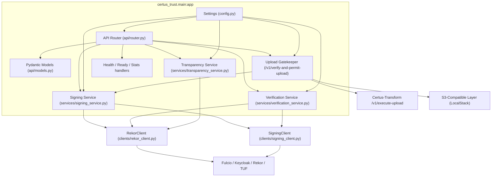

# Component View (C4 Level 3)

This diagram dives into the main components inside the Certus-Trust FastAPI service. Each component maps directly to modules under `certus_trust/`.

| Component                   | Responsibilities                                                                                      |
| --------------------------- | ----------------------------------------------------------------------------------------------------- |
| API Router                  | Declares every `/v1/*` endpoint, wires feature flags (mock vs production), logs structured telemetry. |
| Pydantic Models             | Shared validation & response schemas for signatures, transparency entries, upload permissions, etc.   |
| Config                      | Reads `.env.trust`, toggles `mock_sigstore`, configures Sigstore URLs, S3 buckets, feature flags.     |
| Signing Service             | Abstracts signing; returns mock responses or calls Fulcio/Rekor via `SigningClient`/`RekorClient`.    |
| Verification Service        | Validates signatures (mock memory log or cryptographic check + Rekor search).                         |
| Transparency Service        | Serves log entries and Merkle proofs (mock memory log or Rekor).                                      |
| Upload Gatekeeper           | Implements the verification-first upload workflow and notifies Certus-Transform.                      |
| Stats/Health Handlers       | Report health, readiness, and service stats to operators.                                             |
| RekorClient / SigningClient | Low-level HTTP clients for Rekor and signing operations (keyless/key-based).                          |
| Sigstore Stack              | External Fulcio, Rekor, Keycloak, and TUF services addressed over the compose network.                |
| S3-Compatible Layer         | LocalStack buckets referenced in upload permissions.                                                  |
| Certus-Transform API        | Receives asynchronous callbacks once uploads are permitted.                                           |
