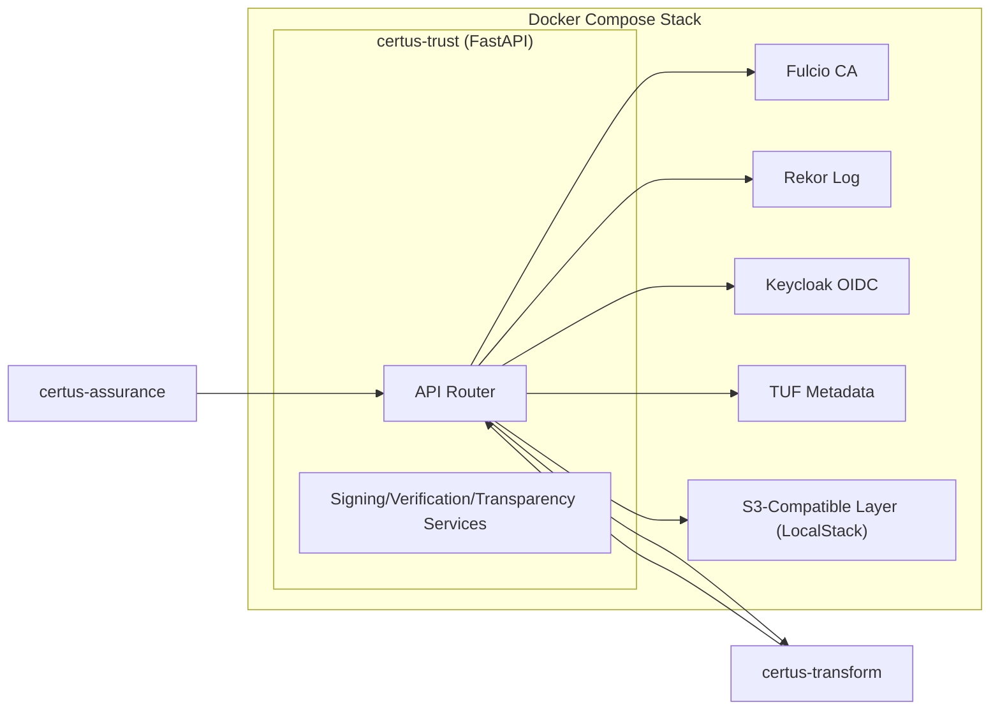
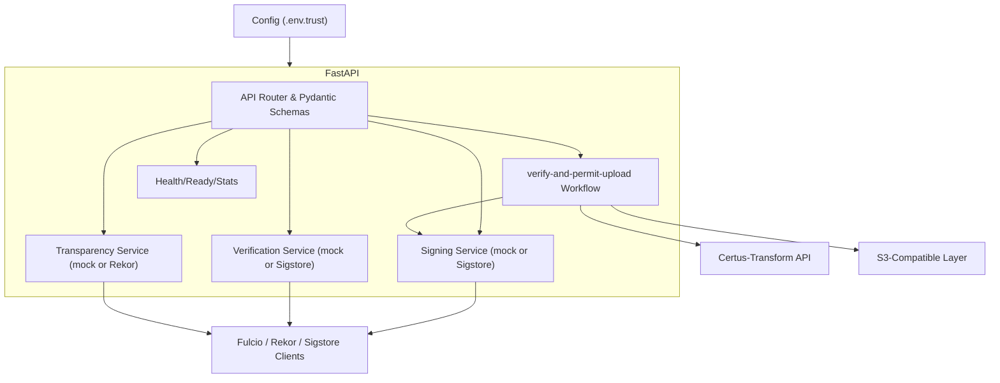

# Container View (C4 Level 2)

The Certus-Trust stack in development is a Docker Compose environment. A single FastAPI container fronts the Sigstore dependencies (Fulcio, Rekor, Keycloak, TUF) plus the LocalStack S3-compatible layer used by downstream workflows.

| Container                   | Responsibilities                                                                             |
| --------------------------- | -------------------------------------------------------------------------------------------- |
| certus-trust (FastAPI)      | Hosts router, signing service, verification service, transparency service, readiness checks. |
| Fulcio                      | Issues short-lived certificates for keyless signing (mocked in dev).                         |
| Rekor                       | Receives transparency log entries for signatures and upload permissions.                     |
| Keycloak                    | OIDC provider used by Fulcio and optional API auth.                                          |
| TUF                         | Serves root/targets metadata endpoints for key distribution.                                 |
| S3-Compatible Layer         | LocalStack buckets referenced in upload permissions handed to Certus-Transform.              |
| certus-assurance (external) | Calls `/v1/sign`, `/v1/verify`, `/v1/sign-artifact`, `/v1/verify-chain`.                     |
| certus-transform (external) | Receives callbacks from `/v1/verify-and-permit-upload`.                                      |

## Runtime Components

Inside the `certus-trust` container, the FastAPI app wires several services that can run in mock or production mode.

| Component            | Notes                                                                                               |
| -------------------- | --------------------------------------------------------------------------------------------------- |
| API Router           | Defines `/v1/sign`, `/v1/verify`, `/v1/transparency`, `/v1/sign-artifact`, `/v1/verify-chain`, etc. |
| Signing Service      | Dispatches to `MockSigningService` or `ProductionSigningService` depending on `mock_sigstore`.      |
| Verification Service | Validates signatures (mock or real Rekor search + crypto verification).                             |
| Transparency Service | Serves log entries (mock memory store or Rekor client).                                             |
| Gatekeeper Workflow  | Handles `/v1/verify-and-permit-upload` to guard downstream storage writes.                          |
| Health/Readiness     | Reports dependency status (Fulcio, Rekor, TUF, Keycloak).                                           |
| Sigstore Clients     | `RekorClient`, `SigningClient`, Fulcio/Keycloak OIDC handshake (future).                            |
| LocalStack           | S3-compatible bucket references returned in upload permissions.                                     |
| Certus-Transform API | Called asynchronously once verification passes.                                                     |
