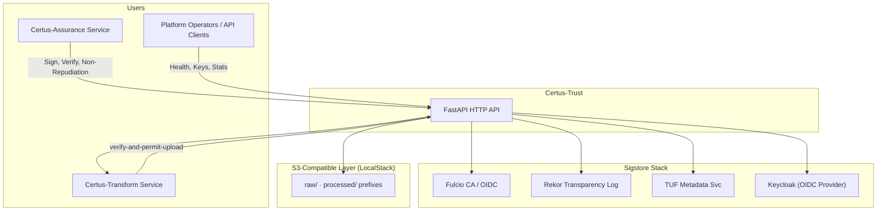

# Context

Certus-Trust is the signing, verification, and transparency service that backs the Certus platform’s non‑repudiation guarantees. It exposes HTTP APIs (FastAPI) that wrap Sigstore (Fulcio, Rekor, TUF) and orchestrates policy workflows with other Certus services.

## System Context (C4 Level 1)

| Actor / System                   | Description                                                                                                  |
| -------------------------------- | ------------------------------------------------------------------------------------------------------------ |
| Certus-Assurance                 | Produces scan artifacts and inner signatures; invokes Certus-Trust to sign/verify evidence.                  |
| Certus-Transform                 | Receives upload permissions from Trust before writing to the S3-compatible layer or registries.              |
| Platform Operators / API Clients | Call health, stats, transparency, and key distribution endpoints.                                            |
| Fulcio / Keycloak                | Provide certificates and identity for keyless signing.                                                       |
| Rekor                            | Stores transparency log entries for signatures and non-repudiation proofs.                                   |
| TUF                              | Publishes signing keys/metadata for downstream consumers.                                                    |
| S3-Compatible Layer (LocalStack) | Local buckets used when Trust issues upload permissions or references artifact locations.                    |
| Certus-Trust FastAPI API         | Single container exposing `/v1/sign`, `/v1/verify`, `/v1/transparency`, `/v1/verify-and-permit-upload`, etc. |
