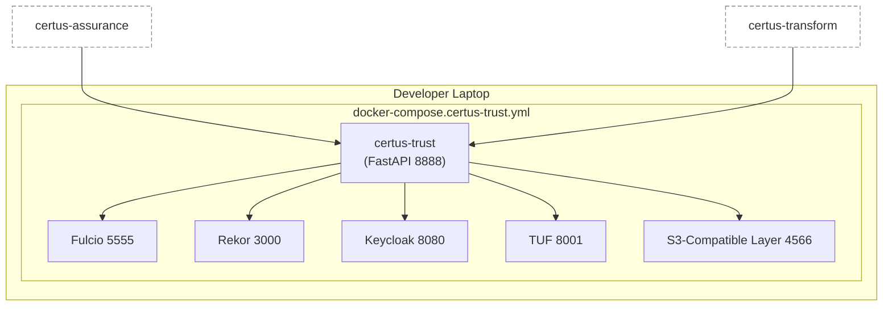
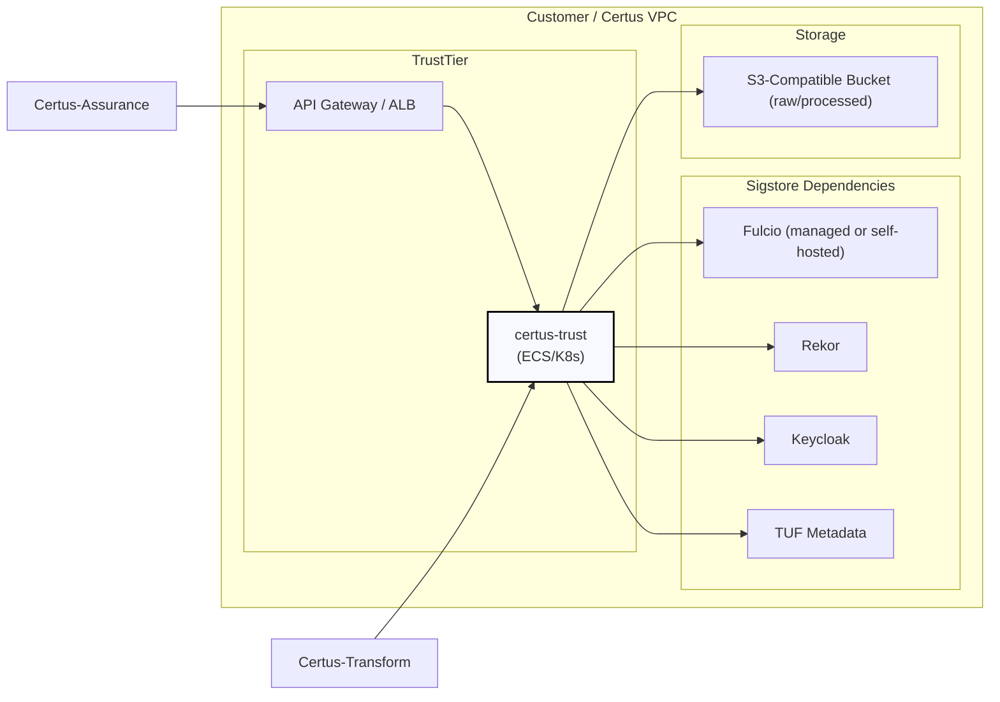

# Deployment

Certus-Trust currently runs in a developer-friendly Docker Compose stack with Sigstore dependencies (Fulcio, Rekor, Keycloak, TUF) plus LocalStack for S3-compatible storage. This section describes the local setup and the intended production topology once Sigstore integrations move out of mock mode.

## Local / Compose Deployment

| Service          | Notes                                                                                         |
| ---------------- | --------------------------------------------------------------------------------------------- |
| certus-trust     | Runs FastAPI with mock Sigstore clients by default (`CERTUS_TRUST_MOCK_SIGSTORE=true`).       |
| Fulcio           | Mock CA handing out certificates for keyless signing flows.                                   |
| Rekor            | Mock transparency log; the FastAPI service can switch to real Rekor by disabling mock mode.   |
| Keycloak         | Provides OIDC issuer for Fulcio / API auth testing.                                           |
| TUF              | Serves metadata files returned by `/v1/keys/*.json`.                                          |
| LocalStack       | Acts as the S3-compatible layer for upload permissions and artifact references.               |

## Production Blueprint

Once Sigstore integration is fully enabled, Certus-Trust can run as a standalone container in a trusted VPC. Fulcio/Rekor may be hosted (Sigstore public) or self-managed.

Deployment considerations:

- **Sigstore Connectivity:** When `CERTUS_TRUST_MOCK_SIGSTORE=false`, the service must reach real Fulcio and Rekor endpoints. Configure outbound firewall rules accordingly.
- **Secrets:** Use encrypted storage (Secrets Manager, HashiCorp Vault) for cosign keys if key-based signing is enabled.
- **Observability:** Ship FastAPI structured logs to the central logging stack and monitor Sigstore dependencies.
- **S3-Compatible Layer:** Point `S3_ENDPOINT_URL`, `DATALAKE_RAW_BUCKET`, and `DATALAKE_GOLDEN_BUCKET` at the production object store so upload permissions reference the correct locations.
