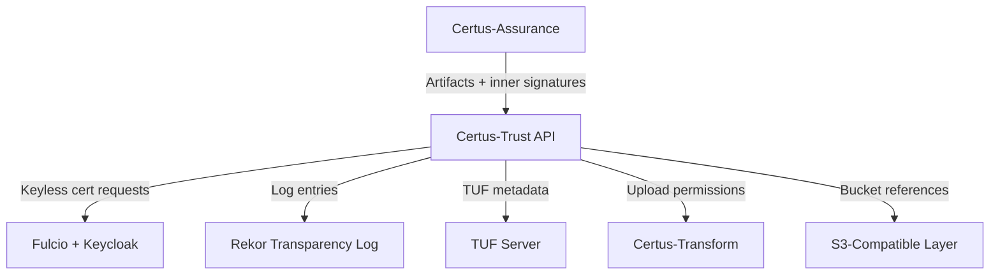
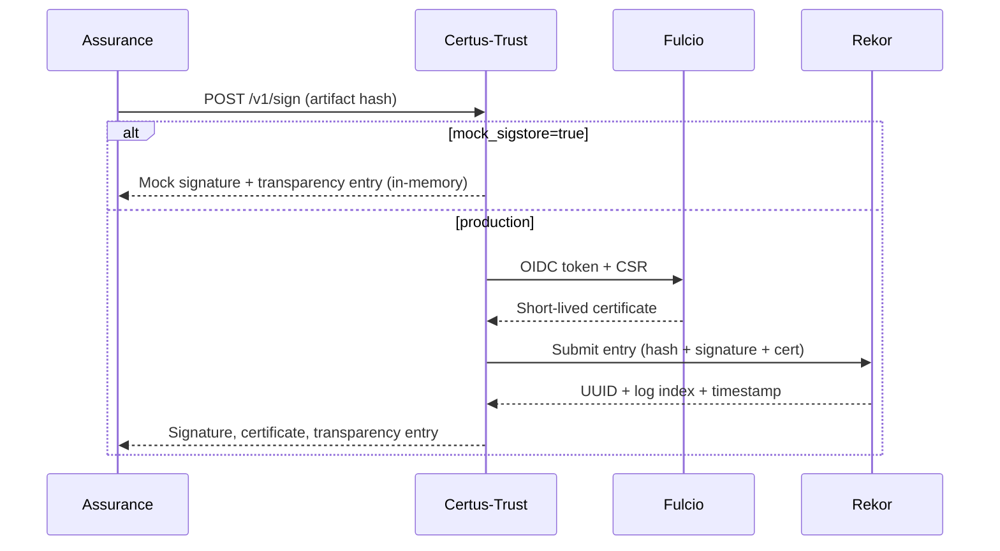
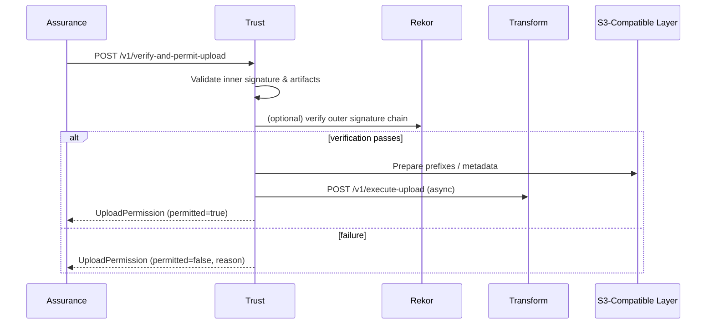

# Security

Certus-Trust is the cryptographic backbone for non-repudiation, so its threat model centers on protecting signing keys, validating identities, and ensuring the transparency log cannot be tampered with. The current implementation supports both mock (in-memory) and production Sigstore modes; the diagrams below highlight the critical trust boundaries common to both.

## Data Flow & Trust Boundaries

- **API Boundary:** All callers must be authenticated (OIDC/Bearer tokens) in production to prevent arbitrary signing or upload permissions.
- **Sigstore Boundary:** Fulcio/Keycloak validate identities; Rekor provides tamper-evident transparency. Certus-Trust should verify TLS certificates and pin endpoints when talking to these services.
- **Storage Boundary:** Upload permissions reference buckets and prefixes. Those buckets must enforce server-side encryption, bucket policies, and immutability where required.

## Signing Flow (Mock vs Production)

Controls:
- Mock mode is intentionally limited to dev environments; never expose it publicly.
- Production mode must validate OIDC identity before requesting Fulcio certificates.
- Rekor submission responses include inclusion proofs; store them alongside the signing response for later verification.

## Verification & Upload Gatekeeper

Controls:
- Only verified scans receive `permitted=true`. This ensures unverified payloads never touch buckets or OCI registries.
- Upload permissions include Sigstore evidence (Rekor entry UUID, cosign signature) so downstream services can re-validate.

## Key & Secret Management

- **Keyless (preferred):** Certus-Trust uses Fulcio to mint ephemeral certificates tied to OIDC identities. This eliminates long-lived signing keys.
- **Key-based fallback:** If `cosign_key_path` is configured, ensure the PEM file is stored outside the repo and injected through a secret manager. Use passphrases and rotate regularly.
- **Config Files:** `.env.trust` should never be committed with real credentials. Restrict file permissions (`chmod 600`) in dev, and rely on orchestrator secret stores in prod.

## Logging & Monitoring

- Structured logs capture request IDs (`X-Request-ID` header), actors, and Sigstore UUIDs. Ship them to the central SIEM.
- `/v1/ready` exposes dependency status (Fulcio/Rekor/Keycloak/TUF). Wire those into health monitors.
- Implement alerting for:
  - Signing failures (Fulcio/Rekor unreachable)
  - Verification failures / tampered chains
  - Upload denials (unexpected spikes may indicate abuse)

## Residual Risks & Next Steps

- Mock mode does not persist logs; disable it outside isolated environments.
- Production Rekor searches currently fetch the first matching entry; tighten logic to handle multiple entries and inclusion proofs.
- Add rate limits / auth to `/v1/sign-artifact` and `/v1/verify-chain` before opening to untrusted actors.
- Encrypt bucket prefixes referenced in upload permissions, and audit `verify-and-permit-upload` calls for anomalies.
