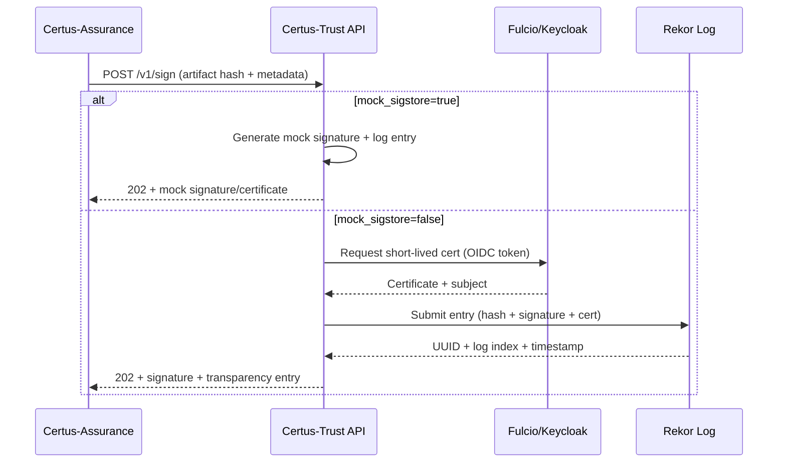
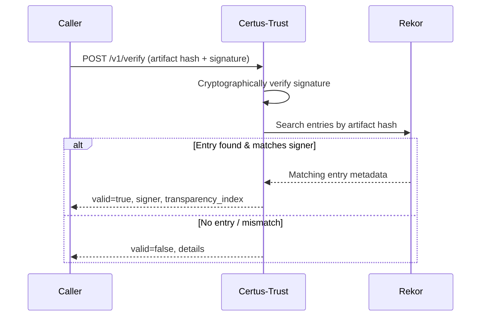
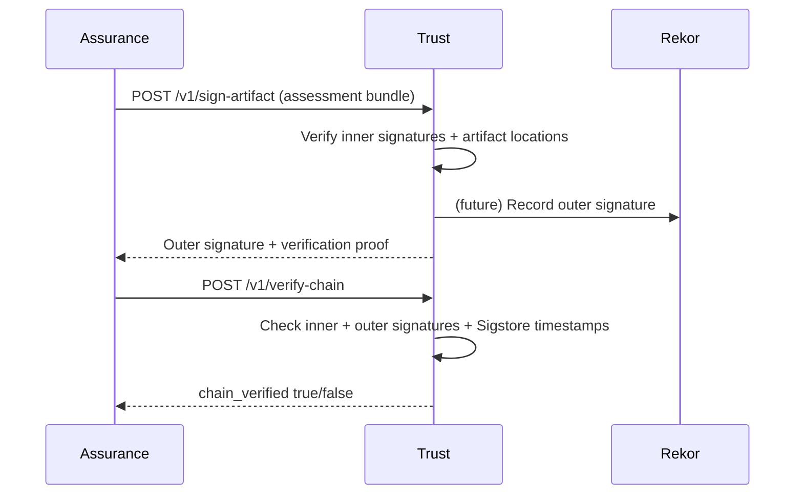
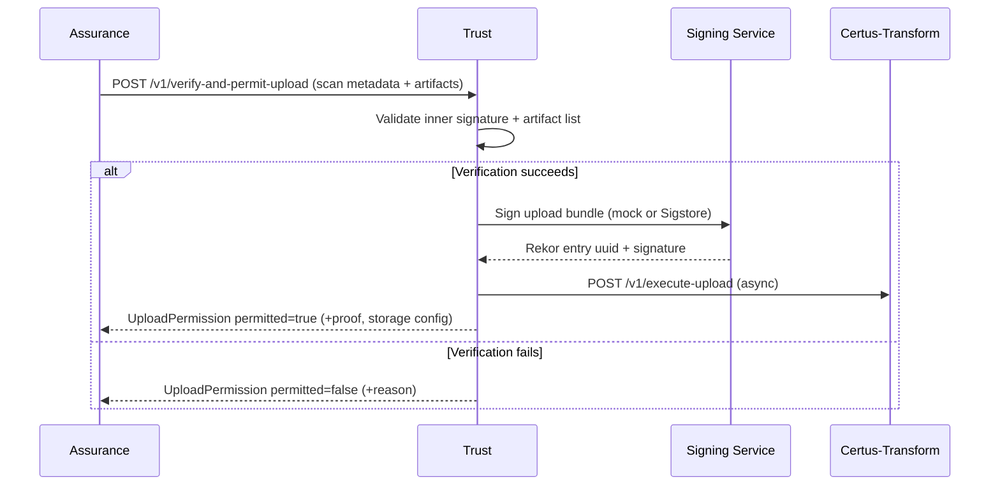
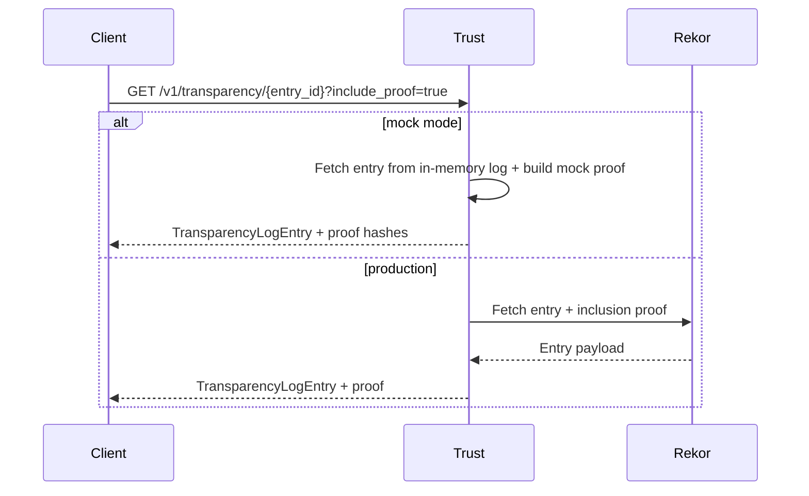

# Sequence Diagrams

## `/v1/sign` – Keyless Signing Flow

## `/v1/verify` – Signature Verification

## `/v1/sign-artifact` and `/v1/verify-chain`

## `/v1/verify-and-permit-upload` – Gatekeeper Workflow

## `/v1/transparency` – Transparency Queries

