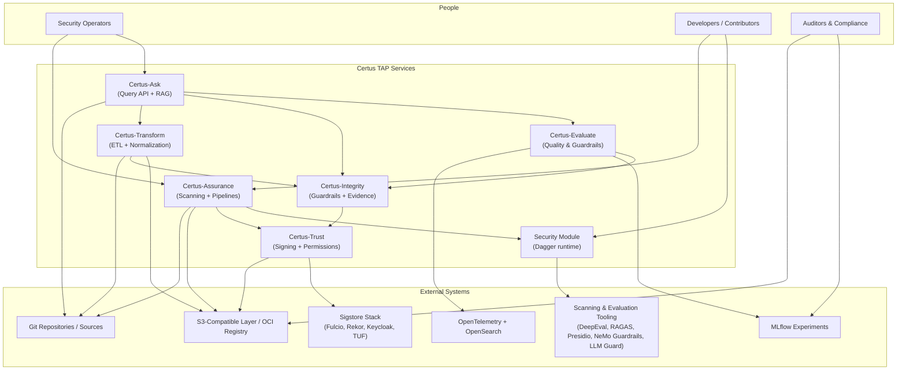
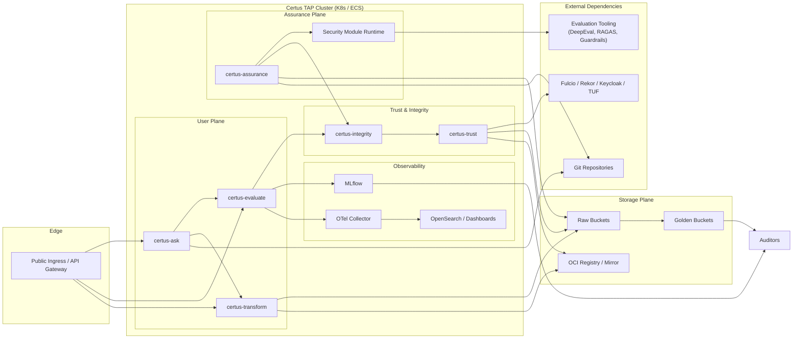
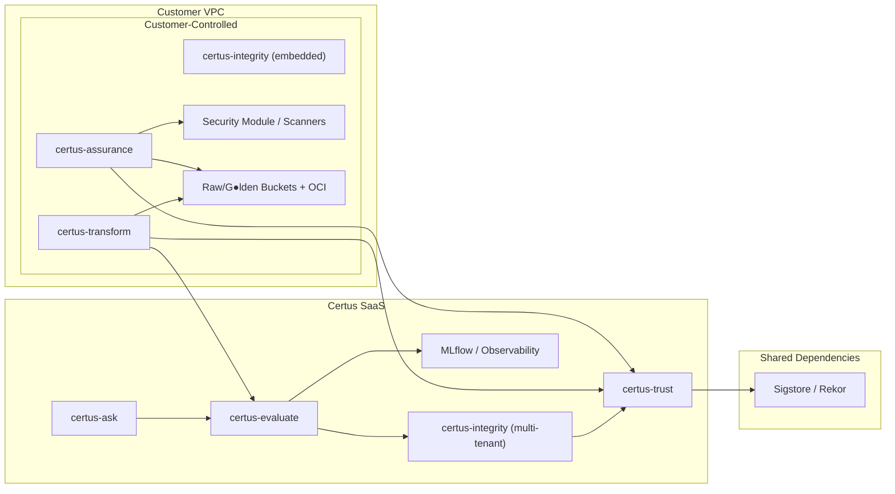
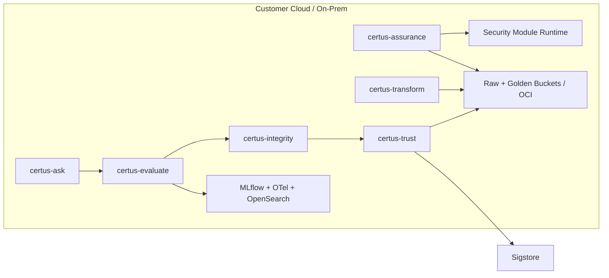
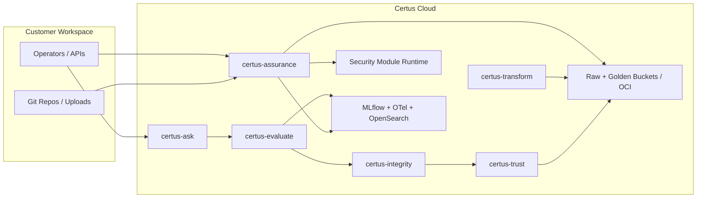
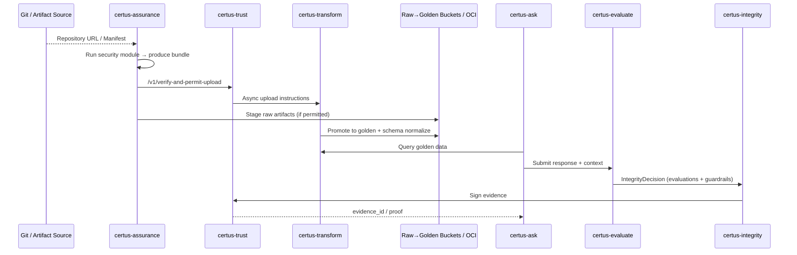

# System Landscape (C4)

The Certus Trust and Assurance Platform is a federation of services that ingest security data, evaluate LLM quality, enforce guardrails, and sign evidence for downstream consumers. This view summarizes the people and systems (internal + external) and how they interact.

## People & External Systems

| Actor / System                      | Role in the landscape                                                                                           |
| ----------------------------------- | --------------------------------------------------------------------------------------------------------------- |
| Security Operators                  | Use Certus-Ask for investigations, trigger Certus-Assurance scans, review Certus-Transform outputs.             |
| Builders / Contributors             | Extend the Dagger-based security module and evaluation pipelines, provide manifests and scans.                  |
| Auditors / Compliance Teams         | Consume MLflow experiments, evidence bundles, and telemetry dashboards to verify quality/compliance.            |
| Git Repositories / Sources          | Material scanned by Assurance, ingested by Transform, or referenced in Ask answers.                             |
| Tooling (DeepEval, RAGAS, etc.)     | External toolchain invoked by certus-evaluate and the security module to compute metrics and guardrail signals. |
| S3-Compatible Layer / OCI Registry  | Raw/golden artifact stores used by Assurance + Transform; also holds signed evidence bundles.                   |
| MLflow / OpenTelemetry / OpenSearch | Observability plane for quality metrics, regression runs, and guardrail alerts.                                 |
| Sigstore Stack                      | Fulcio/Rekor/Keycloak/TUF services called by Certus-Trust for signing, verification, and transparency evidence. |

## Core Services & Responsibilities

| Service          | Summary of responsibilities                                                                                                                       |
| ---------------- | ------------------------------------------------------------------------------------------------------------------------------------------------- |
| Certus-Ask       | FastAPI + Haystack RAG service that answers operator questions and streams responses to certus-evaluate + integrity guardrails.                   |
| Certus-Evaluate  | Runs DeepEval/RAGAS metrics, Haystack validators, and security guardrails; emits signed evidence via certus-integrity/trust; logs to MLflow/OTel. |
| Certus-Assurance | Executes repository scans using the shared security module, packages artifacts, and uploads to the raw→golden S3 layers after Trust approval.     |
| Security Module  | Dagger-based scanning runtime providing standardized profiles (smoke → full) used locally and by Assurance.                                       |
| Certus-Transform | Normalizes scan outputs, applies anonymization, and moves verified bundles from raw storage to golden stores for downstream query services.       |
| Certus-Integrity | Shared guardrail middleware that validates requests, stores IntegrityDecision objects, and forwards them to Trust for signing.                    |
| Certus-Trust     | Acts as the cryptographic control plane: verifies signatures, issues upload permissions, signs evaluations, and exposes transparency logs.        |

Together, these services enforce the principle of “trust through evidence”: every ingestion, scan, evaluation, or query passes through a sequence of quality checks, guardrails, and signing workflows before being stored or surfaced to end users.

## Deployment Overview

This deployment view emphasizes the common topology: requests enter through a shared ingress, Certus-Ask/Evaluate/Transform run in the user plane, Assurance and the Dagger runtime occupy a separate plane with access to source repositories, and Trust/Integrity sit in their own tier with outbound connectivity to Sigstore. Raw/golden buckets and OCI registries form the storage plane, while MLflow and OpenTelemetry provide observability for operations and audits.

### Deployment Options

There are two common topologies depending on customer needs.

#### 1. Hybrid SaaS (Ask/Evaluate/Trust hosted by Certus)

In this model, the customer keeps the scanning and transformation layers close to their source code and storage, while Certus hosts the conversational interface, evaluation engine, and signing service. `certus-integrity` can be embedded with Assurance/Transform for local guardrails or rely on the hosted multi-tenant instance.

#### 2. Fully Self-Hosted (All services in customer control)

Here, every component runs within the customer’s boundary. Certus provides reference deployments (Helm charts / Compose files) and the Dagger module, but the customer manages secrets, scaling, and Sigstore connectivity. `certus-integrity` still acts as the glue between the evaluation/assurance layers and Trust, but it can be deployed once and shared across services or embedded per workload.

In both topologies, the key design principle remains: **quality and evidence live where the customer needs them**, while Trust and Integrity ensure signed provenance whether the services run as SaaS or on customer infrastructure.

#### 3. Fully SaaS (Certus-hosted end-to-end)

This option places every service inside the Certus-controlled cloud while exposing ingress endpoints, secure upload APIs, and artifact retrieval interfaces to customers. It’s suitable for teams that prefer a turnkey experience and are comfortable uploading repositories or scan artifacts to a hosted environment. certus-integrity still acts as the shared guardrail layer but runs inside the Certus environment, providing multi-tenant policy enforcement and evidence signing out-of-the-box.

### Deployment Comparison

| Model             | What the customer controls                                                        | When to choose it                                                          | Data residency considerations                                                             |
| ----------------- | --------------------------------------------------------------------------------- | -------------------------------------------------------------------------- | ----------------------------------------------------------------------------------------- |
| Hybrid SaaS       | Certus-Assurance, Certus-Transform, raw/golden storage, optional certus-integrity | When scanning needs to stay on-prem but teams want SaaS Ask/Evaluate/Trust | Scan artifacts and manifests remain in customer storage; prompts/answers flow to SaaS.    |
| Fully Self-Hosted | Every Certus service, Sigstore connectivity, observability stack                  | Regulated environments or air-gapped deployments                           | No data leaves the customer environment unless Sigstore is also SaaS.                     |
| Fully SaaS        | Only data sources and client access controls                                      | Greenfield teams or those without infra capacity                           | Repositories/artifacts are uploaded to Certus; retention policies enforced contractually. |

## certus-integrity Deployment Patterns

- **Embedded Mode:** Run a lightweight instance side-by-side with certus-assurance or certus-evaluate to enforce guardrails locally and forward signed decisions to Certus-Trust. Useful for air-gapped or hybrid environments.
- **Central Service:** Deploy a shared integrity instance (single pod/service) that all Certus workloads call. This is the default for SaaS and simplifies configuration of policies, secrets, and Sigstore credentials.
- **Edge Cache:** For low-latency scenarios, run embedded integrity modules that mirror policies from the central service; evidence is still sent upstream for signing, but local caches handle request admission control quickly.

## End-to-End Flow

This flow stitches together the scanning, signing, transformation, query, and evaluation loops that are documented individually in the service-specific pages.

## Cross-Service Observability

- **Tracing:** All services emit OpenTelemetry spans with shared `trace_id` headers (`X-Request-ID` or `traceparent`). Evaluations use spans like `evaluation.ragas`, scans use `assurance.pipeline`, and Trust exposes `trust.upload_permission`.
- **Metrics:** Certus-Assurance/Evaluate publish pass/fail gauges and latency histograms. Certus-Ask increments counters when guardrails block responses. Aggregate these in OpenSearch or your preferred metrics backend.
- **MLflow Experiments:** Evaluate logs metrics (`deepeval_score`, `faithfulness`, `answer_relevancy`) with `integrity_evidence_id` params so auditors can correlate evidence bundles with experiments.
- **Logging Schema:** Structured logs include `service_name`, `workspace_id`, `test_id/evidence_id`, `manifest_digest`, and `decision`. Use these fields to pivot between components during incident response.
