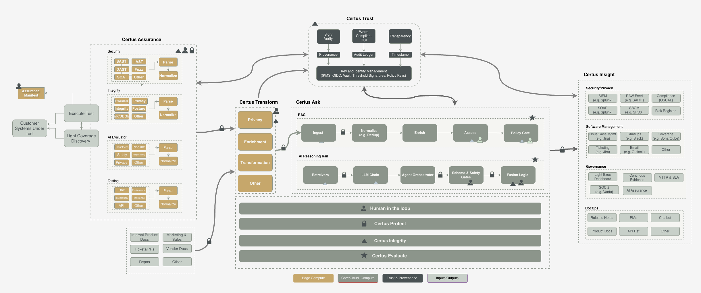

# Certus TAP

**Certus Trust & Assurance Platform (CertusTAP)** is a unified, technology-agnostic framework for evaluating, enriching, and governing software and AI systems through automation, evidence, and selective human review. It defines the target architecture (principles, workflows, ontology, and practices) that any trust & assurance platform should aspire to implement.

The companion Certus PoC (this repository’s services and scripts) is a concrete reference implementation that incrementally validates these ideas with specific technologies. As you explore the framework, keep in mind that some components are already realized in the PoC, while others remain forward-looking roadmap items.

???+ info "Click to hide architecture"

    { .static-diagram }

The flow is intentional:

1. **Workflows** describe the desired interactions (developers, auditors, ops, execs, etc.).
2. Those workflows inform the **architecture** (contracts, components, and governance hooks.)
3. The PoC implements concrete **capabilities** that map back to that architecture.

---

## Potential Uses

At the moment the goal is to use this platform to combine security, integrity, privacy, and AI Assurance testing into a single automated flow.

Ultimately, some of the use cases we hope to tackle with this approach include but are not limited to:

### Trust & Integrity

- **Prove software integrity** through automated build attestations and signed provenance
- **Maintain a living evidence trail** linking code, model, and policy decisions to measurable proof
- **Support secure supply-chain validation** with verifiable SBOMs and dependency attestations
- **Drive accountability** by codifying human decisions and approvals into the assurance record

### Security & Privacy

- **Continuously validate security posture** with embedded scanning and evidence collection
- **Detect and mitigate privacy risks** using automated PII and data-handling analysis
- **Govern AI behavior** via bias, fairness, and transparency evaluations built into the workflow

### Compliance & Audit

- **Map controls to frameworks** (SOC 2, NIST, ISO, AI Act) to generate machine-readable compliance evidence
- **Facilitate continuous audit readiness** by automating evidence generation and storage
- **Provide the data, metrics, and integrations** for organizations preferred compliance tooling to generate real-time trust dashboards summarizing compliance, risk, and integrity metrics

### Governance & Collaboration

- **Enable selective human review** where ethical or contextual judgment is required
- **Bridge development and governance** so assurance is built in—not bolted on
- **Empower external stakeholders** (regulators, customers, partners) with transparent, verifiable trust artifacts
- **Foster ecosystem collaboration** through open, machine-interpretable assurance specifications
- **Unify assurance language across humans and systems** through standardized metadata and schemas
