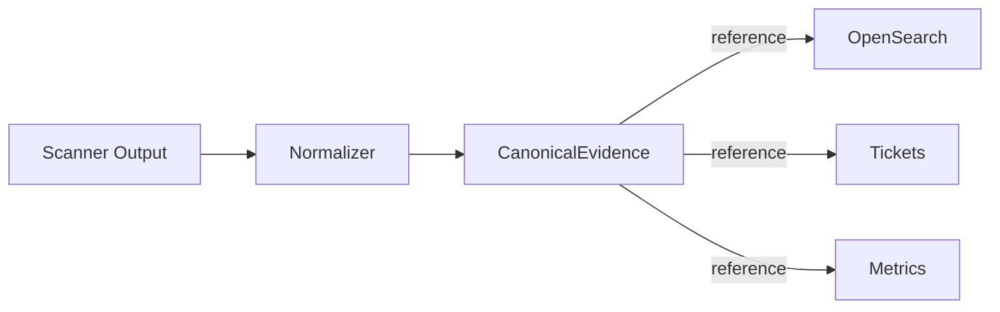

# Practices

Where principles capture the “why,” practices captures the “how.” Each practice distills the concrete steps we repeat whenever we extend the platform. Reference these patterns when implementing new services or tuning existing pipelines.

---

## Practice 1. Normalize Once, Then Reuse Everywhere

**Goal:** Establish a canonical evidence layer that every downstream system can trust.

**Steps**

1. **Collect** raw scanner output (prefer SARIF; convert JSON/proprietary formats into SARIF whenever possible).
2. **Enrich** each finding with metadata (commit SHA, image digest, branch, environment, scanner version).
3. **Fingerprint** deterministically (e.g., `sha1(rule_id + file + line)`) to dedupe across runs.
4. **Emit** a canonical JSON/SARIF artifact and store it immutably (OCI registry or WORM bucket).
5. **Expose** indexes (OpenSearch, Neo4j, data lake) that reference the canonical artifact via `evidence_uri` rather than embedding bespoke copies.



Treat this canonical artifact set as the **Normalization Layer**. Everything above it (tickets, dashboards, metrics) is replaceable, while everything below it (SARIF, SBOMs, attestations) stays immutable. Guard that contract so downstream systems never reach back into raw scanner output.

**Checklist**

- [ ] All scanners emit SARIF or have a converter.
- [ ] Every normalized document includes `evidence_uri` and `content_digest`.
- [ ] Downstream jobs read only the canonical format.
- [ ] Normalizer pipelines are versioned, tested, and reproducible.

---

## Practice 2. Replace “Platforms” With a Simple Sync Layer

**Goal:** Automate triage/update flows without ceding control to a monolithic vendor platform.

**Pattern**

```python
fingerprint = sha1(rule_id + file + line)
issue = tms.find_by_fingerprint(fingerprint)

if issue is None:
    tms.create_issue(summary, description, severity, fingerprint, evidence_uri)
else:
    tms.update_issue(issue.id, status="open", comment="Still present in commit abc123")
```

**Implementation Notes**

- Store the fingerprint in a dedicated custom field/label (`evidence_id`).
- Include severity, component, environment, and tool metadata so filters remain fast.
- Treat the TMS as a **view layer**; the canonical evidence remains the source of truth.
- Run the sync on every CI run or scheduled job; never rely on manual ticket edits.
- Log every create/update operation with the associated artifact digest.
- Enrich tickets with contextual metadata (severity, component/service, commit/PR) so stakeholders can triage without re-querying scanners.
- Reference immutable evidence (`evidence_uri`) rather than copying payloads into tickets; the URI is your chain of custody.

**When to Use**

- Need ticket automation but want deterministic, auditable behavior.
- Want to swap TMS vendors without rearchitecting.
- Require cryptographic linkage between issues and evidence.

---

## Practice 3. Schema-First Graph Ingestion

**Goal:** Load richly structured evidence (findings, packages, relationships) into _any_ graph database in a predictable, auditable way.

**Steps**

1. **Define the ontology** (e.g., `Scan`, `Finding`, `Package`, `License`, `Location`, `DependsOn`).
2. **Apply constraints/indexes** before ingest (unique IDs, required properties) so loaders fail fast.
3. **Make loaders idempotent**: clear or merge existing nodes for the same logical ID (`workspace-scan`, `workspace-sbom`).
4. **Run verification queries** post-ingest (`MATCH (scan:Scan)-[:CONTAINS]->(f:Finding)` etc.) to ensure counts align with the source evidence.

This pattern works whether you’re using Neo4j, JanusGraph, Neptune, or any Gremlin/Cypher-compatible system.

---

## Practice 4. Promotion Pipelines for Untrusted → Trusted Storage

**Goal:** Keep raw/unverified artifacts separate from the curated set regardless of storage technology.

**Flow**

1. **Land** new artifacts (scans, SBOMs, attestations) in a raw/quarantine area.
2. **Verify + normalize** (signatures, schema, metadata).
3. **Promote** to a golden bucket/registry only if verification succeeds.
4. **Ingest** from the golden location into search indexes, graphs, or downstream workflows.

This ensures compliance whether you’re using S3, GCS, Azure Blob, NFS, or OCI registries.

---

## Practice 5. Evidence-Linked Ticket Sync

**Goal:** Whatever TMS you use (Jira, ServiceNow, Azure Boards), keep the ticket tied to immutable evidence.

**Key Moves**

- Compute deterministic fingerprints per finding.
- Store the fingerprint in a custom field/label.
- Include `evidence_uri` pointing to the canonical artifact.
- Treat the TMS as a read/write cache; the artifact remains the source of truth.
- Do not edit findings manually. Update tickets only by re-running scans and re-syncing so the workflow stays reproducible.
- Never overwrite historical states. If a vulnerability returns, mark it “re-opened” with references to the new artifact digests.
- Prefer digests over filenames (`sha256:abcd...`) for long-term verifiability, and sign bulk updates so every sync batch is attestable.

This pattern keeps human workflows flexible without diluting the provenance chain.

---

## Practice 6. Verification-First External Workflows

**Goal:** Before writing to shared storage or triggering downstream actions, require a gatekeeper service to validate the artifacts.

**Generic Steps**

1. Producer submits a verification request (includes metadata, signatures, expected digests).
2. Gatekeeper validates signatures/policy, checks against registries/logs, and returns a permission token.
3. Only after permission is granted do downstream services upload to S3/OCI or trigger ingestion.
4. Record the verification proof alongside the artifact metadata for future audits.

This pattern applies whether your gatekeeper is Certus-Trust, an internal attestation service, or any policy engine.

---

## Practice 7. Automate Metrics from Evidence

**Goal:** Generate trustworthy operational metrics without inventing a parallel data model.

**Steps**

1. Read from the canonical normalized artifacts rather than ad-hoc exports.
2. Expose metrics such as `security_findings_open{severity="critical"}` directly from normalized data.
3. Include freshness indicators (last scan timestamp, pipeline commit) next to every counter.
4. Publish via Prometheus/OpenMetrics exporters and visualize in Grafana, Looker, etc.

**Why it Works**

- Metrics inherit the provenance of the underlying evidence.
- You avoid drift between dashboards and the artifacts auditors will inspect.
- Engineers can track MTTR, SLA breaches, and scan staleness with the exact same identifiers present in tickets and registries.

---

## Practice 8. Enforce Policy as Code

**Goal:** Gate promotions or deployments using declarative policies tied to signed evidence.

**Pattern**

1. Encode security SLOs (e.g., “critical findings = 0”, “no highs older than 30 days”, “last scan < 24h”) in CUE/OPA/Rego.
2. Bundle the policy with version metadata and publish it alongside pipelines.
3. Evaluate policies in CI/CD, passing the normalized artifact metadata as input.
4. Block promotions automatically when policies fail; sign the decision and surface it in tickets/dashboards.

This keeps “continuous assurance” concrete: every deploy is backed by reproducible evidence, a versioned policy, and a verifiable decision log.

---

## Practice 9. Keep AI on a Leash

**Goal:** Control when and how AI services are invoked so sensitive data and provenance never slip outside governed boundaries.

**Steps**

1. **Start local**: Run the smallest acceptable model inside your boundary to meet privacy, carbon, and cost goals. Benchmark it with golden datasets so you know when it's “good enough.”
2. **Define escalation gates**: Encode the telemetry or evaluation thresholds that justify routing to stronger hosted/public models. Require policy approval for each escalation path.
3. **Log every routing decision**: Record which engine handled each request, the evaluation score that triggered escalation, and the evidence digest the AI acted on.
4. **Continuously re-evaluate**: As local models improve, rerun the benchmark and downgrade traffic back to private inference whenever it meets the target.
5. **Keep the bypass removable**: Build AI calls as optional middleware—toggling them off must not break the assurance flow.

**Checklist**

- [ ] Local inference path exists and is benchmarked.
- [ ] Escalation policy (who/what allows external calls) is versioned and auditable.
- [ ] Routing logs capture model ID, prompt, response, and evidence digest.
- [ ] Disable flag or feature gate can turn off AI components without code changes.
- [ ] Periodic evaluation jobs compare local vs. remote quality and update routing thresholds.

---

## Practice 10. Embrace Composability Over Centralization

Avoid the “single platform” trap—the ecosystem must be **modular**, not monolithic. Build around open standards (SARIF, SPDX, OPA, OCI), ensure each component (scanner, normalizer, sync, visualizer) can be swapped without breaking the chain, and encourage integration through API contracts and schema stability rather than UI lock-in. This philosophy keeps the system resilient to vendor churn and technological drift.

**Goal:** Keep every layer of the assurance stack swappable so vendor churn or new requirements do not force rewrites.

**Pattern**

1. **Contract first:** Define APIs/schemas between scanners, normalizers, sync layers, dashboards, etc., and version them.
2. **Use open standards:** Favor SARIF/SPDX/OPA/OCI for interchange to reduce bespoke glue.
3. **Abstract integrations:** Wrap external services (e.g., Jira, Grafana, Neo4j) behind service classes so replacements require only adapter swaps.
4. **Continuously test seams:** Add contract or compatibility tests ensuring alternative implementations behave identically.

**Checklist**

- [ ] Every integration point has a documented schema or interface.
- [ ] Component swaps (scanner, ticketing, storage) require only configuration/adapters, not pipeline rewrites.
- [ ] Regression tests cover adapter behavior for at least one alternative implementation.
- [ ] UI choices never gate functionality—API contracts remain canonical.

---

## Practice 11. Treat Assurance as a Feedback Loop

Assurance isn't a one-way audit; it's a continuous learning cycle. Feed enriched metrics (MTTR, false-positive rate, bias score, etc.) back into scanner configuration and policy thresholds, automatically tune or retire ineffective rules, and use AI-based triage or clustering to guide developers toward high-value remediations first. The goal is adaptive improvement, not static compliance.

**Goal:** Use real evidence to tune scanners, policies, and AI triage continuously.

**Steps**

1. **Instrument pipelines** to emit MTTR, false-positive rates, and scan freshness metrics (see Practice 7).
2. **Feed metrics back** into configuration repositories (e.g., adjust rule severities, retire noisy checks).
3. **Automate reviews**: Schedule jobs that compare current metrics vs. SLOs and open issues/PRs when drift occurs.
4. **Leverage clustering/AI** to group related findings and focus humans on highest-value work.

**Checklist**

- [ ] Metrics dashboards clearly show trends per repo/service.
- [ ] There is a documented process (and cadence) for tuning scanners based on evidence.
- [ ] Policy thresholds are updated via code review, not ad-hoc edits.
- [ ] AI assist tooling logs its recommendations and resulting human decisions for future tuning.

---

## Practice 12. Build for Multi-Persona Collaboration

Different participants—developers, auditors, data scientists, compliance officers—interpret “risk” differently. Deliver context-appropriate surfaces (tickets for devs, dashboards for ops, signed ledgers for auditors), maintain a shared vocabulary through consistent metadata fields (e.g., severity, component, evidence_uri), and keep human review paths explicit, auditable, and reversible. This avoids one-size-fits-all “security portals.”

**Goal:** Ensure every stakeholder gets a surface tailored to their responsibility without losing provenance.

**Pattern**

1. **Define personas** (developer, auditor, compliance, SRE, data scientist) and map decisions each must make.
2. **Provide context-specific views** (e.g., Jira for devs, Grafana metrics for ops, signed ledgers for auditors) all referencing the same `evidence_uri`.
3. **Maintain shared vocabulary** via schemas/metadata fields so severity/component/environment mean the same thing everywhere.
4. **Track human interventions** (approvals, waivers) with signatures or attestations for auditability.

**Checklist**

- [ ] Every persona has a documented workflow referencing canonical evidence.
- [ ] Metadata fields are enforced/validated across systems.
- [ ] Human review paths (approvals, waivers) are logged with timestamps and identities.
- [ ] Removing any single UI does not break coordination because APIs remain the source of truth.

---

## Practice 13. Design for Policy, Tooling, and AI Drift

Every system you integrate—scanners, AI validators, governance policies—will evolve. Version everything (schemas, policies, prompts, AI models), persist results with their context (model hash, policy commit, scanner version), and periodically re-evaluate historical evidence with updated logic to maintain continuity across generations. This provides temporal assurance: what was compliant last year can still be verified under today's rules.

**Goal:** Version everything that influences assurance decisions and make it simple to replay historical evidence under new rules.

**Steps**

1. **Version schemas/policies/prompts/models** alongside code; embed version IDs into normalized artifacts.
2. **Persist context**: store model hashes, policy commits, scanner versions, and environment metadata with every result.
3. **Automate re-evaluation**: run periodic jobs that replay historical evidence with updated logic to detect regressions or newly non-compliant states.
4. **Report gaps**: When re-evaluation outcomes change, open issues linking old vs. new evidence to maintain continuity.

**Checklist**

- [ ] Every artifact includes references to the exact policy/prompt/model versions used.
- [ ] There is a documented process to replay historical evidence.
- [ ] Tool upgrades include migration guides describing how old data will be interpreted.
- [ ] Drift reports are surfaced to stakeholders (dashboards, tickets) with actionable next steps.

_Have another repeatable pattern?_ Open an issue or PR so we can append it here and keep the framework actionable as well as aspirational.
