# Hybrid Search: Combining Semantic Search and Knowledge Graphs

>**STATUS:Tutorial is currently in beta. If you have issues see our [Communication & Support guide](../../about/communication.md)**

The most powerful security analysis combines **OpenSearch's semantic search** for exploratory discovery with **Neo4j's knowledge graph** for structural analysis. This guide shows how to use both tools together to answer complex security questions, perform impact analysis, and generate compliance reports.

```mermaid
sequenceDiagram
    participant Analyst
    participant OpenSearch
    participant Neo4j
    participant Reports

    Analyst->>OpenSearch: Natural-language query (discover issues)
    OpenSearch-->>Analyst: Ranked findings + context
    Analyst->>Neo4j: Follow-up graph query (impact/dependencies)
    Neo4j-->>Analyst: Exact relationships & counts
    Analyst->>Reports: Combine results (CSV/HTML/compliance)
    Reports-->>Analyst: Final report for stakeholders
```



## When to Use Hybrid Search

Reach for the hybrid workflow when:

- A natural-language question needs **precise follow-up** (“Show me auth-related SQL injection issues, then list their downstream dependencies”).
- You must **pivot from text to structure** (discover findings in OpenSearch, then enumerate affected packages/files in Neo4j).
- You need to **validate semantic results** with deterministic graph traversals (compliance, impact reports).
- You’re joining **unstructured context with structured relationships** (e.g., remediation narrative + dependency chain).

## Why Hybrid Search?

Neither tool alone provides complete insight:

| Limitation                                                               | Tool       | Solution                       |
| ------------------------------------------------------------------------ | ---------- | ------------------------------ |
| "Find issues related to secrets" - text scattered across findings        | Neo4j      | Use OpenSearch semantic search |
| "What's the impact of B303 pickle vulnerability?" - need relationships   | OpenSearch | Use Neo4j graph traversal      |
| "Which files have exploitable vulns?" - requires both text and structure | Both       | Combine approaches             |

The hybrid approach:

1. **Discover** issues with OpenSearch (natural language, relevance ranking)
2. **Analyze** impact with Neo4j (relationships, dependencies)
3. **Report** findings with both (text + structure)

## Prerequisites

- Working directory: project root unless noted otherwise.

## Step 1 - Set-up

### 1.1 Bring up relevant services

```bash
just ask-up
```

### 1.2 Check if everything is ready for the tutorial

```bash
just preflight-ask
```

### 1.3 Configure `aws` CLI for LocalStack

```bash
aws configure set aws_access_key_id test
aws configure set aws_secret_access_key test
aws configure set default.region us-east-1
aws configure set profile.localstack.s3.endpoint_url ${S3_ENDPOINT}
```

### 1.4 run the helper script once per workspace so the buckets and sample SARIF/SPDX files are consistent with the keyword/semantic tutorials:

```bash
./scripts/setup-security-search.sh --workspace hybrid-search-demo --ingest-all
export WORKSPACE_ID=hybrid-search-demo
```

**Verify Neo4j graph data** - The setup script loads data into Neo4j. Verify it completed successfully:

```bash
docker exec neo4j cypher-shell -u neo4j -p password \
  'MATCH (loc:Location) RETURN count(loc) as location_count;'
```

Expected output: `location_count` should be > 0 (typically 12+ locations for the sample data)

## Step 2 - Vulnerability Impact Analysis

**Goal:** Understand the full impact of a discovered vulnerability

### 2.1 Discover with OpenSearch

Use the `security-findings` alias to pull just the SARIF findings and filter by the concept you care about:

```bash
curl -s -X POST "${OPENSEARCH_HOST}/security-findings/_search" \
  -H 'Content-Type: application/json' \
  -d '{
        "query": {
          "bool": {
            "must": [
              {"term": {"record_type": "finding"}},
              {"match": {"content": "pickle"}}
            ]
          }
        },
        "_source": ["rule_id","severity","source_location"],
        "size": 20
      }' \
  | jq -r '.hits.hits[]
           | "\(.["_source"].rule_id)\t\(.["_source"].severity)\t\(.["_source"].source_location)"'
```

**Returns:** Matching B303 findings with their file + line (`app/cache.py:34` in the sample data).

### 2.2 Analyze with Neo4j

Jump straight to the deterministic Neo4j scan ID returned by ingestion:

```bash
docker exec neo4j cypher-shell -u neo4j -p password \
  'MATCH (scan:SecurityScan {id: "neo4j-'${WORKSPACE_ID}'-scan"})-[:CONTAINS]->(f:Finding {rule_id: "B303"})
   OPTIONAL MATCH (f)-[:LOCATED_AT]->(loc:Location)
   RETURN f.rule_id, f.severity, loc.uri, loc.line
   ORDER BY loc.uri, loc.line;'
```

### 2.3 Find downstream impact

```bash
docker exec neo4j cypher-shell -u neo4j -p password \
  'MATCH (:SBOM {id: "neo4j-'${WORKSPACE_ID}'-sbom"})-[:CONTAINS]->(pkg:Package)-[:DEPENDS_ON]->(dep:Package {name: "redis"})
   RETURN pkg.name, pkg.version
   ORDER BY pkg.name;'
```

### 2.4 Report findings

- **OpenSearch**: “Two B303 findings at `app/cache.py:34`”
- **Neo4j**: “Celery depends on Redis in the SBOM graph”
- **Action**: “Patch cache serialization before redeploying Celery tasks that rely on Redis”

---

## Step 3 - License Compliance Review

**Goal:** Ensure all dependencies meet licensing requirements

### 3.1 Discover packages with problematic licenses (OpenSearch)

```bash
curl -s -X POST "${OPENSEARCH_HOST}/sbom-packages/_search" \
  -H 'Content-Type: application/json' \
  -d '{
        "query": {
          "bool": {
            "must": [
              {"term": {"record_type": "package"}},
              {"wildcard": {"licenses": "*LGPL*"}}
            ]
          }
        },
        "_source": ["package_name","package_version","licenses","supplier"],
        "size": 100
      }' \
  | jq -r '.hits.hits[]
           | .["_source"]
           | [.package_name, .package_version, (.licenses | join(",")), .supplier]
           | @tsv'

```

_(Swap `"LGPL"` for `"MIT"`, `"GPL"`, etc. to match your SBOM content.)_

### 3.2 Analyze with Neo4j

```bash
docker exec neo4j cypher-shell -u neo4j -p password \
  'MATCH (:SBOM {id: "neo4j-'${WORKSPACE_ID}'-sbom"})-[:CONTAINS]->(pkg:Package)
   MATCH (pkg)-[:USES_LICENSE]->(lic:License {name: "LGPL-3.0-only"})
   MATCH (consumer:Package)-[:DEPENDS_ON*1..3]->(pkg)
   RETURN pkg.name, pkg.version, collect(distinct consumer.name) AS consumers
   ORDER BY pkg.name;'
```

### 3.3 Decide policy

- **OpenSearch** shows “psycopg2 uses LGPL”
- **Neo4j** shows “SQLAlchemy depends on psycopg2”
- **Decision**: Document the exception or replace the dependency

---

## Step 4 - Hotspot Analysis & Remediation Priority

**Goal:** Identify which files need the most security attention

### 4.1 Aggregate high-severity hits in OpenSearch

```bash
curl -s -X POST "${OPENSEARCH_HOST}/security-findings/_search" \
  -H 'Content-Type: application/json' \
  -d '{
        "query": {"term": {"record_type": "finding"}},
        "aggs": {
          "by_severity": {"terms": {"field": "severity"}},
          "hotspots": {"terms": {"field": "source_location", "size": 20}}
        },
        "size": 0
      }' \
  | jq '.aggregations'
```

### 4.2 Drill into a file with Neo4j

```bash
docker exec neo4j cypher-shell -u neo4j -p password \
  'MATCH (scan:SecurityScan {id: "neo4j-'${WORKSPACE_ID}'-scan"})-[:CONTAINS]->(f:Finding)-[:LOCATED_AT]->(loc:Location {uri: "app/database.py"})
   RETURN f.rule_id, f.severity, f.message, loc.line
   ORDER BY loc.line;'
```

### 4.3 Prioritize remediation

Use the counts from OpenSearch plus the detailed context from Neo4j to focus on the riskiest files first.

## Step 5 - Dependency Risk Assessment

**Goal:** Inspect the dependency chain for a key package (Flask)

### 5.1 Locate the package in OpenSearch

```bash
curl -s -X POST "${OPENSEARCH_HOST}/sbom-packages/_search" \
  -H 'Content-Type: application/json' \
  -d '{
        "query": {
          "bool": {
            "must": [
              {"term": {"record_type": "package"}},
              {"match": {"package_name": "flask"}}
            ]
          }
        },
        "_source": ["package_name","package_version","licenses","supplier"],
        "size": 10
      }' \
  | jq -r '.hits.hits[]?["_source"] | [
      .package_name,
      .package_version,
      (.licenses | join(",")),
      .supplier
    ] | @tsv'

```

### 5.2 Examine its dependencies with Neo4j

```bash
docker exec neo4j cypher-shell -u neo4j -p password \
  'MATCH (:SBOM {id: "neo4j-'${WORKSPACE_ID}'-sbom"})-[:CONTAINS]->(pkg:Package {name: "flask"})-[:DEPENDS_ON]->(dep:Package)
   RETURN pkg.name, pkg.version, collect(dep.name) AS dependencies
   ORDER BY pkg.name;'
```

### 5.3 Score the risk

Combine Flask's dependency list (Werkzeug, Jinja2, Click, Python) with vulnerability/licensing data to decide whether additional review is required.

---

## Step 6 - Multi-Level Dependency Chain Analysis

**Goal:** Understand the full dependency tree for a critical package\*\*

### 6.1 Locate the package document (OpenSearch)\*\*

```bash
curl -s -X POST "${OPENSEARCH_HOST}/sbom-packages/_search" \
  -H 'Content-Type: application/json' \
  -d '{
        "query": {"term": {"package_name": "cryptography"}},
        "_source": ["package_name","package_version","licenses","supplier"],
        "size": 5
      }' \
  | jq -r '.hits.hits[]?["_source"] | [
      .package_name,
      .package_version,
      (.licenses | join(",")),
      .supplier
    ] | @tsv'

```

### 6.2 Walk the dependency graph (Neo4j)

```bash
docker exec neo4j cypher-shell -u neo4j -p password \
  'MATCH (:SBOM {id: "neo4j-'${WORKSPACE_ID}'-sbom"})-[:CONTAINS]->(target:Package {name: "cryptography"})
   MATCH (downstream:Package)-[:DEPENDS_ON*0..3]->(target)
   RETURN distinct downstream.name, downstream.version
   ORDER BY downstream.name;'
```

### 6.3 Summarize exposure

Report how many packages rely on cryptography, which services they live in, and whether they’re in scope for remediation.

--

## Command Reference: Hybrid Search Workflows

### Pattern 1: Discover → Analyze → Report

```bash
# 1. DISCOVER: Find all CRITICAL findings
curl -s -X POST "${OPENSEARCH_HOST}/security-findings/_search" \
  -H 'Content-Type: application/json' \
  -d '{
        "query": {
          "bool": {
            "must": [
              {"term": {"record_type": "finding"}},
              {"term": {"severity": "HIGH"}}
            ]
          }
        },
        "_source": ["rule_id","severity","source_location"],
        "size": 50
      }'

# 2. ANALYZE: For finding rule_id from step 1, find all occurrences
docker exec neo4j cypher-shell -u neo4j -p password \
  "MATCH (scan:SecurityScan {id: 'neo4j-${WORKSPACE_ID}-scan'})-[:CONTAINS]->(f:Finding {rule_id: 'RULE_FROM_STEP_1'})
   OPTIONAL MATCH (f)-[:LOCATED_AT]->(loc:Location)
   RETURN f.rule_id, loc.uri, loc.line, count(f) AS count;"

# 3. REPORT: Combine both findings for remediation plan
```

### Pattern 2: Risk Identification → Impact → Prioritization

```bash
# 1. IDENTIFY RISK: Find packages with problematic licenses
curl -s -X POST "${OPENSEARCH_HOST}/sbom-packages/_search" \
  -H 'Content-Type: application/json' \
  -d '{
        "query": {
          "bool": {
            "must": [
              {"term": {"record_type": "package"}},
              {"match": {"licenses": "LGPL"}}
            ]
          }
        }
      }'

# 2. ASSESS IMPACT: Find downstream dependents
docker exec neo4j cypher-shell -u neo4j -p password \
  "MATCH (:SBOM {id: 'neo4j-${WORKSPACE_ID}-sbom'})-[:CONTAINS]->(pkg:Package {name: 'PKG_FROM_STEP_1'})
   MATCH (consumer:Package)-[:DEPENDS_ON*1..2]->(pkg)
   RETURN pkg.name, count(consumer) AS downstream_services;"

# 3. PRIORITIZE: High downstream impact = higher priority
```

### Pattern 3: Hotspot Detection → Root Cause → Remediation

```bash
# 1. DETECT HOTSPOTS: Find files with most findings
curl -s -X POST "${OPENSEARCH_HOST}/security-findings/_search" \
  -H 'Content-Type: application/json' \
  -d '{
    "query": {"term": {"record_type": "finding"}},
    "aggs": {"by_file": {"terms": {"field": "source_location", "size": 10}}},
    "size": 0
  }'

# 2. ROOT CAUSE: Get details of findings in hotspot file
docker exec neo4j cypher-shell -u neo4j -p password \
  "MATCH (scan:SecurityScan {id: 'neo4j-${WORKSPACE_ID}-scan'})-[:CONTAINS]->(f:Finding)-[:LOCATED_AT]->(loc:Location {uri: 'HOTSPOT_FILE'})
   RETURN f.rule_id, f.severity, f.message, loc.line
   ORDER BY f.severity;"

# 3. REMEDIATION: Fix by rule_id priority
```

## Best Practices for Hybrid Analysis

### 1. **Start with OpenSearch for Discovery**

- Users think in natural language ("SSL vulnerabilities", "database issues")
- OpenSearch returns relevant results with ranking
- Lower cognitive load; faster initial insights

### 2. **Pivot to Neo4j for Structural Understanding**

- Once you've identified an issue, understand its relationships
- Who depends on it? What files are affected? How do packages relate?
- Neo4j answers these with exact, traversable relationships

### 3. **Combine Results for Actionable Insights**

- OpenSearch: "Found 5 HIGH findings"
- Neo4j: "Affecting 2 critical services, 7 transitive dependencies"
- Together: "These 5 findings need immediate patching; impact is high"

### 4. **Use for Different Stakeholder Needs**

| Stakeholder        | Tool       | Use Case                                   |
| ------------------ | ---------- | ------------------------------------------ |
| Security Analyst   | OpenSearch | Explore new vulnerability reports          |
| Security Analyst   | Neo4j      | Understand impact and dependencies         |
| Compliance Officer | Neo4j      | Generate license/version reports           |
| Developer          | OpenSearch | Search findings by symptom                 |
| Developer          | Neo4j      | Understand how their code affects services |

## Troubleshooting

| Issue                                        | Cause                            | Solution                                   |
| -------------------------------------------- | -------------------------------- | ------------------------------------------ |
| OpenSearch returns too many results          | Query too broad                  | Add filters (severity, file_path)          |
| Neo4j query times out                        | Traversing too many nodes        | Add labels, limit relationships, use LIMIT |
| Mismatch between OpenSearch and Neo4j counts | Data ingestion timing            | Verify both systems completed import       |
| Different results between tools              | Query interpretation differences | Check field names, case sensitivity        |
| Can't correlate findings between tools       | Missing linking data             | Ensure scan_id and rule_id match           |

## Step 7. Cleanup

```bash
just down          # stop containers, keep volumes
just cleanup       # stop + remove containers, keep volumes
just destroy       # full tear-down (volumes removed)
```
