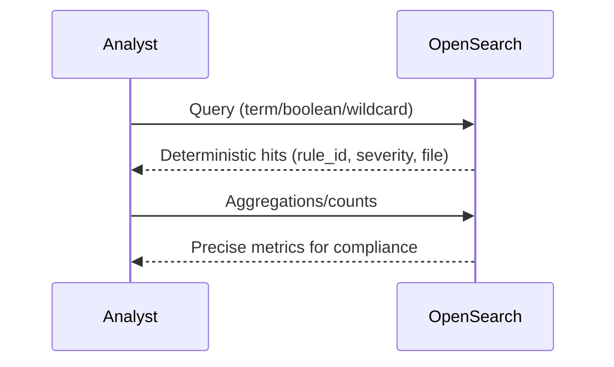

# Keyword Search for Security Analysis

>**STATUS:Tutorial is currently in beta. If you have issues see our [Communication & Support guide](../../about/communication.md)**

While semantic search finds conceptually related issues and knowledge graphs analyze relationships, **keyword search** provides precise, deterministic results for compliance audits, exact matching, and structured queries. This guide shows how to use OpenSearch keyword search for security investigations that require accuracy over relevance.



## When to Use Keyword Search

Keyword search excels at:

- **Compliance audits** - "Find all findings with rule B105"
- **Exact matching** - "Show findings in exactly this source location"
- **Boolean logic** - "HIGH severity AND database.py AND B10\*"
- **Performance-critical queries** - Keyword fields are faster than text
- **Reproducible results** - Same query always returns same results (no ranking variance)
- **Structured investigations** - "All findings where severity=critical AND source_location contains /auth/"

It's less ideal for:

- **Natural language questions** - "What are the SQL issues?" (use semantic search)
- **Fuzzy/approximate matches** - "Probably related to encryption" (use semantic search)
- **Understanding relationships** - "What depends on this?" (use knowledge graphs)

### Query Types

| Query      | Best For                     | Speed       | Precision      |
| ---------- | ---------------------------- | ----------- | -------------- |
| `term`     | Exact keyword match          | ⚡⚡⚡ Fast | ✅ Perfect     |
| `terms`    | Multiple keyword values (OR) | ⚡⚡ Fast   | ✅ Perfect     |
| `match`    | Text search                  | ⚡ Moderate | ⚠️ Approximate |
| `wildcard` | Pattern matching             | ⚡ Moderate | ✅ Good        |
| `bool`     | Complex combinations         | ⚡ Varies   | ✅ Precise     |
| `range`    | Date/number ranges           | ⚡⚡ Fast   | ✅ Perfect     |

## Prerequisites

- Working directory: project root unless noted otherwise.

## Step 1 - Set-up

### 1.1 Bring up relevant services

```bash
just ask-up
```

### 1.2 Check if everything is ready for the tutorial

```bash
just preflight-ask
```

### 1.3 Configure `aws` CLI for LocalStack

```bash
aws configure set aws_access_key_id test
aws configure set aws_secret_access_key test
aws configure set default.region us-east-1
aws configure set profile.localstack.s3.endpoint_url ${S3_ENDPOINT}
```

### 1.4 Bootstrap the workspace + S3 samples\*\* – execute the shared helper once per workspace:

```bash
./scripts/setup-security-search.sh --workspace keyword-search-demo --ingest-all
export WORKSPACE_ID=keyword-search-demo
```

**Wait for ingestion to complete** - The script ingests SARIF and SPDX files into OpenSearch. This typically takes 5-10 seconds. You can verify completion with:

```bash
curl -s "${OPENSEARCH_HOST}/security-findings/_count" | jq .
```

Expected output: `{"count": 12, ...}` (or higher if you've ingested additional files)

## Step 2 - Basic Keyword Queries

### 2.1 Exact Rule ID Match

Find all findings for a specific security rule:

```bash
curl -s -X POST "${OPENSEARCH_HOST}/security-findings/_search" \
  -H 'Content-Type: application/json' \
  -d '{
        "query": {
          "bool": {
            "must": [
              {"term": {"record_type": "finding"}},
              {"term": {"rule_id": "B105"}}
            ]
          }
        },
        "_source": ["rule_id","severity","content","source_location"],
        "size": 100
      }' \
  | jq '.hits.hits[] | .["_source"]'
```

**When to use:** "Audit all SQL injection findings"

**Expected output:**

```json
{
  "hits": [
    {
      "_source": {
        "rule_id": "B105",
        "severity": "INFO",
        "content": "## Hardcoded SQL string detected - user input concatenated directly into query\n\n- Rule: B105\n- Severity: INFO\n- Location: app/database.py:88\n\nHardcoded SQL string detected - user input concatenated directly into query\n",
        "source_location": "app/database.py:88"
      }
    }
  ]
}
```

### 2.2 Exact Severity Match

Find all critical findings:

```bash
curl -s -X POST "${OPENSEARCH_HOST}/security-findings/_search" \
  -H 'Content-Type: application/json' \
  -d '{
        "query": {
          "bool": {
            "must": [
              {"term": {"record_type": "finding"}},
              {"term": {"severity": "HIGH"}}
            ]
          }
        },
        "_source": ["rule_id","severity","source_location"],
        "size": 100
      }' \
  | jq '.hits.hits[] | .["_source"]'
```

**When to use:** "Show me everything critical"

### 2.3 Multiple Values (OR Logic)

Find findings matching any of several rules:

```bash
curl -s -X POST "${OPENSEARCH_HOST}/security-findings/_search" \
  -H 'Content-Type: application/json' \
  -d '{
        "query": {
          "bool": {
            "must": [
              {"term": {"record_type": "finding"}},
              {"terms": {"rule_id": ["B105","B602","B101"]}}
            ]
          }
        },
        "_source": ["rule_id","severity","source_location"],
        "size": 100
      }' \
  | jq '.hits.hits[] | .["_source"]'
```

**When to use:** "Find all instances of these three security issues"

**Equivalent to:** `rule_id = "B105" OR rule_id = "B602" OR rule_id = "B101"`

### 2.4 Multiple Severity Levels

Find both high and medium findings:

```bash
curl -s -X POST "${OPENSEARCH_HOST}/security-findings/_search" \
  -H 'Content-Type: application/json' \
  -d '{
        "query": {
          "bool": {
            "must": [
              {"term": {"record_type": "finding"}},
              {"terms": {"severity": ["MEDIUM","HIGH"]}}
            ]
          }
        },
        "_source": ["rule_id","severity","source_location"],
        "size": 100
      }' \
  | jq '.hits.hits[] | .["_source"]'
```

**When to use:** "Get all severe findings for executive report"

## Step 3 - Advanced Keyword Queries

### 3.1 Wildcard Patterns

Find all B10x rules (B101, B102, ... B109):

```bash
curl -s -X POST "${OPENSEARCH_HOST}/security-findings/_search" \
  -H 'Content-Type: application/json' \
  -d '{
        "query": {
          "bool": {
            "must": [
              {"term": {"record_type": "finding"}},
              {"wildcard": {"rule_id": "B10*"}}
            ]
          }
        },
        "_source": ["rule_id","severity","source_location"],
        "size": 100
      }' \
  | jq '.hits.hits[] | .["_source"]'
```

**Pattern examples:**

- `B10*` - Matches B101, B102, B103, etc.
- `*database*` - Matches any source location containing "database"
- `app/*` - Matches files in app directory
- `*/auth/*` - Matches files in any auth directory

### 3.2 Boolean AND (Must Have Both)

Find high findings in database module:

```bash
curl -s -X POST "${OPENSEARCH_HOST}/security-findings/_search" \
  -H 'Content-Type: application/json' \
  -d '{
        "query": {
          "bool": {
            "must": [
              {"term": {"record_type": "finding"}},
              {"term": {"severity": "HIGH"}},
              {"wildcard": {"source_location": "*database*"}}
            ]
          }
        },
        "_source": ["rule_id","severity","source_location"],
        "size": 100
      }' \
  | jq '.hits.hits[] | .["_source"]'

```

**Equivalent to:** `severity = "critical" AND source_location contains "database"`

### 3.3 Boolean OR (Any Match)

Find either SQL or shell injection findings:

```bash
curl -s -X POST "${OPENSEARCH_HOST}/security-findings/_search" \
  -H 'Content-Type: application/json' \
  -d '{
        "query": {
          "bool": {
            "must": [
              {"term": {"record_type": "finding"}}
            ],
            "should": [
              {"term": {"rule_id": "B105"}},
              {"term": {"rule_id": "B602"}}
            ],
            "minimum_should_match": 1
          }
        },
        "size": 100
      }' \
  | jq '.hits.hits[] | .["_source"]'
```

**Equivalent to:** `rule_id = "B105" OR rule_id = "B602"`

### 3.4 Boolean NOT (Exclude Matches)

Find all findings except low severity:

```bash
curl -s -X POST "${OPENSEARCH_HOST}/security-findings/_search" \
  -H 'Content-Type: application/json' \
  -d '{
        "query": {
          "bool": {
            "must": [
              {"term": {"record_type": "finding"}}
            ],
            "must_not": [
              {"term": {"severity": "LOW"}}
            ]
          }
        },
        "size": 100
      }'
```

**Equivalent to:** `severity != "low"`

## Step 4 - SBOM & Package Queries

### 4.1 Find Specific Package

Find a specific package and its version:

```bash
curl -s -X POST "${OPENSEARCH_HOST}/sbom-packages/_search" \
  -H 'Content-Type: application/json' \
  -d '{
        "query": {
          "bool": {
            "must": [
              {"term": {"record_type": "package"}},
              {"term": {"package_name": "requests"}}
            ]
          }
        },
        "_source": ["package_name","package_version","licenses"],
        "size": 10
      }' \
  | jq '.hits.hits[] | .["_source"]'
```

### 4.2 Find Packages by License Type

Find all MIT-licensed packages:

```bash
curl -s -X POST "${OPENSEARCH_HOST}/sbom-packages/_search" \
  -H 'Content-Type: application/json' \
  -d '{
        "query": {
          "bool": {
            "must": [
              {"term": {"record_type": "package"}},
              {"wildcard": {"licenses": "MIT*"}}
            ]
          }
        },
        "_source": ["package_name","package_version","licenses"],
        "size": 100
      }' \
  | jq '.hits.hits[] | .["_source"]'
```

### 4.3 Find GPL/Restrictive Licenses

Find packages with copyleft licenses for compliance review:

```bash
curl -s -X POST "${OPENSEARCH_HOST}/sbom-packages/_search" \
  -H 'Content-Type: application/json' \
  -d '{
        "query": {
          "bool": {
            "must": [
              {"term": {"record_type": "package"}},
              {
                "bool": {
                  "should": [
                    {"wildcard": {"licenses": "*GPL*"}},
                    {"wildcard": {"licenses": "*AGPL*"}},
                    {"wildcard": {"licenses": "*SSPL*"}}
                  ],
                  "minimum_should_match": 1
                }
              }
            ]
          }
        },
        "_source": ["package_name","package_version","licenses"],
        "size": 100
      }' \
  | jq '.hits.hits[] | .["_source"]'
```

### 4.4 Find Packages by Supplier

Find all packages from a specific organization:

```bash
curl -s -X POST "${OPENSEARCH_HOST}/sbom-packages/_search" \
  -H 'Content-Type: application/json' \
  -d '{
        "query": {
          "bool": {
            "must": [
              {"term": {"record_type": "package"}},
              {"wildcard": {"supplier": "*Pallets*"}}
            ]
          }
        },
        "_source": ["package_name","package_version","supplier"],
        "size": 100
      }' \
  | jq '.hits.hits[] | .["_source"]'

```

## Step 5 - Real-World Audit Scenarios

### 5.1 SOC2 Audit - Find All Critical Issues

**Requirement:** List all critical findings for remediation tracking

```bash
curl -s -X POST "${OPENSEARCH_HOST}/security-findings/_search" \
  -H 'Content-Type: application/json' \
  -d '{
        "query": {
          "bool": {
            "must": [
              {"term": {"record_type": "finding"}},
              {"term": {"severity": "HIGH"}}
            ]
          }
        },
        "_source": ["rule_id","severity","content","source_location"],
        "sort": [{"source_location": "asc"}],
        "size": 1000
      }' | jq '.hits.hits[] | {
    rule: ._source.rule_id,
    severity: ._source.severity,
    file: ._source.source_location,
    issue: ._source.content
  }'

```

**Output format:** CSV-ready for audit report

### 5.2 GDPR Data Protection - Encryption Verification

**Requirement:** Find all cryptography-related findings to ensure encryption is implemented

```bash
curl -s -X POST "${OPENSEARCH_HOST}/security-findings/_search" \
  -H 'Content-Type: application/json' \
  -d '{
        "query": {
          "bool": {
            "must": [
              {"term": {"record_type": "finding"}},
              {
                "bool": {
                  "should": [
                    {"term": {"rule_id": "B303"}},
                    {"term": {"rule_id": "B308"}},
                    {"wildcard": {"content": "*crypt*"}},
                    {"wildcard": {"content": "*encrypt*"}}
                  ],
                  "minimum_should_match": 1
                }
              }
            ]
          }
        },
        "_source": ["rule_id","severity","source_location","content"],
        "size": 1000
      }' | jq '.hits.hits[] | {
    rule: ._source.rule_id,
    severity: ._source.severity,
    file: ._source.source_location,
    message: ._source.content
  }'
```

### 5.3 License Compliance Audit

**Requirement:** Find all GPL packages and their locations

```bash
curl -s -X POST "${OPENSEARCH_HOST}/sbom-packages/_search" \
  -H 'Content-Type: application/json' \
  -d '{
        "query": {
          "bool": {
            "must": [
              {"term": {"record_type": "package"}},
              {"wildcard": {"licenses": "*GPL*"}}
            ]
          }
        },
        "_source": ["package_name","package_version","licenses","supplier"],
        "size": 1000
      }' | jq '.hits.hits[] | {
    package: ._source.package_name,
    version: ._source.package_version,
    license: ._source.licenses,
    supplier: ._source.supplier
  }'
```

### 5.4 Security Training Targeting

**Requirement:** Find findings to show developers what to avoid

```bash
curl -s -X POST "${OPENSEARCH_HOST}/security-findings/_search" \
  -H 'Content-Type: application/json' \
  -d '{
        "query": {
          "bool": {
            "must": [
              {"term": {"record_type": "finding"}},
              {"terms": {"rule_id": ["B105","B602","B101","B201"]}}
            ]
          }
        },
        "_source": ["rule_id","source_location","content","severity"],
        "size": 1000
      }' | jq '.hits.hits[] | {
    rule: ._source.rule_id,
    file: ._source.source_location,
    content: ._source.content,
    severity: ._source.severity
  }'
```

## Comparison: Keyword vs Semantic vs Graph

| Question                      | Keyword  | Semantic       | Graph        |
| ----------------------------- | -------- | -------------- | ------------ |
| "Find B105 findings"          | ✅ Exact | ⚠️ Approximate | ⚠️ Overkill  |
| "Find SQL injection findings" | ❌ No    | ✅ Perfect     | ⚠️ Overkill  |
| "All critical in auth/"       | ✅ Fast  | ⚠️ Slow        | ⚠️ Overkill  |
| "What depends on requests?"   | ❌ No    | ❌ No          | ✅ Perfect   |
| "Compliance audit"            | ✅ Best  | ⚠️ OK          | ❌ Not ideal |
| "Find related issues"         | ❌ No    | ✅ Best        | ⚠️ OK        |

## Troubleshooting

| Issue                         | Cause                                | Solution                                               |
| ----------------------------- | ------------------------------------ | ------------------------------------------------------ |
| "No results found"            | Searching text field with term query | Use `match` for text fields, `term` for keyword fields |
| "Query syntax error"          | Malformed JSON                       | Validate JSON with jq or JSON linter                   |
| "Wildcard too slow"           | Wildcard starting with `*`           | Use suffix wildcards: `B10*` not `*10*`                |
| "Different results each time" | Using `match` (scoring varies)       | Use `term` for deterministic results                   |
| "Field doesn't exist"         | Searching non-existent field         | Check field names in index mapping                     |
| "Case sensitivity issues"     | Keyword fields are case-sensitive    | Use lowercase or exact case                            |

## Step 6 - Cleanup

To remove everything

```bash
just down          # stop containers, keep volumes
just cleanup       # stop + remove containers, keep volumes
just destroy       # full tear-down (volumes removed)
```
