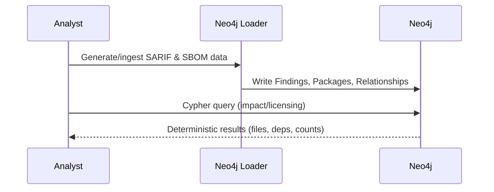

# Neo4j Local Ingestion Guide

>**STATUS:Tutorial is currently in beta. If you have issues see our [Communication & Support guide](../../about/communication.md)**

Semantic search excels at answering natural language questions across unstructured text, but it struggles with richly structured sources like SARIF, SBOMs, SPDX manifests, SPDX JSON/YAML, or custom JSON audit logs. Neo4j fills that gap: it stores each finding, package, dependency, and relationship explicitly, enabling questions like "Which packages depend on `requests` and have known vulnerabilities?" or "Which files have the most security findings?" that would be tedious with embedding-only search. This guide shows how to load the provided SARIF/SBOM samples into Neo4j so you can complement semantic search with graph queries.



## When to Use Graph Search

Use Neo4j when you need:

- **Multi-hop reasoning** – e.g., “Which packages transitively depend on a vulnerable library?”
- **Deterministic dependency analysis** – “Show every file with >5 findings” or “List everything that depends on `requests`.”
- **Impact assessment** – “If we remove package X, which services break?”
- **License/compliance traversal** – “Find all GPL/LGPL packages and their dependents.”
- **Exact aggregation of structured data** – counts, top offenders, or relationship-heavy reports that are awkward in keyword/semantic search.

## Prerequisites

- Working directory: project root unless noted otherwise.

  > The backend's async logging thread talks to OpenSearch even if you're only loading Neo4j. Skip headaches by keeping OpenSearch running whenever you execute backend utilities locally.

## Step 1 - Set-up

### 1.1 Bring up relevant services

```bash
just ask-up
```

### 1.2 Check if everything is ready for the tutorial

```bash
just preflight-ask
```

### 1.3 Configure `aws` CLI for LocalStack

```bash
aws configure set aws_access_key_id test
aws configure set aws_secret_access_key test
aws configure set default.region us-east-1
aws configure set profile.localstack.s3.endpoint_url ${S3_ENDPOINT}
```

## Step 2 - Load (or refresh) the Neo4j schema

Neo4j requires indexes/constraints before the loaders run. Pipe the schema file into `cypher-shell` using `-i` for interactive input:

```bash
docker exec -i neo4j cypher-shell -u neo4j -p password \
  < samples/neo4j_spike/schema.cypher
```

You'll see "constraint already exists" if it was applied earlier—that's fine.

## Step 3 - Activate the project virtualenv (host workflows)

Most import errors (e.g., `ModuleNotFoundError: structlog`) stem from running outside the repo's virtualenv. Activate it once per shell session:

```bash
source .venv/bin/activate
```

If you prefer to avoid host networking issues altogether, skip to the container workflow in Step 4B.

## Step 4 - Load SARIF & SBOM data

Run the loader script from inside the backend container:

```bash
docker exec ask-certus-backend bash -c \
  'source .venv/bin/activate && python /app/scripts/load_security_into_neo4j.py \
  --workspace neo4j-security-scans \
  --neo4j-uri neo4j://neo4j:7687'
```

## Step 5 - Verify the graph

Check counts with Cypher (the loader creates `SecurityScan` nodes, so be sure to target that label):

```bash
docker exec neo4j cypher-shell -u neo4j -p password \
  'MATCH (:SecurityScan {id: "neo4j-security-scans-scan"})-[:CONTAINS]->(f:Finding)
   RETURN count(f) AS findings;'
```

You can also browse `http://localhost:7474` (`neo4j` / `password`) and run queries interactively.

## Step 6 - Query Examples

Once the SARIF/SBOM artifacts are loaded, Neo4j's graph structure enables complex security queries that would be difficult with embeddings alone.

The queries below demonstrate Neo4j's advantages over semantic search for security-critical, highly structured data.

### Basic Queries

**List all SARIF findings with severity and location**

```bash
docker exec neo4j cypher-shell -u neo4j -p password \
  'MATCH (scan:SecurityScan {id: "neo4j-security-scans-scan"})-[:CONTAINS]->(f:Finding)
   OPTIONAL MATCH (f)-[:LOCATED_AT]->(loc:Location)
   RETURN f.rule_id, f.severity, loc.uri
   ORDER BY CASE f.severity WHEN "critical" THEN 0 WHEN "high" THEN 1 WHEN "medium" THEN 2 ELSE 3 END, f.rule_id
   LIMIT 15;'
```

**Count all packages and licenses in SBOM**

```bash
docker exec neo4j cypher-shell -u neo4j -p password \
  'MATCH (sbom:SBOM {id: "neo4j-security-scans-sbom"})-[:CONTAINS]->(pkg:Package)
   OPTIONAL MATCH (pkg)-[:USES_LICENSE]->(lic:License)
   RETURN count(distinct pkg) AS total_packages, count(distinct lic) AS unique_licenses;'
```

### Severity & Risk Analysis

**Show severity distribution across all findings**

```bash
docker exec neo4j cypher-shell -u neo4j -p password \
  'MATCH (:SecurityScan {id: "neo4j-security-scans-scan"})-[:CONTAINS]->(f:Finding)
   RETURN f.severity, count(f) AS count
   ORDER BY CASE f.severity WHEN "critical" THEN 0 WHEN "high" THEN 1 WHEN "medium" THEN 2 WHEN "low" THEN 3 ELSE 4 END;'
```

**Find the most common security issues (by rule)**

```bash
docker exec neo4j cypher-shell -u neo4j -p password \
  'MATCH (:SecurityScan {id: "neo4j-security-scans-scan"})-[:CONTAINS]->(f:Finding)
   RETURN f.rule_id, f.severity, count(f) AS occurrences
   ORDER BY occurrences DESC;'
```

**List all critical findings with details**

```bash
docker exec neo4j cypher-shell -u neo4j -p password \
  'MATCH (scan:SecurityScan {id: "neo4j-security-scans-scan"})-[:CONTAINS]->(f:Finding {severity: "critical"})
   OPTIONAL MATCH (f)-[:LOCATED_AT]->(loc:Location)
   RETURN f.rule_id, f.message, loc.uri, loc.line
   ORDER BY f.rule_id;'
```

### File & Location Analysis

**Find which files have the most security findings**

```bash
docker exec neo4j cypher-shell -u neo4j -p password \
  'MATCH (:SecurityScan {id: "neo4j-security-scans-scan"})-[:CONTAINS]->(f:Finding)-[:LOCATED_AT]->(loc:Location)
   RETURN loc.uri, count(f) AS findings
   ORDER BY findings DESC;'
```

**List all findings in a specific file**

```bash
docker exec neo4j cypher-shell -u neo4j -p password \
  'MATCH (:SecurityScan {id: "neo4j-security-scans-scan"})-[:CONTAINS]->(f:Finding)-[:LOCATED_AT]->(loc:Location {uri: "app/database.py"})
   RETURN f.rule_id, f.severity, f.message, loc.line
   ORDER BY loc.line;'
```

### License & Compliance

**Count packages per license type**

```bash
docker exec neo4j cypher-shell -u neo4j -p password \
  'MATCH (:SBOM {id: "neo4j-security-scans-sbom"})-[:CONTAINS]->(pkg:Package)-[:USES_LICENSE]->(lic:License)
   RETURN lic.name AS license, count(distinct pkg) AS package_count
   ORDER BY package_count DESC;'
```

**Find all packages with permissive licenses (MIT, Apache)**

```bash
docker exec neo4j cypher-shell -u neo4j -p password \
  'MATCH (:SBOM {id: "neo4j-security-scans-sbom"})-[:CONTAINS]->(pkg:Package)-[:USES_LICENSE]->(lic:License)
   WHERE lic.name IN ["MIT", "Apache-2.0", "BSD-3-Clause"]
   RETURN pkg.name, pkg.version, lic.name
   ORDER BY lic.name, pkg.name;'
```

**Find packages with GPL or copyleft licenses**

```bash
docker exec neo4j cypher-shell -u neo4j -p password \
  'MATCH (:SBOM {id: "neo4j-security-scans-sbom"})-[:CONTAINS]->(pkg:Package)-[:USES_LICENSE]->(lic:License)
   WHERE lic.name CONTAINS "GPL" OR lic.name CONTAINS "AGPL"
   RETURN pkg.name, pkg.version, lic.name;'
```

### Dependency Analysis

**Find all direct and transitive dependencies of a package**

```bash
docker exec neo4j cypher-shell -u neo4j -p password \
  'MATCH (:SBOM {id: "neo4j-security-scans-sbom"})-[:CONTAINS]->(pkg:Package {name: "flask"})
   MATCH (pkg)-[:DEPENDS_ON*0..2]->(dep:Package)
   RETURN distinct dep.name, dep.version
   ORDER BY dep.name;'
```

**Find packages that are high-risk targets (depended on by many others)**

```bash
docker exec neo4j cypher-shell -u neo4j -p password \
  'MATCH (:SBOM {id: "neo4j-security-scans-sbom"})-[:CONTAINS]->(pkg:Package)
   MATCH (other:Package)-[:DEPENDS_ON]->(pkg)
   WITH pkg, count(other) AS dependents
   WHERE dependents > 0
   RETURN pkg.name, pkg.version, dependents
   ORDER BY dependents DESC;'
```

### Advanced Queries

**Find all packages that depend on a vulnerable library (e.g., requests)**

```bash
docker exec neo4j cypher-shell -u neo4j -p password \
  'MATCH (:SBOM {id: "neo4j-security-scans-sbom"})-[:CONTAINS]->(vuln:Package {name: "requests"})
   MATCH (consumer:Package)-[:DEPENDS_ON]->(vuln)
   RETURN consumer.name, consumer.version
   ORDER BY consumer.name;'
```

**Get a complete software inventory report**

```bash
docker exec neo4j cypher-shell -u neo4j -p password \
  'MATCH (:SBOM {id: "neo4j-security-scans-sbom"})-[:CONTAINS]->(pkg:Package)
   OPTIONAL MATCH (pkg)-[:USES_LICENSE]->(lic:License)
   RETURN pkg.name, pkg.version, lic.name AS license, pkg.supplier
   ORDER BY pkg.name, pkg.version;'
```

**Match findings to source files (cross-reference SARIF and SBOM)**

```bash
docker exec neo4j cypher-shell -u neo4j -p password \
  'MATCH (:SecurityScan {id: "neo4j-security-scans-scan"})-[:CONTAINS]->(f:Finding)-[:LOCATED_AT]->(loc:Location)
   MATCH (:SBOM {id: "neo4j-security-scans-sbom"})-[:CONTAINS]->(pkg:Package)
   WHERE loc.uri STARTS WITH pkg.name OR pkg.name IN split(loc.uri, "/")
   RETURN distinct f.rule_id, f.severity, pkg.name, loc.uri
   ORDER BY f.severity DESC, pkg.name;'
```

**Find packages by license family (useful for compliance reports)**

```bash
docker exec neo4j cypher-shell -u neo4j -p password \
  'MATCH (:SBOM {id: "neo4j-security-scans-sbom"})-[:CONTAINS]->(pkg:Package)-[:USES_LICENSE]->(lic:License)
   WITH lic.name AS license, count(distinct pkg) AS count, collect(pkg.name) AS packages
   RETURN license, count, packages
   ORDER BY count DESC;'
```

### Why Knowledge Graphs Beat Semantic Search for Security Data

**OpenSearch (semantic search)** is excellent for answering natural language questions across unstructured text: "What are the recent security updates for our dependencies?" But it struggles with structured security data because:

1. **Relationships are opaque** - Embeddings can't naturally express "Package A depends on Package B which has a critical vulnerability." You'd need to retrieve and re-rank results, losing structural information.

2. **Exact matching is critical** - Security requires precise answers: "Show me all HIGH findings in app/database.py" must return exactly those findings, not "similar" ones. Semantic search returns ranked approximations, not deterministic results.

3. **Aggregations are expensive** - Answering "How many packages depend on requests?" in OpenSearch requires fetching all documents, then post-processing. Neo4j traverses the dependency graph directly: `MATCH (pkg)-[:DEPENDS_ON]->(:Package {name:"requests"}) RETURN count(pkg)`.

4. **Transitive relationships are hard** - "What packages transitively depend on a vulnerable library?" requires multi-hop reasoning. Semantic search can't express "2+ hops" naturally. Cypher handles it: `MATCH (pkg)-[:DEPENDS_ON*1..3]->(vuln)`.

5. **License compliance requires structure** - "Find all GPL-licensed packages and their dependents" is a graph query: traverse licenses, then reverse-traverse dependencies. Embeddings can't efficiently answer this.

**Neo4j (knowledge graph) strengths:**

- **Deterministic results** - Query returns exact matches, not approximations
- **Efficient traversal** - Finding all packages depending on X is O(edges) not O(documents)
- **Multi-hop queries** - Transitive relationships, dependency chains, impact analysis
- **Aggregations** - Counts, distributions, and groupings are native operations
- **Structural enforcement** - Schema constraints ensure data integrity

**Hybrid approach:**

- Use **OpenSearch** for exploratory, natural language questions ("Show me findings that mention crypto issues")
- Use **Neo4j** for precise, structural questions ("Show all packages with MIT license", "Impact of removing dependency X", "Files with >5 findings")

## Step 6. Cleanup

To remove everything

```bash
just down          # stop containers, keep volumes
just cleanup       # stop + remove containers, keep volumes
just destroy       # full tear-down (volumes removed)
```
